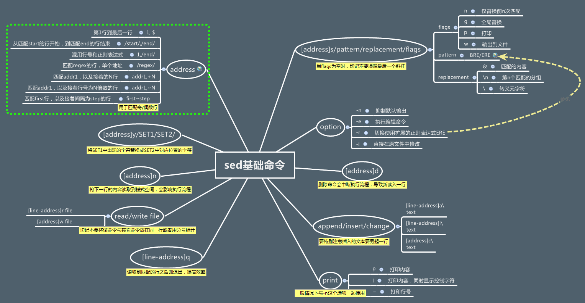

## 基本命令

### cut 命令

cut 命令有点像 awk 的简化版，当简单切割字符串时，没必要动用 awk，使用简单的 cut 即可。

cut 命令用于按“列”提取文本字符，格式为“cut [参数] 文本”。

在 Linux 系统中，如何准确地提取出最想要的数据，这也是我们应该重点学习的内容。一般而言，按基于“行”的方式来提取数据是比较简单的，只需要设置好要搜索的关键词即可。但是如果按列搜索，不仅要使用-f 参数来设置需要看的列数，还需要使用-d 参数来设置间隔符号。passwd 在保存用户数据信息时，用户信息的每一项值之间是采用冒号来间隔的，接下来我们使用下述命令尝试提取出 passwd 文件中的用户名信息，即提取以冒号（：）为间隔符号的第一列内容：

```sh
cut -d: -f1 /etc/passwd
```

### tr 命令

tr 命令用于替换文本文件中的字符，格式为“tr [原始字符] [目标字符]”。

在很多时候，我们想要快速地替换文本中的一些词汇，又或者把整个文本内容都进行替换，如果进行手工替换，难免工作量太大，尤其是需要处理大批量的内容时，进行手工替换更是不现实。这时，就可以先使用 cat 命令读取待处理的文本，然后通过管道符（详见第 3 章）把这些文本内容传递给 tr 命令进行替换操作即可。例如，把某个文本内容中的英文全部替换为大写：

```sh
cat anaconda-ks.cfg | tr [a-z] [A-Z]

# 删除所有空格
playwright -V | tr -d ' '
```

### sed 命令

参考：[SED 简明教程](https://coolshell.cn/articles/9104.html)

<https://www.yiibai.com/sed>

[shell 文件内容替换 sed 用法](https://blog.csdn.net/fengxianger/article/details/64127644)

[shell 文件内容替换 sed 用法](https://zhangge.net/1926.html)

<http://kodango.com/sed-and-awk-notes-part-1>

笔记：

```sh
# 调试 sed，先用 -n p
# -n 选项，这是模式缓冲区的缺省打印选项。不做任何修改，仅把修改行的结果显示到屏幕上。
sed -n 's/.*autologin-user=.*/autologin-user=kisa747/p' /etc/lightdm/lightdm.conf
#确定没有问题后，在替换为 -i
sed -i 's/.*autologin-user=.*/autologin-user=kisa747/' /etc/lightdm/lightdm.conf
```

调用 sed 命令有两种形式：

```sh
sed [options] 'command' file(s)
sed [options] -f scriptfile file(s)
```

删除命令：

```sh
# 删除：d 命令
# 删除 test.txt 文件的第二行。
sed '2d' test.txt
# 删除 test.txt 文件的第二行到末尾所有行。
sed '2,$d' test.txt
# 删除 test.txt 文件的最后一行。
sed '$d' test.txt
# 删除 test.txt 文件所有包含 test 的行。
sed '/test/'d test.txt
```

修改命令：

```sh
sed 's/要被替换的字符串/新的字符串/g' test.txt

# 在整行范围内把 test 替换为 mytest。
sed 's/test/mytest/g' example
# 如果没有 g 标记，则只有每行第一个匹配的 test 被替换成 mytest。

# -i 直接修改并保存
sed -i 's/被替换的内容/要替换成的内容/' file

# 在第二行之后加入“drink tea?”
sed '2a drink tea?' test
sed '2a\drink tea?' test
sed '2a\drink\ntea?' test  # 添加多行

# (-n) 选项和 p 标志一起使用表示只打印那些发生替换的行。也就是说，如果某一行开头的 test 被替换成 mytest，就打印它。
sed -n 's/^test/mytest/p' example
# &符号表示替换换字符串中被找到的部份。所有以 192.168.0.1 开头的行都会被替换成它自已加 localhost，变成 192.168.0.1 localhost。
sed 's/^192.168.0.1/& localhost/' example
# love 被标记为 1，所有 loveable 会被替换成 lovers，而且替换的行会被打印出来。
sed -n 's/\(love\)able/\1rs/p' example
#不论什么字符，紧跟着 s 命令的都被认为是新的分隔符，所以，“#”在这里是分隔符，代替了默认的“/”分隔符。表示把所有 10 替换成 100。
sed 's#10#100#g' example

从文件读入：r命令
$ sed '/test/r file' example
```

sed 命令思维导图：



顺手介绍一下正则表达式的一些最基本的东西：

- `^` 表示一行的开头。如：`/^#/` 以#开头的匹配。
- `$` 表示一行的结尾。如：`/}$/` 以}结尾的匹配。
- `\<` 表示词首。如：`\<abc` 表示以 abc 为首的詞。
- `\>` 表示词尾。如：`abc\>` 表示以 abc 結尾的詞。
- `.` 表示任何单个字符。
- `*` 表示某个字符出现了 0 次或多次。
- `\?` 表示匹配零个或一个匹配前面的字符
- `\+` 加号（\+）匹配前面的字符出现一次或多次。
- `[ ]` 字符集合。如：`[abc]` 表示匹配 a 或 b 或 c，还有 `[a-zA-Z]` 表示匹配所有的 26 个字符。
- `[^a]`  如果其中有^表示反，如 `[^a]` 表示非 a 的字符

### awk 命令

参考：[AWK 简明教程](<https://coolshell.cn/articles/9070.html>)

[阮一峰的 awk 入门教程](http://www.ruanyifeng.com/blog/2018/11/awk.html)

```sh
lsb_release -a | awk -F ':' '{ print $2 }'
```

### stat 命令

```sh
pi@raspi:~ $ stat move2folder.log
  文件：move2folder.log
  大小：0               块：0          IO 块：4096   普通空文件
设备：802h/2050d        Inode：833         硬链接：1
权限：(0644/-rw-r--r--)  Uid：( 1000/      pi)   Gid：( 1000/      pi)
最近访问：2020-07-23 08:07:29.813465776 +0800
最近更改：2020-07-23 08:07:29.813465776 +0800
最近改动：2020-07-23 08:07:29.813465776 +0800
创建时间：-
```

### find 命令

表 2-16                                             find 命令中的参数以及作用

|        参数        | 作用                                                         |
| :----------------: | ------------------------------------------------------------ |
|       -name        | 匹配名称                                                     |
|       -perm        | 匹配权限（mode 为完全匹配，-mode 为包含即可）                  |
|       -user        | 匹配所有者                                                   |
|       -group       | 匹配所有组                                                   |
|    -mtime -n +n    | 匹配修改内容的时间（-n 指 n 天以内，+n 指 n 天以前）               |
|    -atime -n +n    | 匹配访问文件的时间（-n 指 n 天以内，+n 指 n 天以前）               |
|    -ctime -n +n    | 匹配修改文件权限的时间（-n 指 n 天以内，+n 指 n 天以前）           |
|      -nouser       | 匹配无所有者的文件                                           |
|      -nogroup      | 匹配无所有组的文件                                           |
|   -newer f1 !f2    | 匹配比文件 f1 新但比 f2 旧的文件                                 |
| --type b/d/c/p/l/f | 匹配文件类型（后面的字幕字母依次表示块设备、目录、字符设备、管道、链接文件、文本文件） |
|       -size        | 匹配文件的大小（+50KB 为查找超过 50KB 的文件，而 -50KB 为查找小于 50KB 的文件） |
|       -prune       | 忽略某个目录                                                 |
|   -exec …… {}\;    | 后面可跟用于进一步处理搜索结果的命令（下文会有演示）         |

```sh
# 查找当前目录 txt 文件，然后删除。
find . -name "*.txt" -exec rm "{}" \;

# 删除“最近改动时间 mtime”大于 60 天的文件
find /mnt/sdb1/orico/.trash_samba -mtime +61 -exec rm -rf "{}" \;
# /email/v1_bak          --设置查找的目录；
# -mtime +92             --设置时间为 91 天前；
# -type f                --设置查找的类型为文件；
# -name *.mail[12]       --设置文件名称中包含 mail1 或者 mail2；
# -exec rm -rf            --查找完毕后执行删除操作；
```

### xargs 命令

参考：[用 xargs 处理带空格文件名](https://www.cnblogs.com/hunter_gio/archive/2012/09/05/2671760.html)

```sh
find ./ -name '*.tmp' | xargs rm
# 如果文件名有空格，就会报错。
# find 有一个参数-print0，于默认的-print 相比，输出的序列不是以空格分隔，而是以 null 字符分隔。而 xargs 也有一个参数 -0，可以接受以 null 而非空格间隔的输入流。所以说 xargs 简直就是为 find 而生的。上面的问题就很好解决了：
find ./ -name '*.tmp' -print0 | xargs -0 rm
# 下面的方法也行
find . -name "*.tmp"|xargs -i echo '"{}"' | xargs rm
# 直接使用 find 命令的 -exec 参数也行。
find . -name "*.url" -exec rm "{}" \;

# 解压当前目录所有的 zip 文件
for filename in *.zip
do
    unzip -v $filename
done
find . -name "*.txt" -exec rm "{}" \;
find . -name "*.png" -exec rm "{}" \;
find . -name "*.url" -exec rm "{}" \;
```

### grep 命令

grep 命令的参数及其作用

| 参数 | 作用                                           |
| :--: | ---------------------------------------------- |
|  -b  | 将可执行文件 (binary) 当作文本文件（text）来搜索 |
|  -c  | 仅显示找到的行数                               |
|  -i  | 忽略大小写                                     |
|  -n  | 显示行号                                       |
|  -v  | 反向选择——仅列出没有“关键词”的行。             |

```sh
# 去掉 samba 配置所有注释行
grep -v -E "^#|^;|^$" /etc/samba/smb.conf | sudo tee /etc/samba/smb.conf
cat /etc/samba/smb.conf
```

### wc 统计

wc 的参数以及作用

| 参数 | 作用         |
| :--: | ------------ |
|  -l  | 只显示行数   |
|  -w  | 只显示单词数 |
|  -c  | 只显示字节数 |

```sh
wc -l /etc/passwd
>>>38 /etc/passwd

cat /etc/passwd | wc -l
>>>29
```

## 常用命令

> 输入输出重定向

输入重定向中用到的符号及其作用

|         符号         | 作用                                         |
| :------------------: | -------------------------------------------- |
|     命令 < 文件      | 将文件作为命令的标准输入                     |
|    命令 << 分界符    | 从标准输入中读入，直到遇见分界符才停止       |
| 命令 < 文件 1 > 文件 2 | 将文件 1 作为命令的标准输入并将标准输出到文件 2 |

输出重定向中用到的符号及其作用

|                符号                 | 作用                                                         |
| :---------------------------------: | ------------------------------------------------------------ |
|             命令 > 文件             | 将标准输出重定向到一个文件中（清空原有文件的数据）           |
|            命令 2> 文件             | 将错误输出重定向到一个文件中（清空原有文件的数据）           |
|            命令 >> 文件             | 将标准输出重定向到一个文件中（追加到原有内容的后面）         |
|            命令 2>> 文件            | 将错误输出重定向到一个文件中（追加到原有内容的后面）         |
| 命令 >> 文件 2>&1  或 命令 &>> 文件 | 将标准输出与错误输出共同写入到文件中（追加到原有内容的后面） |

### 特殊字符

```sh
command1 && command2
# 命令 1 执行成功后，才运行命令 2

command1 || command2
# 命令 1 执行失败后，才运行命令 2

command1 ; command2
# 按照顺序执行命令 1、命令 2，不能保证每条命令都执行成功
```

### test 命令

#### 数值测试

| 参数 | 说明           |
| :--: | :------------- |
| -eq  | 等于则为真     |
| -ne  | 不等于则为真   |
| -gt  | 大于则为真     |
| -ge  | 大于等于则为真 |
| -lt  | 小于则为真     |
| -le  | 小于等于则为真 |

#### 字符串测试

|   参数    | 说明                               |
| :-------: | :--------------------------------- |
|     =     | 等于则为真，bash 中使用 `==` 也行。 |
|    !=     | 不相等则为真                       |
| -z 字符串 | 字符串的长度为零则为真             |
| -n 字符串 | 字符串的长度不为零则为真           |

#### 文件测试

|   参数    | 说明                                 |
| :-------: | :----------------------------------- |
| -e 文件名 | 如果文件存在则为真                   |
| -r 文件名 | 如果文件存在且可读则为真             |
| -w 文件名 | 如果文件存在且可写则为真             |
| -x 文件名 | 如果文件存在且可执行则为真           |
| -s 文件名 | 如果文件存在且至少有一个字符则为真   |
| -d 文件名 | 如果文件存在且为目录则为真           |
| -f 文件名 | 如果文件存在且为普通文件则为真       |
| -c 文件名 | 如果文件存在且为字符型特殊文件则为真 |
| -b 文件名 | 如果文件存在且为块特殊文件则为真     |

#### 方括号 []

[浅析 Bash 中的 {花括号}](https://linux.cn/article-10624-1.html)

[在 Bash 中使用 [方括号] （一）](https://linux.cn/article-10717-1.html)

[在 Bash 中使用 [方括号]（二）](https://linux.cn/article-10761-1.html)

[Linux 工具：点的含义](https://linux.cn/article-10465-1.html)

<http://c.biancheng.net/view/2751.html>

一对方括号可以替代 test 命令，2 对方括号更严谨。

注意：方括号内的命令与方括号之间留有空格。

```sh
[[ "a" = "a" ]]
echo $?
```

### sudo

参考：[sudo 入门指南](<https://linux.cn/article-8278-1.html>)

[如何在 Linux 中配置 sudo 访问权限](https://linux.cn/article-10746-1.html)

```sh
# 切换至 pi 用户，带环境变量。（--login）
sudo -i pi
sudo su
su
# 切换至 pi 用户，不带环境变量
su pi
# 切换至 pi 用户，带环境变量。（--login）
su - pi
# 添加 sudo 权限。
sudo mkdir -p
echo "$USER ALL=(ALL:ALL) NOPASSWD: ALL" | sudo tee /etc/sudoers.d/010-$USER
echo "kisa747 ALL=(ALL:ALL) NOPASSWD: ALL" | sudo tee /etc/sudoers.d/010-kisa747
# 编辑 sudo 主配置文件，不推荐，建议编辑 /etc/sudoers.d/ 目录下的内容。
sudo visudo
```

说明：

>kisa747 ALL=(ALL:ALL) ALL    用户 kisa747 具有 sudo 权限。
>
>kisa747 ALL=(ALL:ALL) NOPASSWD: ALL    用户 kisa747 具有 sudo 权限，且密码。
>
>%kisa747 ALL=(ALL:ALL) ALL    允许 kisa747 用户组中的用户执行所有命令

### cd 切换目录

```sh
cd    进入用户主目录；
cd ~  进入用户主目录；
cd -  返回进入此目录之前所在的目录；
cd ..  返回上级目录（若当前目录为“/“，则执行完后还在“/"， ".."为上级目录的意思）；
cd ../..  返回上两级目录；
cd !$  把上个命令的参数作为cd参数使用。
```

### & 后台运行

要让命令后台运行，只需在命令后加上 `&` ，比如：

参考：<https://www.ruanyifeng.com/blog/2016/02/linux-daemon.html>

[Linux 中的 &](https://linux.cn/article-10587-1.html)

```sh
ls &
```

"后台任务"有两个特点。

> 1. 继承当前 session（对话）的标准输出（stdout）和标准错误（stderr）。因此，后台任务的所有输出依然会同步地在命令行下显示。
> 2. 不再继承当前 session 的标准输入（stdin）。你无法向这个任务输入指令了。如果它试图读取标准输入，就会暂停执行（halt）。

可以看到，"后台任务"与"前台任务"的本质区别只有一个：是否继承标准输入。所以，执行后台任务的同时，用户还可以输入其他命令。

### nohup 守护进程

要想变成守护进程，使用 nohup 命令：

```sh
nohup node server.js &
```

`nohup`命令对`server.js`进程做了三件事。

> - 阻止`SIGHUP`信号发到这个进程。
> - 关闭标准输入。该进程不再能够接收任何输入，即使运行在前台。
> - 重定向标准输出和标准错误到文件`nohup.out`。

注意，`nohup`命令不会自动把进程变为"后台任务"，所以必须加上`&`符号。

输入输出重定向，错误输出与标准输出位置相同的话，可以使用 `2>&1` 。

```sh
ls >./ls.log 2>&1

# 丢弃所有输出
ls >/dev/null 2>&1
```

### rsync 数据同步

参考：

[rsync 用法教程](https://www.ruanyifeng.com/blog/2020/08/rsync.html) - 阮一峰

[rsync 备份服务](https://www.wqblogs.com/rsync备份服务/)

<https://www.cnblogs.com/george-guo/p/7718515.html>

[使用 rsync 进行增量备份并保存每天的快照](https://www.suokunlong.cn/wp/rsync-snapshot/)

```sh
# rsync [OPTION] SRC DEST
rsync -avP --delete /media/mint/MEDIA/Backup/ /media/mint/openwrt/sync/Backup
# -a, --archive 归档模式，表示以递归方式传输文件，并保持元信息（权限、属性），等于-rlptgoD。
# -v, --verbose 详细模式输出。
# -P  显示进度、断点续传。-P 参数是--progress（显示进度）和--partial（断点续传）这两个参数的结合。
# -h, --human-readable 以人类可读的格式显示，自动转换 G/M/K 单位（默认 1000 进制，重复使用 2 个该参数使用 1024 进制）。
# -hh 以 1024 进制格式显示
# -n, --dry-run 干运行 perform a trial run with no changes made
# --debug=FILTER 调试模式，显示过滤规则效果

# --delete 删除那些 DST 中 SRC 没有的文件。
# -f 过滤规则
# -F 启用所有目录（包含父目录）下的 .rsync-filter 过滤规则

# --exclude=PATTERN 指定排除不需要传输的文件模式。
# --include=PATTERN 指定不排除而需要传输的文件模式。
```

注意：rsync 与 robocopy 不同。

>rsync 默认会自动在 DEST 创建相应的目录，robocopy 则不创建。若要让 rsync 命令不自动创建目录，需要在源目录后添加 `/`，比如：
>
>rsync -avPhh --delete /media/mint/MEDIA/Backup/ /media/mint/openwrt/sync
>
>rsync 的 src 目录后面有 /  类似这样形式 data/，表示只将 data 目录下面的内容进行复制。
>
>rsync 的 src 目录后面没有 / 类似这样形式 data,  表示将 data 目录下面的内容以及目录本身进行复制。
>
>robocopy 是复制目录下面的内容，不复制目录本身。

添加`--delete` 参数，实现镜像复制效果，与 robocopy 的 `/mir` 参数实现的效果一一致

```sh
# 镜像复制
rsync -avPhh --delete /media/mint/MEDIA/Backup/ /media/mint/openwrt/sync/Backup

# 镜像复制，排除指定文件
rsync -avPhh --delete --exclude='@eaDir' /media/mint/MEDIA/Backup/ /media/mint/openwrt/sync/Backup
```

但是此方法有个缺点：当源目录中删除某个目录，而目的目录中包含有 `@eaDir` 目录（群晖自动索引的），就会导致无法删除。报错：`rsync cannot delete non-empty directory` 。也就是目的目录下有排除文件，源目录没有，不会删除目的目录下的排除文件，即保护删除排除文件。

原理：`exclude, '-'` specifies an exclude pattern that (by default) is both a `hide` and a `protect`. 也就是说 `exclude` 参数和 `-` 开关其实意思是排除 + 保护删除，使用 `-p` 开关就仅排除，不再保护删除。

<https://download.samba.org/pub/rsync/rsync.1#FILTER_RULES_WHEN_DELETING>

<https://superuser.com/questions/543419/rsync-cannot-delete-non-empty-directory>

```sh
# 使用 -p 开关就可以完美实现镜像效果，其实大部分时候应该是用 -p 开关
rsync -avP --delete -f'-p @eaDir' /volume1/homes/kevin/备份/sync/Home/Pictures/照片/ /volume1/photo/Pictures
```

排除规则：

`-F` 参数，相当于`-f': /.rsync-filter'`，他会查找源目录及上级目录下的所有 `.rsync-filter` 排除文件，并不符合我们一般的理解，一般我们只需要查找源目录下的所有排除文件，使用 `-f': .rsync-filter'` 参数即可，冒号等同于 `dir-merge` 合并目录下的过滤规则文件。

```sh
rsync -avPhh --delete -f': .rsync-filter' ~/test/photo/ ~/test/photo_new
# 等同于下面的命令
rsync -avPhh --delete --filter='dir-merge .rsync-filter' ~/test/photo/ ~/test/photo_new
```

增量备份：

```sh
rsync -avP --delete -f'-p @eaDir/' --link-dest=kevin@192.168.109.128:/home/kevin/photo /cygdrive/E/test/rsync-test/照片/ kevin@192.168.109.128:/home/kevin/photo_new
```

测试模式：

```sh
rsync -avPhhn --debug=FILTER ~/test/photo/ ~/test/photo_new
# 等同于下面的命令
rsync -avPhh --dry-run --debug=FILTER ~/test/photo/ ~/test/photo_new
```

### nice 命令

 nice 命令以更改过的优先序来执行程序，范围为 -20（最高优先序）到 19（最低优先序）。若 nice 命令未指定优先级的调整值，则以缺省值 10 来调整程序运行优先级。

```sh
nice -n 15 command
```

### tee 命令

tee 命令用于将数据重定向到文件，另一方面还可以提供一份重定向数据的副本作为后续命令的 stdin。简单的说就是把数据重定向到给定文件和屏幕上。

**理解**：`tee` 相当于命令版的 `>` 和 `>>` 。

```sh
sudo echo a > 1.txt
-bash: 1.txt: Permission denied
```

使用 sudo echo 写入文件，仍会提示权限不足。bash 拒绝这么做，说是权限不够，这是因为重定向符号“>”也是 bash 的命令。sudo 只是让 echo 命令具有了 root 权限，但是没有让“>”命令也具有 root 权限，所以 bash 会认为这个命令没有写入信息的权限。

使用 tee 命令可以很好地解决这个问题，利用管道和 tee 命令，可以从标准输入中读入信息并将其写入标准输出或文件中。

参考：<https://www.cnblogs.com/f-ck-need-u/p/7325378.html>

```sh
# tee 相当于从从 echo a 读取，写入到 1.txt
echo "a" | sudo tee 1.txt
# -a 是追加的意思，等同于 >>
echo "a" | sudo tee -a 1.txt
# 配合 EOF 实现更高级的
cat <<EOF | sudo tee /etc/apt/preferences.d/my_preferences
Package: *
Pin: release a=testing
Pin-Priority: 450
EOF
```

### 进程管理

参考：<http://man.linuxde.net/ps>

<https://www.linuxidc.com/Linux/2016-07/133515.htm>

ps 命令的参数以及作用

| 参数 | 作用                               |
| :--: | ---------------------------------- |
|  -a  | 显示所有进程（包括其他用户的进程） |
|  -u  | 用户以及其他详细信息               |
|  -x  | 显示没有控制终端的进程             |

Linux 系统中时刻运行着许多进程，如果能够合理地管理它们，则可以优化系统的性能。在 Linux 系统中，有 5 种常见的进程状态，分别为运行、中断、不可中断、僵死与停止，其各自含义如下所示。

> **R（运行）：**进程正在运行或在运行队列中等待。
>
> **S（中断）：**进程处于休眠中，当某个条件形成后或者接收到信号时，则脱离该   状态。
>
> **D（不可中断）：**进程不响应系统异步信号，即便用 kill 命令也不能将其中断。
>
> **Z（僵死）：**进程已经终止，但进程描述符依然存在，直到父进程调用 wait4() 系统函数后将进程释放。
>
> **T（停止）：**进程收到停止信号后停止运行。

```sh
# 标准的格式（system V 风格）显示所有用户的进程，推荐使用
# -e 查看所有进程，all processes
# -f full-format, including command lines
ps -ef | grep "aria2c"
# BSD 的格式显示所有用户的进程
ps aux

# 显示当前用户的进程
# -u, U, --user <UID>  effective user id or name
ps -fu $USER
# BSD 风格显示所有用户的进程。
ps ux

# 实时显示 process 的动态
top
# 以树状图的方式展现进程之间的派生关系，显示效果比较直观
pstree

# top 命令可以实时动态地查看系统的整体运行情况
top
# free 命令可以显示当前系统未使用的和已使用的内存数目，还可以显示被内核使用的内存缓冲区。
free
# df 命令用于显示磁盘分区上的可使用的磁盘空间
df -hT
```

pidof 命令

pidof 命令用于查询某个指定服务进程的 PID 值，格式为“pidof [参数] [服务名称]”。

每个进程的进程号码值（PID）是唯一的，因此可以通过 PID 来区分不同的进程。例如，可以使用如下命令来查询本机上 sshd 服务程序的 PID：

```sh
pidof sshd
>>>2156
```

kill 命令

kill 命令用于终止某个指定 PID 的服务进程，格式为“kill [参数] [进程 PID]”。

接下来，我们使用 kill 命令把上面用 pidof 命令查询到的 PID 所代表的进程终止掉，其命令如下所示。这种操作的效果等同于强制停止 sshd 服务。

```sh
kill 2156
```

killall 命令

killall 命令用于终止某个指定名称的服务所对应的全部进程，格式为：“killall [参数] [服务名称]”。

通常来讲，复杂软件的服务程序会有多个进程协同为用户提供服务，如果逐个去结束这些进程会比较麻烦，此时可以使用 killall 命令来批量结束某个服务程序带有的全部进程。下面以 httpd 服务程序为例，来结束其全部进程。由于 RHEL7 系统默认没有安装 httpd 服务程序，因此大家此时只需看操作过程和输出结果即可，等学习了相关内容之后再来实践。

```sh
pidof httpd
>>>13581 13580 13579 13578 13577 13576
killall httpd
pidof httpd
>>>
```

如果我们在系统终端中执行一个命令后想立即停止它，可以同时按下 Ctrl + C 组合键（生产环境中比较常用的一个快捷键），这样将立即终止该命令的进程。或者，如果有些命令在执行时不断地在屏幕上输出信息，影响到后续命令的输入，则可以在执行命令时在末尾添加上一个&符号，这样命令将进入系统后台来执行。

### wget 命令

wget 命令用于在终端中下载网络文件，格式为“wget [参数] 下载地址”。

wget 命令的参数以及作用

| 参数 | 作用                                 |
| :--: | ------------------------------------ |
|  -b  | 后台下载模式                         |
|  -P  | 下载到指定目录                       |
|  -t  | 最大尝试次数                         |
|  -c  | 断点续传                             |
|  -p  | 下载页面内所有资源，包括图片、视频等 |
|  -r  | 递归下载                             |

```bash
wget -P ~/ https://www.linuxprobe.com/docs/LinuxProbe.pdf
```

### set 命令

参考：<http://www.ruanyifeng.com/blog/2017/11/bash-set.html>

```sh
# 直接运行 set，会显示所有的环境变量和 Shell 函数。
set

# 当执行时使用到未定义过的变量，则显示错误信息。脚本在头部加上它，遇到不存在的变量就会报错，并停止执行。
set -u

# set -e 有一个例外情况，就是不适用于管道命令。
# 若指令传回值不等于 0，则立即退出 shell。
set -e

# 用来在运行结果之前，先输出执行的那一行命令。
set -x
```

## 文件压缩归档

`zip`格式无法存储编码信息，因此才有乱码的问题，没有完美的解决方法，所以 windows 下使用 7z 格式，linux 下使用 gz、xz、7z 格式。

### tar 压缩文档

```sh
# 解开归档文件 archive.tar 中的所有文件。
tar -xf archive.tar
# 压缩指定的文件夹或文件
tar -czvf download.tar.gz download/
# 解压 tar.gz 到当前目录
tar -xzvf download.tar.gz
# 解压 tar.xz 压缩包至当前目录
tar -xJvf test.tar.xz
# 将目录压缩为 tar.xz
tar -cJvf linux-3.12.tar.xz linux-3.12/

# 主操作模式：
#  -x, --extract, --get       从归档中解出文件
#  -c, --create               创建一个新归档
#  -r, --append               追加文件至归档结尾
#  -u, --update               仅追加比归档中副本更新的文件
#  -t, --list                 列出归档内容
# 上面 5 个是独立的命令，压缩、解压缩、查看要用其中一个，只能用其中一个。
# ----------------------------------------
#  压缩选项：
#  -a, --auto-compress        使用归档后缀名来决定压缩程序
#  -J, --xz                   通过 xz 归档，后缀名 *.xz
#  -z, --gzip                 通过 gzip 归档，后缀名 *.gz
#  -j, --bzip2                通过 bzip2 归档，后缀名 *.bz2
# ----------------------------------------
#  -v, --verbose              显示详细的过程
#  -f, --file=ARCHIVE         使用归档文件，切记，这个参数是最后一个参数，后面只能接受档案名。
# 总结，可以使用 a 选项根据后缀名自动选择压缩程序。
# 常见的压缩文档后缀，*.tar、*.tar.gz、*.tar.xz。


# 将目录压缩为 tar.xz
tar -cavf linux-3.12.tar.xz linux-3.12/
# 文件名使用绝对名称，不移除文件名称前的“/”号；
sudo tar caPf ~/etc.tar.xz /etc
# 解压 tar.xz 压缩包至当前目录
tar -xavf test.tar.xz
# 解压至指定目录
tar xavf fonts.tar.xz -C ~/.local/share
```

注意：`tar` 命令直接调用 `-J` 是用 `xz` 格式压缩，速度是`gz`格式的 8.7%，连它的十分之一都不到，可以说是慢的令人发指。开启多线程后，速度会明显提高，速度是 `gz`格式的 1/4。两种方法开启多线程压缩：

方法 1：`xz` 和 `tar` 都会解析 `XZ_DEFAULTS` and `XZ_OPT` 两个参数。可以将环境变量添加至`~/.bashrc`文件。

推荐使用此方法。

```sh
# echo 'export XZ_OPT="$XZ_OPT -T 0"' >> ~/.bashrc
echo 'export XZ_OPT="-T 0"' >> ~/.bashrc
tail ~/.bashrc
source ~/.bashrc
```

测试脚本：

```sh
#!/usr/bin/env bash
starttime=`date +'%Y-%m-%d %H:%M:%S'`
#执行程序
export XZ_OPT="-T0"
tar -cavf py.tar.xz py
endtime=`date +'%Y-%m-%d %H:%M:%S'`
start_seconds=$(date --date="$starttime" +%s);
end_seconds=$(date --date="$endtime" +%s);
echo "本次运行时间： "$((end_seconds-start_seconds))"s"
```

方法 2：通过管道调用 `xz` 命令，添加 `-T 0` 参数，也可以添加其它的参数。

```sh
tar cv ~/test | xz -T 0  > ./test.tar.xz
```

添加 `-T 0` 参数后，速度是未添加的 3 倍，速度提升明显。

对比表格：

|     格式      | 时间 | 压缩文件大小 |
| :-----------: | :--: | :----------: |
|      gz       | 34s  |    21.5M     |
| xz（-T0 参数） | 130s |    10.5M     |
|      xz       | 412s |    10.4M     |
|      7z       | 92s  |    10.7M     |

### p7zip

`7z`是一个优秀的压缩格式的容器，可以支持 lzma、lzma2 等压缩算法，可以存储编码信息，默认就是 `utf-8` 编码，不会存在像 zip 那样的乱码现象。

```sh
sudo apt install p7zip-full
# p7zip-full 提供了 7z、7za 命令
# p7zip 提供了 7zr 命令
# 创建压缩文件
7z a test.7z test
# 解压至当前目录
7z e test.7z
```

### unar 解压缩

在中文 windows 下压缩的 zip 文件，在 linux 下使用 unzip 解压缩，解压出的文件乱码。使用`unzip-iconv`或者`unzip-natspec`添加 `-O gbk` 参数也能解决，但还是太麻烦了。还是使用解压神器 unar 最为方便。

参考：<https://linuxtoy.org/archives/wrong-handling-of-chinese-coded-filename-in-fileroller-unzip.html>

<https://www.findhao.net/easycoding/1605.html>

```sh
# 安装 unar
sudo apt install unar

# 列出压缩包内容
lsar document.zip
# 解压压缩包
unar document.zip

# unar 常用选项解释
# -o 指定解压结果保存的位置
unar document.zip -o ~/doc/
# -e 指定编码
unar -e gb18030 document.zip
# -p 指定解压密码
unar -p 123456 document.zip

# 解决 linux 解压压缩包中文文件名乱码问题
lsar document.zip
###若发现乱码，可指定压缩包文件名使用的编码格式##
lsar -e gb18030 document.zip
###若能正常列出文件名，可解压###
unar -e gb18030 document.zip
```
