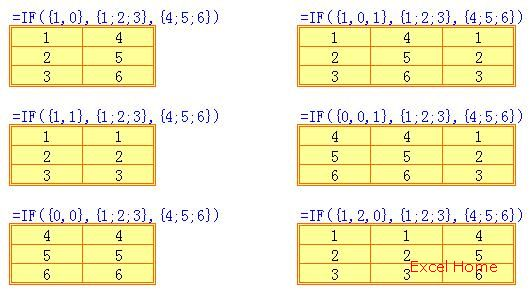
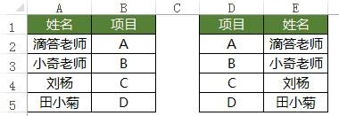

# Excel 笔记

## 文本中提取数据

```vb
Function regextract(rng As String, pat As String, Optional group As Boolean = False)
'正则表达式函数
'用法：
'默认不分组，根据正则表达式返回第一个匹配
'group 为 True 时，正则表达式必须要要有括号分组，则返回第一个匹配的的第一个分组
'暂时就这样写函数了，根据需求，如果有更高级的需求，在调整函数

'参数1 rng: String 选择要匹配的单元格
'参数2 str: String 正则表达式
'参数3：group: Boolean 是否分组


With CreateObject("VBscript.regexp")
    .Global = True
    .pattern = pat   '表达式,直接从函数的第二个参数中调用
    If .Execute(rng).Count = 0 Then
        GetStr = ""
    Else
        If group Then
            regextract = .Execute(rng)(0).SubMatches(0)
        Else
            regextract = .Execute(rng)(0)
        End If
    End If
End With
End Function
```

## 组合查询

利用 `IF({1,0}` 创建数组进行查询。

```vb
={VLOOKUP(E2&F2,IF({1,0},透视!A:A&透视!B:B,透视!C:C),2,0)}
```

参考：[Excel 学习笔记：if({1,0}) 用法](https://www.cnblogs.com/hider/p/10430864.html)

**数组：**逗号分隔是水平数组，分号分隔是垂直数组。

`IF{1,0}` 根据两个条件，分别返回 IF 的两个值，同时把两个结果组成一个数组，条件不仅限于两个，可以是多个，就是不仅限于{1,0}，也可以是{1,0,1}、{1,0,0}、{1,0,1,1}等，千变万化，那么就返回多个对应的结果。



案例：将 AB 列构成 DE 列的效果

  操作：选中 D1:E5 单元格区域，输入公式：`=IF({1,0},B1:B5,A1:A5)`，按下 ctrl+shift+ 回车，完成多单元格公式输入。



## 切分固定分隔符字符串

```vb
=TRIM(MID(SUBSTITUTE(D116,CHAR(10),REPT(" ",100)),100,100))
```

## 从文本中提取数字

参考：<https://www.lanrenexcel.com/excel-formula-extract-number-from-text/>

<https://zhuanlan.zhihu.com/p/37531415>

```vb
=-LOOKUP(1,-RIGHT(LEFT(B3,LOOKUP(10,--MID(B3,ROW($1:$20),1),ROW($1:$20))),ROW($1:$20)))
```

数组公式版，需要按三键“**Ctrl+shift+ 回车**”结束。

```vb
=-LOOKUP(0,-MID(A1,MIN(FIND(ROW($1:$10)-1,A1&1/17)),ROW($1:$9)))
```

## 工作表与工作簿

工作簿：一个 `xlsx` 文件就是一个工作簿。

工作表：工作簿里的一个 sheet 就是一个工作表。

## vlookup 函数陷阱

当使用风口风阀尺寸作为被查找对象时，注意里面包含有 `*` 特殊字符，因此应使用 `substitute` 函数将 `*` 替换为 `~*` ，避免作为通配符查找。更高级的应该使用 `lookup` 函数。

```vb
=VLOOKUP(SUBSTITUTE(D2&E2,"*","~*"),Sheet1!$I:$J,2,0)
```

使用 lookup 函数：

```vb
=LOOKUP(1,0/(B3:B9=H3),D3:D9)
=LOOKUP(1,0/((B3:B9=H3)*(E3:E9=I3)),D3:D9)
```
