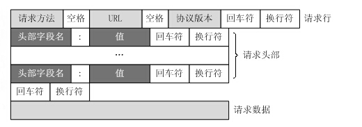
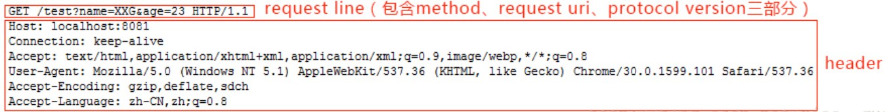

# HTTP 请求

参考：<https://foofish.net/http-request-process.html>

<https://www.cnblogs.com/WindSun/p/11489356.html>

一次完整的 HTTP 请求过程从 TCP 三次握手建立连接成功后开始，客户端按照指定的格式开始向服务端发送 HTTP 请求，服务端接收请求后，解析 HTTP 请求，处理完业务逻辑，最后返回一个 HTTP 的响应给客户端，HTTP 的响应内容同样有标准的格式。无论是什么客户端或者是什么服务端，大家只要按照 HTTP 的协议标准来实现的话，那么它一定是通用的。

> HTTP 主要的请求方式有 get、post，get 方法没有请求正文，所有的参数都要包含在网址中，post 方法有请求正文。

## HTTP 请求报文格式

HTTP 请求报文由四部分组成：请求行，请求头、空格、请求正文



**请求行：**（request-line）请求行是请求消息的第一行，由三部分组成：分别是请求方法（**GET/POST/DELETE/PUT/HEAD**）、请求资源的 URI 路径、HTTP 的版本号

```python
GET /index.html HTTP/1.1
```

**请求头：**（general-headers、request-headers）请求头中的信息有和缓存相关的头（Cache-Control，If-Modified-Since）、客户端身份信息（User-Agent）等等

```python
Cache-Control:max-age=0
Cookie:gsScrollPos=; _ga=GA1.2.329038035.1465891024; _gat=1
If-Modified-Since:Sun, 01 May 2016 11:19:03 GMT
User-Agent:Mozilla/5.0 (Windows NT 10.0; WOW64) AppleWebKit/537.36 (KHTML, like Gecko) Chrome/51.0.2704.84 Safari/537.36
```

**空行：**（empty-line）空行就是\r\n (POST 请求时候有)

**请求正文：**（message-body）当使用 POST 等方法时，通常需要客户端向服务器传递数据。这些数据就储存在请求正文中（GET 方式是保存在 url 地址后面，不会放到这里）


## GET 请求

下面是浏览器对 <http://localhost:8081/test?name=XXG&age=23> 的 GET 请求时发送给服务器的数据：



可以看出请求包含请求行和请求头两部分。其中请求行中包含 method（例如 GET、POST）、URI（通一资源标志符）和协议版本三部分，三个部分之间以空格分开。请求行和每个请求头各占一行，以换行符 CRLF（即 \r\n）分割。

## POST 请求

下面是浏览器对 <http://localhost:8081/test> 的 POST 请求时发送给服务器的数据，消息体中带上参数 name=XXG&age=23


可以看出，上面的请求包含三个部分：请求行、请求头、空格、消息体，比之前的 GET 请求多了一个请求消息，其中 请求头和消息体之间用一个空行分割。POST 请求的参数不在 URL 中，而是在消息体中，请求头中多了一项 Content-Length 用于表示消息体的字节数，这样服务器才能知道请求是否发送结束。这也就是 GET 请求和 POST 请求的主要区别。

那么起始行中的请求方法有哪些种呢？

> GET: 完整请求一个资源（常用）
> HEAD: 仅请求响应首部
> POST：提交表单（常用）
> PUT: (webdav) 上传文件（但是浏览器不支持该方法）
> DELETE：(webdav) 删除
> OPTIONS：返回请求的资源所支持的方法的方法
> TRACE: 追求一个资源请求中间所经过的代理（该方法不能由浏览器发出）

那什么是 URL、URI、URN？

> URI  Uniform Resource Identifier 统一资源标识符
> URL  Uniform Resource Locator 统一资源定位符
> URN  Uniform Resource Name 统一资源名称

URL 和 URN 都属于 URI，为了方便就把 URL 和 URI 暂时都通指一个东西

## 服务器响应 HTTP 请求，浏览器得到 html 代码

HTTP 响应也由三部分组成：状态行，响应头，空格，消息体

状态行包括：协议版本、状态码、状态码描述

**状态码：**状态码用于表示服务器对请求的处理结果

> 1xx：指示信息——表示请求已经接受，继续处理
> 2xx：成功——表示请求已经被成功接收、理解、接受。
> 3xx：重定向——要完成请求必须进行更进一步的操作
> 4xx：客户端错误——请求有语法错误或请求无法实现
> 5xx：服务器端错误——服务器未能实现合法的请求。

列举几种常见的：

> 200（没有问题）
> 302（要你去找别人）
> 304（要你去拿缓存）
> 307（要你去拿缓存）
> 403（有这个资源，但是没有访问权限）
> 404（服务器没有这个资源）
> 500（服务器这边有问题）

## request header

requests 库默认的 request header。

```python
headers = {'User-Agent': 'python-requests/2.25.1',
           'Accept-Encoding': 'gzip, deflate',
           'Accept': '*/*',
           'Connection': 'keep-alive'
          }
```

反爬虫主要是：随机 UA、设置 Referer、正确 GET 地址、正确 POST 表单。

有的网站会根据 referer 进行反爬。如果要频繁抓取一个网页，每次都设置一样的 UA，这也会被网站怀疑，因为一个人可能不会短时间内访问千百次那个网站，所以我们要做的是随机换 UA，我们可以从网上搜集一个 UA 列表，每次从中随机提取即可。

headers 中的 referer 表示你是从哪个网页来到这个网页的，比如上面我们是在[这个页面](https://www.zhihu.com/people/wang-da-shan-68/columns)点击进入的[这个页面](https://zhuanlan.zhihu.com/python-programming)，后者的 headers 中 referer 就是前一个页面。

## 0.2. 表单处理

某些网站需要进行账户和密码登陆，需要使用 POST 方法向服务器发送账户和密码表单数据，这里就需要模拟登陆。

如何获取表单数据的格式呢？通过谷歌浏览器开发者工具中 Network 锁定请求头部和 post 发出的表单数据，伪装表单数据

> 当由于 Method 太多，找不到 POST 提交登录请求 Method 方法的时候，可以尝试使用错误密码，这样就可以容易的找 POST 方法对应的头部。
