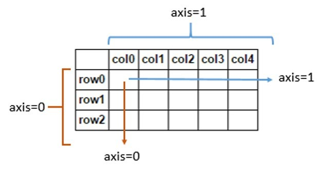
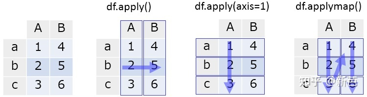

# 循环迭代 DataFrame

参考：[五种 Pandas 循环方法效率对比](https://zhuanlan.zhihu.com/p/80880493)

[Pandas 数据处理三板斧——map、apply、applymap 详解](https://zhuanlan.zhihu.com/p/100064394)

> 如果不用 apply，只能用一些简单的一维函数比如：sum，mean, max ,min 等，连 value_counts 都无法使用。用 apply 方法后，可以使用 series 的高级函数，比如 series.nlargest() 函数，返回多个值。或者 np.mean
>
> 还有更简单的方法，直接对 DataFrameGroupBy 对象进行运算
>
> DataFrameGroupBy.sum()
>
> DataFrameGroupBy.count()
>
> 参见官方文档：<http://pandas.pydata.org/pandas-docs/stable/api.html#groupby>
>
> 注意，任何分组关键词中的缺失值，都会被从结果中除去。



```python
df = pd.DataFrame({'A': [1, 2, 3],
                   'B': [4, 5, 6]},
                  index=['a', 'b', 'c'])
df
#    A  B
# a  1  4
# b  2  5
# c  3  6
```

假如我们要逐行求和，有以下方法：

1、转换成列表，然后循环。

```python
lis = []
for x in df.to_numpy().tolist():
    a, b = x
    print(a, b)
    s = a + b
    lis.append(s)
print(lis)

>>>

1 4
2 5
3 6
[5, 7, 9]
```

2、Iterrows 循环（迭代列使用 df.itmes()）：

```python
lis = []
for index, row in df.iterrows():
    a, b = row
    s = a + b
    print(f'第 {index} 行数据：{a} {b}，求和为 {s}')
    lis.append(s)
print(lis)

>>>

第 a 行数据：1 4，求和为 5
第 b 行数据：2 5，求和为 7
第 c 行数据：3 6，求和为 9
[5, 7, 9]
```

3、Apply 循环：

```python
def sum_ab(series, n):
    a, b = series
    s = (a + b)* n
    return s
df.apply(sum_ab, axis=1, args=(1,))
>>>
a    5
b    7
c    9
dtype: int64
```

4、Numpy 向量化函数：

```python
np.sum(df, axis=1)
>>>
a    5
b    7
c    9
dtype: int64
```

5、Pandas 内置向量化函数：

```python
df.sum(axis=1)
>>>
a    5
b    7
c    9
dtype: int64
```

总结：

pandas 如果要求逐行或是逐个处理数据，应优先考虑内置向量化函数，如果没有就用 numpy 的函数，都没有的话，自己写一个函数，使用 apply、map、applymap 来处理。没必要使用 Iterrows 循环、转换成列表循环。

得益于传入自定义函数的处理， `apply` 的自由度很高，但这是以性能为代价的。一般而言，使用 `pandas` 的内置函数处理和 `apply` 来处理同一个任务，其速度会相差较多，因此只有在确实存在自定义需求的情境下才考虑使用 `apply` 。

## apply、map、applymap 函数

参考：<https://zhuanlan.zhihu.com/p/394479538>

```python
DataFrame.apply(func, axis=0, raw=False, result_type=None, args=(), **kwargs)
```

- DataFrame.apply：DataFrame 对每一列或每一行应用该函数。行/列由 axis 关键字指定
- DataFrame.applymap：DataFrame 对每个值应用一个函数（会单独介绍）
- Series.map：Series 每个值被映射使用一个参数，字典 dict 可提供对应关系



axis=0，跨行，沿着 Y 轴方向，逐列摘取

axis=1，跨列，沿着 X 轴方向，逐行摘取
