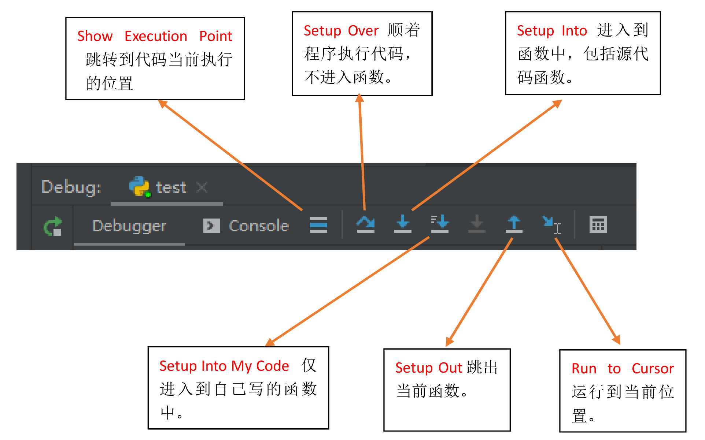

# 编辑器

## Pycharm

[PyCharm 编辑器教程](https://www.5axxw.com/wiki/topic/18ogr1)

[PyCharm 中文指南](https://pycharm.iswbm.com/win/)

### 快捷键

|        快捷键        |              功能              | 备注 |
| :------------------: | :----------------------------: | :--: |
|       Ctrl + /       |             行注释             |      |
|   Ctrl + Shift + /   |             块注释             |      |
|    Ctrl + Alt + L    |           代码格式化           |      |
|    Shift + Enter     | 任意位置换行（不用鼠标操作了） |      |
|      Shift + F6      |      批量方法或变量重命名      |      |
|      Ctrl + +/-      |      展开/折叠当前代码块       |      |
|   Ctrl + Shift +/-   |      展开/折叠全部代码块       |      |
|        Ctrl+P        |       显示有效形参的列表       |      |
|       Ctrl + O       |          重写父类方法          |      |
| Ctrl + Shift + Enter | 自动结束代码，行末自动添加冒号 |      |
|     Alt + Enter      |            智能提示            |      |
|      CTRL+ALT+O      |        优化 import 导入        |      |

分割窗口

在大屏显示器上写代码倍儿爽，很多时候我们在两个文件中来回的切换，这时把屏幕切割成两半就无需来回切换了，效率大大提高。Pycharm 的默认配置没有设置分割的快捷键，你可以在 Settings 中的 Keymap 自定义快捷键。keymap - Editor Tabs - Split Vertically  Split Horizontally

### 技巧

参考：[python 导入同级目录文件、上级目录文件以及下级目录数据集和模块包](https://www.cnblogs.com/ipersevere/p/10916803.html)

* Pycharm 虚拟环境下应该使用 `python` 命令，不能使用 `python3` 命令，python3 命令调用的不是虚拟环境的。
* 使用 unit 单元测试时，在代码内右键运行、调试时注意：右键放到 TestCase 的方法内，则仅运行此方法，相当于电机方法左边的运行小三角。

### 中文语言界面

进入 FIle --> Setting --> Plugins，搜索 Chinese，安装 `chinese （simplified）language` 插件，重启即可显示中文。

### 格式化代码

#### ruff

参考：[ruff 官方文档](https://docs.astral.sh/ruff/)

切换至 ruff 工具，配置好后，可以检查一下所有文件，看会有哪些会被更改

```sh
ruff format --check --diff
```

Windows 下用户配置文件为：`%APPDATA=%\ruff\ruff.toml` 或是 `%APPDATA%\ruff\pyproject.toml`

勾选以下配置：

* [x] Run ruff when the python file is saves
* [x] Use Import Optimizer
* [x] Use ruff format for version 0.0.289 or later

#### black

参考：[Python 代码格式化工具「Black」使用详解](https://zhuanlan.zhihu.com/p/418508530)

代码风格：[The Black code style](https://black.readthedocs.io/en/stable/the_black_code_style/current_style.html)

Black：The uncompromising code formatter，零妥协代码格式化工具。

```sh
-S, --skip-string-normalization  # 不要标准化字符串引号或前缀。
-l --line-length  # 每行允许的字符数。[默认值：88]
-v --verbose  # 输出详细信息。如果使用了配置文件，会显示出使用配置文件的位置。

# 神奇的尾随逗号（trailing comma）
# Black 将向由逗号分隔的表达式添加尾随逗号，每个元素占据单独的一行。这包括函数声明。
# 已经存在的尾随逗号提示 Black 始终将当前括号对的内容分解为每行一个项目。
# 在列表、元组、字典、函数参数内，最后一个元素添加一个逗号
-C, --skip-magic-trailing-comma  # 不要将尾随逗号作为分割行的理由。

# 以 # fmt: off 开头并以 # fmt: on 结尾的代码块，或以 # fmt: skip 结尾的行不会被重新格式化。
# 代码 # fmt: on/off 必须在相同级别的缩进位置。出于礼貌，它也对 YAPF 的块注释具有相同的效果。
```

##### Pycharm 默认方法（推荐）

新版的 pycharm 默认集成了 black 工具，很方便的设置。

1、安装 black 库。

```python
pip install black
```

2、Pycharm - 设置 - 工具 - Black，设置：`-S -l 100`。或者什么参数也不添加，直接只用 `pyproject.toml` 配置文件。

##### File Watchers 方案

官方的 BlackConnect 经常出现连接错误，而且没有任何提示。果断放弃，采用更普遍的 `File Watchers` 插件方法。

1、安装 black 库。

```python
pip install black
```

2、Pycharm 中安装 `File Watchers` 插件，重启 Pycharm。

3、查找 black 安装的位置：

```sh
# Windows
where black
# Linux
which black
```

4、设置 File Watcher 插件。

设置 - 工具 - File Watcher - 添加，添加以下内容：

>名称：`black`
>
>文件类型：`python`
>
>范围：`项目文件`
>
>程序：程序的位置 `black.exe`
>
>参数：`-S -l 90 $FilePath$` ，也可以添加 `-S -l 100` 参数，多人协作推荐使用配置文件。
>
>要刷新的输出路径：`$FilePath$`
>
>高级选项：
>
>​    取消勾选：□ 自动保存编辑的文件以触发观察程序
>
> 取消勾选：□ 进行外部更改时触发更改程序

配件使用配置文件控制 black 的参数，这样不同项目可以设置不同配置，如果项目没有配置，则使用全局配置文件。

使用全局配置文件设置 black，修改 `%HOMEPATH%\.blcak` （Linux 下为：`~/.config/black`），内容如下：

```toml
# %HOMEPATH%\.blcak
[tool.black]
line-length = 100
skip-string-normalization = true
include = '\.py[iw]?$'
```

项目配置文件 `pyproject.toml`

```toml
# 格式化代码
[tool.black]
line-length = 100
# 不格式单引号位为双引号
skip-string-normalization = true
# 单引号包裹的是字面量字符串
include = '\.py[iw]?$'
```

可以使用 `black -v p.py` 命令查看它到底使用了哪个配置文件。

参考 Black 官方文档：

>1. python 文件中以 `# fmt: skip` 结尾，则此行不格式化。
>2. python 文件中以 `# fmt: off` 、`\# fmt: on` 包裹的代码块，不格式化。`# fmt: on/of` 必须在相同的缩进等级上。
>3. Black 读取配置等级按照以下顺序，由高到低：
>
> * 命令行参数
> * 当前目录下的 `pyproject.toml` 配置文件，如果不存在，依次向上一级目录寻找，或直到发现 `.git` 目录，或直到根目录。
> * 用户配置文件 `%HOMEPATH%\.blcak` （linux 下为：`~/.config/black`）
> * **注意：black 不会读取多个配置文件，所以如果项目中存在 pyproject.toml 文件，一定要在里面配置 black 选项，否则全局配置文件不会生效。**
>
>4. The magic trailing comma。列表、元组、字典等最后一个元素后添加逗号，Black 会自动将所有元素分行显示。
>5.

5、设置外置工具

* [ ] 基本不需要配置 pycharm 的外置工具了。

#### isort 优化 import 导入

pycharm 内置的 import 优化功能非常好用，但是为了保证不同的 IDE 效果一致，尤其是多人团队合作的时候，一致性非常重要，因此更推荐使用 isort。

pycharm 内置的优化 import 会自动删除未使用的 import 语句。~~设置 优化 import：设置 - 工具 - 保存时的操作，勾选 优化 import。~~

isort 不会自动删除未使用的 import 语句，建议使用 `CTRL+ALT+O` 快捷键，通过内置的 import 优化自动删除。

```sh
pip install isort
```

设置 File Watcher 插件。

设置 - 工具 - File Watcher - 添加，添加以下内容：

>名称：`isort`
>
>文件类型：`python`
>
>范围：`项目文件`
>
>程序：程序的位置 `isort.exe`
>
>参数：`$FilePath$`
>
>要刷新的输出路径：`$FilePath$`
>
>高级选项：
>
>​    取消勾选：□ 自动保存编辑的文件以触发观察程序
>
> 取消勾选：□ 进行外部更改时触发更改程序

项目配置：

```toml
# 格式化 import 语句
[tool.isort]
# Ensures the output doesn't save if the resulting file contains syntax errors.
atomic = true
# Compatibility with black
profile = "black"
line_length = 100
# Treat project as a git repository and ignore files listed in .gitignore.
# NOTE: This requires git to be installed and accessible from the same shell as isort.
skip_gitignore = true
```

### 代码宽度视觉参考线

设置 - 编辑器  ->  代码样式，由于使用了 black 自动格式代码，强制换行位置作用不大。

>强制换行位置：120
>
>视觉参考线：100, 120

### 换行符 LF

文件 -> 设置 -> 编辑器 -> 代码样式 -> 常规 -> `行分隔符` ->  `Unix 和 MacOS(\n)`

### 文件模板

文件 ->  设置  -> 编辑器 ->  文件和代码模板 -> Python Script

```python
#!/usr/bin/env python3
# -*- coding: utf-8 -*-
"""
说明文档
"""
__author__ = 'kevin'
__date__ = '${DATE}'

import logging
def _test():
    logging.info('Done!')
def main():
    logging.info('Done!')
if __name__ == '__main__':
    logging.basicConfig(level=logging.INFO, format='[%(levelname)s] %(message)s')
    
    _test()
    # main()
```

测试文档模板：

```python
#!/usr/bin/env python3
# -*- coding: utf-8 -*-
"""
测试单元
"""
__author__ = 'kevin'
__date__ = '${DATE}'

import logging
import unittest
class MyTestCase(unittest.TestCase):
    def setUp(self):
        pass
    # @unittest.skip('跳过')
    def test_something(self):
        value = ''
        value_test = ''
        self.assertEqual(value, value_test)  # 预期值，实际值
    def tearDown(self):
        pass
if __name__ == '__main__':
    logging.basicConfig(level=logging.INFO, format='[%(levelname)s]: %(message)s')
    unittest.main()
```

### 关闭拼写检查、代码风格检查

* 关闭拼写检查。编辑器 -> 检查，取消勾选 `拼写错误`。

* ~~关闭代码风格检查。编辑器 -> python，取消勾选 `PEP8编码样式违规`。~~ 这个可以保留。

重启程序后生效。

### 设置 utf-8 编码

进入 设置 - 编辑器 - 文件编码：

> `属性文件的编码` 设置为 UTF-8。
>
> `全局编码、项目编码` 保持默认 GBK。设为 UTF-8 的话，控制台上输出会乱码。

### 字体

进入 设置 - 编辑器 - 字体：

>字体：Fira Code
>
>大小：18；行高：1.2

### 调试

Debug 时，尽量通过右键代码的空白处进入 Debug，防止运行了别的文件。

调试时，一般先设置断点，再使用 `F8` 一步步运行，如果感觉某个函数有问题再 `Setup Into My Code` 执行。



基本调试功能：

>Setup Over（F8）顺着代码执行，不进入代码。
>
>Setup Into（F7）进入到函数中，包括源代码函数。逐句运行。如果引入标准库、第三方库，会跳入其中，所以叫 Step Into。
>
>Setup Into My Code（Alt+Shift+F7）进入到自己写的函数中。逐句运行，直接跳入当前调试的程序，不会跳出。这个最方便快捷。
>
>Setup Out 跳出当前函数。
>
>Run to Cursor 运行到当前位置。

其它的调试功能：

>F9 Resume Program 跳至下一个断点。恢复程序
>
>**3、运行 (Running)**
>Alt + Shift + F10 运行模式配置
>Alt + Shift + F9 调试模式配置
>Shift + F10 运行
>Shift + F9 调试
>Ctrl + Shift + F10 运行编辑器配置
>Ctrl + Alt + R 运行 manage.py 任务
>
>**4、调试 (Debugging)**
>
>Shift + F8 退出
>Alt + F9 运行游标
>Alt + F8 验证表达式
>Ctrl + Alt + F8 快速验证表达式
>
>Ctrl + F8 断点开关
>Ctrl + Shift + F8 查看断点

### 自动导入模块

<https://www.jetbrains.com/help/pycharm/creating-and-optimizing-imports.html>

设置后，输入类、函数、方法后，会有气泡提示。用处不大。

> 设置 -> 编辑器 -> 常规 -> 自动导入 -> Python，勾选 `显示自动导入工具提示`

### pytest 设置

如果直接在 `pyproject.toml` 配置文件中配置 `--color=yes` 参数，vscode 的控制台输出会乱码，所以需要在 pycharm 下专门配置，2 个 IDE 都能正常工作。

编辑配置 - 编辑配置模板 - Python 测试 - 自动检测 - 其他实参 - `--color=yes`

### BUG

#### 三引号不自动生成函数注释

参考： [pycharm 三个有引号不能自动生成函数注释](https://www.cnblogs.com/l7planet/p/13807646.html)

自动生成函数注释，包括参数和返回值。使用方法，函数定义时，直接输入三个双引号后回车，例如：

```python
    def add_script_flow(self, script_name, ip):
        """
        点击一个脚本命令图标，弹出参数配置框，选择脚本，输入执行 ip 和
        :param script_name: 脚本名称
        :param ip: 执行 ip
        :return:
        """
```

突然发现，不能自动生成注释参数了。去 File | Settings | Tools | Python Integrated Tools | Docstring format 这里改成你想要的格式，然后再回去看看你的三个引号。没有函数注释的情况下是 plain。改成 `reStucturedText`。

## VScode

特点：

>优点：
>
>* 优秀的代码检查，只要有可能的错误都能检查出来。
>* 优秀的静态类型提示。
>* 完整支持 jupter、WSL 子系统、SSH 远程调试。
>* 一次配置，永久使用。
>
>缺点：
>
>* 首次配置稍微麻烦。
>* Auto Import 对自定义的包识别较差，不会自动识别 `__init__.py` 导入的内容。
>* docstring 支持的不好。
>* 类里面静态方法，检测不出来。

VSCode 安装成功后，第一次运行，会自动提示安装中文支持扩展，如果没有自动提示，手动安装 `Chinese` 安装即可，然后重启即变成中文界面。

打开一个 py 文件，会自动提示安装 python 扩展，安装后即可支持 python 调试、格式化等。

python 扩展自动安装 isort 扩展，快捷键：`Shift+Alt+O` 。

配置文件地址：`%USERPROFILE%\scoop\persist\vscode\data\user-data\User`

### 快捷键

参考：<https://code.visualstudio.com/docs/getstarted/keybindings#_basic-editing>

|   快捷键    |           命令           | 备注 |
| :---------: | :----------------------: | ---- |
| `Ctrl + .`  |         快速修复         |      |
|    `F5`     |    运行调试/继续调试     |      |
| `Ctrl + F5` | 运行 (without debugging) |      |
|             |                          |      |

### 技巧

`isort` 默认不会清理未使用的 import 语句，可以修改 `reportUnusedImport` 报错等级为 `warning`，然后在下方的问题上右键 `Remove all unused imports` 即可清理所有未使用的 import。

### 基本配置

```json
{
    "telemetry.telemetryLevel": "off",
    "files.eol": "\n",
    "editor.fontSize": 18,
    "editor.lineHeight": 1.6,
    "editor.fontFamily": "Fira Code,MiSans,Source Han Sans SC",
    "editor.rulers": [
        10
    ],
    "editor.unicodeHighlight.allowedLocales": {
        "zh-hant": true
    },
    "editor.minimap.enabled": false,
    "editor.formatOnSave": true,
    "isort.showNotifications": "always",
    "python.formatting.provider": "black",
    "python.analysis.typeCheckingMode": "basic",
    "python.analysis.autoImportCompletions": true,
    "python.analysis.indexing": true,
    "python.analysis.diagnosticSeverityOverrides": {
        "reportOptionalMemberAccess": "information",
        "reportGeneralTypeIssues": "information",
        "reportUnusedImport": "warning",
    },
    "python.analysis.exclude": [
        "**/__pycache__",
        ".git",
        ".idea",
        ".mypy_cache",
        ".pytest_cache",
        ".venv",
        ".tox",
    ],
    "python.analysis.ignore": [
        "**/*.git",
    ],
    "python.testing.pytestEnabled": true,
    "python.testing.unittestEnabled": true,
    "testing.defaultGutterClickAction": "contextMenu",
    "editor.codeActionsOnSave": {
        "source.fixAll": true,
        "source.organizeImports": true,
    },
    "files.autoSave": "afterDelay",
    "autoDocstring.docstringFormat": "sphinx-notypes",
    "workbench.colorCustomizations": {
        "statusBar.background": "#323233",
        // "statusBar.noFolderBackground": "#212121",
        // "statusBar.debuggingBackground": "#263238",
    },
    "workbench.colorTheme": "Visual Studio Dark",
    "workbench.startupEditor": "none",
}
```

视觉参考线：文本编辑器 - Rulers `90`

### python 扩展

设置 - 用户 - 常用设置 - Files: Auto Save，设置为：`onFocusChange`

设置 - 用户 - 文本编辑器 - 格式化 - Format on Save

### Ruff 扩展

### Pylance 扩展

VSCode 安装 Python 扩展后自动安装的，主要是语法检查。

* 不检查 PEP8 风格。

### mypy 扩展

启用后，不用运行命令，即可使用 mypy 实时静态类型检查，非常方便。与 pylance 功能重叠。

```json
"python.linting.mypyEnabled": true,
```

### 报错提示类型

参考：<https://code.visualstudio.com/docs/python/settings-reference#_code-analysis-settings>

<https://blog.csdn.net/XieRuily/article/details/121592754>

|           报错提示           | 解释                                                         | 默认值 |
| :--------------------------: | ------------------------------------------------------------ | ------ |
| `reportOptionalMemberAccess` | 报告可选成员访问的问题，对尝试访问具有 `Optional` 类型的变量成员的诊断。 | error  |
|  `reportGeneralTypeIssues`   | 报告一般类型问题，类型不一致、不受支持的操作、参数/参数不匹配等情况。这涵盖了其他规则未涵盖的所有基本类型检查规则，但它不包括语法错误。 | error  |
|     `reportUnusedImport`     | 报告未使用某导入包的问题，未在该文件中引用导入符号。引入了某个包却未使用。 | None   |

### 用户代码片段

官方文档：<https://code.visualstudio.com/docs/editor/userdefinedsnippets>

显示并运行命令（Ctrl + Shift + P），输入：`Snippets: Configure Snippets`，选择`python` ，添加以下内容：

输入 `py` 然后回车，就能自动生成代码片段。

```json
{
 // Place your snippets for python here. Each snippet is defined under a snippet name and has a prefix, body and 
 // description. The prefix is what is used to trigger the snippet and the body will be expanded and inserted. Possible variables are:
 // $1, $2 for tab stops, $0 for the final cursor position, and ${1:label}, ${2:another} for placeholders. Placeholders with the 
 // same ids are connected.
 "Create python": {
  "prefix": "py",
  "body": [
   "#!/usr/bin/env python3",
   "# -*- coding: utf-8 -*-",
   "$BLOCK_COMMENT_START",
   "说明文档",
   "$BLOCK_COMMENT_END",
   "__author__ = 'kevin'",
   "__date__ = '${CURRENT_YEAR}/${CURRENT_MONTH}/${CURRENT_DATE}'",
   "",
   "import logging",
   "def _test():$0",
   "    logging.info('Done!')",
   "def main():",
   "    logging.info('Done!')",
   "if __name__ == '__main__':",
   "    logging.basicConfig(level=logging.INFO, format='[%(levelname)s] %(message)s')",
   "",
   "    _test()",
   "    # main()"
  ],
  "description": "Python 模板"
 }
}
```

### autodocstring 插件

市场上安装 `autodocstring` 插件，vscode 没发现有完美的方案解决注释文档的方法。

```json
"autoDocstring.docstringFormat": "google-notypes",
```

## Notepad++

### Notepad++ 一键配置 python 运行

```sh
cmd /k cd "$(CURRENT_DIRECTORY)" & python "$(FULL_CURRENT_PATH)"& ECHO. & PAUSE & EXIT
# cmd：打开命令提示符程序
# /k：执行后面的命令，相当于把后面的内容复制到命令提示符里执行
# cd "$(CURRENT_DIRECTORY)" ：进入 py 文件所在目录
# python：启动 python
# $(FULL_CURRENT_PATH) ：Notepad++ 的宏定义，获取当前文件路径，在 cmd 里需要用**双引号**将路径括起来。
# & ：连接多条命令，x & y & z 意味着先执行 x，然后执行 y，然后执行 z
# pause、exit：cmd 的指令，暂停、退出
```

### 关闭历史记录

如果要关闭默认的记录最近打开的文件记录，可以在 **设置**-->**首选项**-->**备份** ，把 **记住最后打开的文件** 前面的钩去掉即可

## Sublime Text

### 注册

Sublime Text3.1 3176 可用注册码

* 首先 host 文件添加以下内容：

```ini
# 127.0.0.1       www.sublimetext.com
127.0.0.1       license.sublimehq.com
```

* 使用以下的注册码：

```ini
----- BEGIN LICENSE -----
sgbteam
Single User License
EA7E-1153259
8891CBB9 F1513E4F 1A3405C1 A865D53F
115F202E 7B91AB2D 0D2A40ED 352B269B
76E84F0B CD69BFC7 59F2DFEF E267328F
215652A3 E88F9D8F 4C38E3BA 5B2DAAE4
969624E7 DC9CD4D5 717FB40C 1B9738CF
20B3C4F1 E917B5B3 87C38D9C ACCE7DD8
5F7EF854 86B9743C FADC04AA FB0DA5C0
F913BE58 42FEA319 F954EFDD AE881E0B
------ END LICENSE ------
```

### 安装 Package Control

使用  `Ctrl+``` 打开 Sublime Text 控制台。输入以下命令：

```python
import urllib.request,os,hashlib; h = '6f4c264a24d933ce70df5dedcf1dcaee' + 'ebe013ee18cced0ef93d5f746d80ef60'; pf = 'Package Control.sublime-package'; ipp = sublime.installed_packages_path(); urllib.request.install_opener( urllib.request.build_opener( urllib.request.ProxyHandler()) ); by = urllib.request.urlopen( 'http://packagecontrol.io/' + pf.replace(' ', '%20')).read(); dh = hashlib.sha256(by).hexdigest(); print('Error validating download (got %s instead of %s), please try manual install' % (dh, h)) if dh != h else open(os.path.join( ipp, pf), 'wb' ).write(by)
```

需要等待一段时间。

点击：Preferences *>* Package Control

基本快捷键：

`Ctrl + Enter` 在当前行下面新增一行然后跳至该行；

`Ctrl + Shift + Enter` 在当前行上面增加一行并跳至该行。

`Ctrl + ←/→` 进行逐词移动，相应的，`Ctrl + Shift + ←/→` 进行逐词选择。

### 安装插件、主题

打开 Package Control → 输入 install 选择下拉框的第一项即 Package Control: Install Package → 回车 → 输入想要安装的插件名字 → 选择对应插件即可安装。

```python
Package Control: Install Package
```

推荐的插件：

```python
IMESupport
# 解决中文输入法输入框不跟随的 bug
```

推荐的主题：

```ini
Theme - Nexus
Theme - Flatland
```

### 配置

Preferences - Settings

```ini
{
 // 设置字体
 "font_face": "Source Code Pro",
 // 字体大小
 "font_size": 12,
 // 高亮当前行
 "highlight_line": true,
}
```
