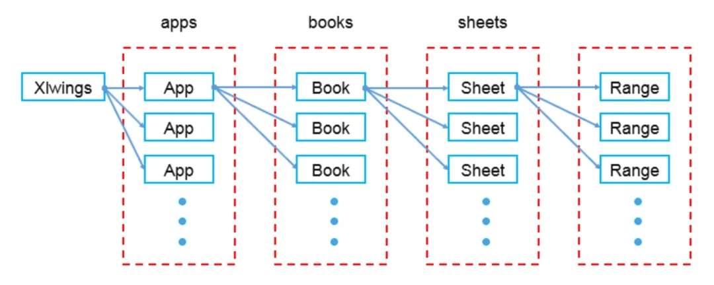

# Xlwings 库

官方文档：<https://docs.xlwings.org/zh_CN/stable/>

参考：<https://blog.csdn.net/whalefall/article/details/102665002>

<https://zhuanlan.zhihu.com/p/82783751>

[python 与 Excel 交互——Xlwings](https://zhuanlan.zhihu.com/p/54003662)

[超全整理｜Python 操作 Excel 库 xlwings 常用操作详解！](https://mp.weixin.qq.com/s?__biz=Mzg5OTU3NjczMQ==&mid=2247510458&idx=1&sn=d8aa358b76d2fa2ceffda352396297ce&source=41)

xlwings 的对象模型和 VBA 的非常相似。如果学习过 VBA，那么 xwings 上手很快。xlwings 依赖电脑上已经安装的 Excel，所以 Excel 能实现的，xlwings 都能实现。

xlwings 的优点：

>* 官方有中文文档。
>* 直接操作 Excel，兼容性高，可视化，配合 Jupyter 调试方便。
>* xlwings 由于使用了与 VBA 一致的 API，因此只要 VBA 有的方法，xlwings 都有。只需学习一套 VBA 的 API，减少学习成本。
>* xlwings 与 Pandas、Numpy 结合良好。

## 安装

最新版的 `pywin32` 支持通过 pip 安装：<https://github.com/mhammond/pywin32>

```sh
# 安装 xlwings 模块
pip install xlwings
# 安装 pywin32
python %USERPROFILE%\scoop\apps\python311\current\Scripts\pywin32_postinstall.py -install
```

安装 pywin32 至用户目录：

```sh
# 安装 pywin32 至用户目录时使用此命令
python %APPDATA%\Python\Python310\Scripts\pywin32_postinstall.py -install -destination "%APPDATA%\Python\Python310\site-packages"
```

## 核心

对 `xlwings` 的核心理解就在于下面这张图：



示例：

```python
# 导入模块
import xlwings as xw

# 默认 visible=None 保持原来的设定，add_book=True，会创建一个新的 [工作簿 1]，可以通过 app.books['工作簿 1'] 获取
# 受环境语言影响，英文系统下默认新建的工作簿名称为 ['Book1']。
# 因此建议手动创建工作簿
with xw.App(visible=False, add_book=False) as app:
    book1 = app.books.add()  # 中文环境下，手动创建的工作簿名称也为：[工作簿 1]
    book2 = app.books.open('test.xlsx')  # 打开一个 Excel 文件
# 使用上下文管理，this will make sure that the Excel instance is closed and cleaned up again properly
# 仅会自动关闭 App 对象，并不会自动关闭 book 对象
```

## 技巧

```python
# 按列插入：A2:A5 分别写入 5,6,7,8
# 你可能会想
sht.range('a2:a5').value = [5,6,7,8]
# 但是你会发现 xlwings 还是会按行处理的，上面一行等同于
sht.range('a2').value = [5,6,7,8]
# 正确语法：
sht.range('a2').options(transpose=True).value = [5,6,7,8]
# 既然默认的是按行写入，我们就把它倒过来嘛（transpose），单词要打对，如果你打错单词，它不会报错，而会按默认的行来写入（别问我怎么知道的）
# 我们输入信息的时候往往不只是写入一行或一列，
# 多行输入就要用二维列表了：
sht.range('a6').expand('table').value = [['a','b','c'],['d','e','f'],['g','h','i']]
# 说完了写入就该讲读取了，记住了写入，读取就简单了
# 读取 A1:D4（直接填入单元格范围就行了）

print(sht.range('a1:d4').value)
# 返回的值是列表形式，多行多列为二维列表，但有一点要注意，返回的数值默认是浮点数

a = sht.range('a1:d1').value
print(a)
for i in a:
  print(i)
  print(type(i))
```

## xlwings 实操

```python
# 默认打开 excel 软件是可见的，如果想要隐藏，需要先设置 visible=False。
app = xw.App(visible=True, add_book=False)
# 关闭警告信息，建议调试阶段不要这样设置。
app.display_alerts=False
# 关闭屏幕更新
app.screen_updating=False

# 建立 excel 表连接
# App.books.open 方式打开可以控制在一个 excel 窗口，Book 方式则会打开多个窗口。
wb = app.books.open("test.xlsx")  # 配合上面一条，隐藏 excel 界面
wb = xw.Book("test.xlsx")  # 连接 excel 文件，默认显示 excel 界面
# 创建一个工作簿，不接受参数，保存时选择路径。
wb = app.books.add()
# 实例化工作表对象
sht = wb.sheets["sheet1"]
sht = wb.sheets[0]
sht = wb.sheets.active
# 返回工作表绝对路径
wb.fullname
# 返回工作簿的名字
sht.name
# 在单元格中写入数据
sht.range('A1').value = "xlwings"
# 保存工作簿
wb.save('test_save.xlsx')

# sht.used_range 工作表中用过的区域
# 如果整张表为空，则返回 A1 单元格
# 关于 used_range 的范围判定，我截取了网上的一段解释：
# UsedRange 属性返回工作表中所有已使用范围的单元格区域，而不管该区域数据间是否有空行或空格。
# 特别注意：UsedRange 属性返回工作表中所有已使用范围的单元格区域是指：
# 单元格中有数值、公式、单元格格式化设置（例如：单元格字体设置、边框设置等等）
sht.used_range
 # 获取数据范围方法一
sht.used_range.shape  # 返回包含行列的元祖：(行数，列数)
[out](81, 8)
# 方法二
nrow = sht.api.UsedRange.Rows.count
ncol = sht.api.UsedRange.Columns.count
# 返回单元格内的数组公式
sht.range('A6:A10').formula_array
# 返回单元格内的公式
sht.range('A6').formula
# 读取单元格内容
sht.range('A1').value
# 清除单元格内容和格式
sht.range('A1').clear()
# 获取单元格的列标
sht.range('A1').column
# 获取单元格的行标
sht.range('A1').row
# 获取单元格的行高
sht.range('A1').row_height
# 获取单元格的列宽
sht.range('A1').column_width
# 列宽自适应
sht.range('A1').columns.autofit()
# 行高自适应
sht.range('A1').rows.autofit()
# 给单元格上背景色，传入 RGB 值
sht.range('A1').color = (34,139,34)
# 获取单元格颜色，RGB 值
sht.range('A1').color
# 清除单元格颜色
sht.range('A1').color = None
# 输入公式，相应单元格会出现计算结果
sht.range('A1').formula='=SUM(B6:B7)'
# 获取单元格公式
sht.range('A1').formula_array
# 在单元格中写入批量数据，只需要指定起始单元格位置即可
sht.range('A2').value = [['Foo 1', 'Foo 2', 'Foo 3'], [10.0, 20.0, 30.0]]
# 读取表中批量数据，使用 expand() 方法
sht.range('A2').expand().value
# 其实你也可以不指定工作表的地址，直接与电脑里的活动表格进行交互
# 写入
xw.Range("E1").value = "xlwings"  # 读取
xw.Range("E1").value
```
