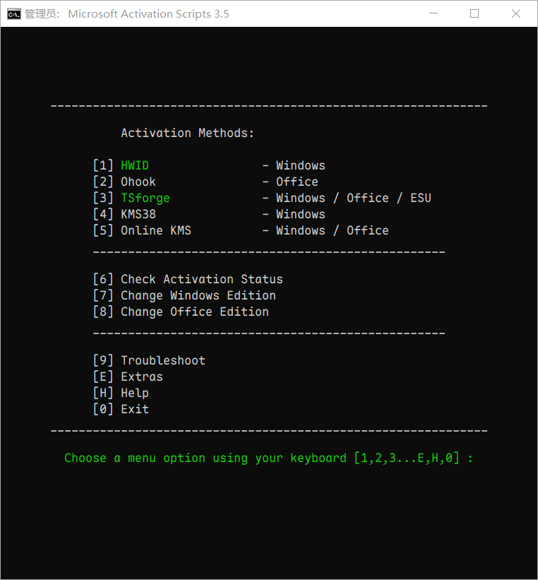

# Windows 11 安装指南

## Windows11 镜像信息

下载地址：

>Windows 11 Enterprise LTSC 2024 (x64) - DVD (Chinese-Simplified)
>
>文件：zh-cn_windows_11_enterprise_ltsc_2024_x64_dvd_cff9cd2d.iso
>
>大小：4.92GB
>
>MD5：1A13ADE0178082432F90DF951A88842F
>
>SHA1：AB7CD740E6CD495A69E3A90FCD7FB56BA0C5C62E
>
>SHA256：2CB21649590C8CF770CD93556596DFF4FD800F24D267A9BE9D9CE0EE9E03F5AC
>
>`magnet:?xt=urn:btih:b84e74c1dbcc88a02c5b24a6f84383f353a2e1dd&dn=zh-cn_windows_11_enterprise_ltsc_2024_x64_dvd_cff9cd2d.iso&xl=5287520256`
>
>`ed2k://|file|zh-cn_windows_11_enterprise_ltsc_2024_x64_dvd_cff9cd2d.iso|5287520256|D6E4FE0BA5FD8A2F22FC9C0326481791|/`

## KEY信息

|           名称           |      代称      |              KEY              |
| :----------------------: | :------------: | :---------------------------: |
| IoT Enterprise LTSC 2024 | IoTEnterpriseS | KBN8V-HFGQ4-MGXVD-347P6-PDQGT |
|   Enterprise LTSC 2024   |  EnterpriseS   | M7XTQ-FN8P6-TTKYV-9D4CC-J462D |

## 将系统转换为 IoT 版

MAS 脚本中也有此功能。

```sh
# 管理员权限运行命令提示符
# 导入 Windows 11 IoT Enterprise LTSC 2024 版本的密钥
cscript //Nologo %windir%\system32\slmgr.vbs /ipk KBN8V-HFGQ4-MGXVD-347P6-PDQGT
# 查看系统版本信息（管理员权限）
Dism /Online /Get-CurrentEdition
```

## 一键激活

开源激活工具： <https://massgrave.dev>  |  [GitHub 仓库](https://github.com/massgravel/Microsoft-Activation-Scripts) ，包含 下载 windows 的地址。

```powershell
# PowerShell 下运行
irm https://get.activated.win | iex
```

查看激活信息

```sh
# 命令提示符或 Powershell 运行都可以
cscript //Nologo %windir%\system32\slmgr.vbs /xpr
```

如果不行就下在最新的脚本手动运行，[最新脚本下载地址1](https://github.com/massgravel/Microsoft-Activation-Scripts/archive/refs/heads/master.zip)   [最新脚本下载地址2](https://git.activated.win/massgrave/Microsoft-Activation-Scripts/archive/master.zip) ，运行  `All-In-One-Version/MAS_AIO.cmd` 。



## 激活方式对比

参考：<https://www.mintimate.cn/2023/12/26/whatOhook/>

<https://massgrave.dev/chart>

|  激活方式  |        激活范围        | 激活有效期 | 备注                                     |
| :--------: | :--------------------: | :--------: | ---------------------------------------- |
|    HWID    |     Windows 10-11      | Permanent  | 数字权利永久激活，需联网，重装系统不失效 |
|   Ohook    |         Office         | Permanent  | 直接激活，无须联网，重装系统失效         |
|  TSforge   | Windows / ESU / Office | Permanent  |                                          |
|   KMS38    |     Windows 10-11      | Year 2038  | 直接激活，无须联网                       |
| Online KMS |    Windows / Office    |  180 Days  | 需连接KMS服务器激活，需联网，会自动续期  |

HWID：HWID（HWID Activation），也就是我们平时所说的数字权利激活。本质上它也是一种软件密钥管理的一种形式，通过在安装软件时收集计算机的硬件信息(主要是主板信息)，并将这些硬件信息与软件密钥绑定，在联网时候，请求远程服务器判断是否激活当前设备。在电脑激活后，就是绑定主板信息的，**如果你再次重装系统，只要你的主板不更换，当Windows连接网络后，从微软服务器上获取信息，判断你的电脑是否已经激活**。

Ohook：仅支持 Office ，通过劫持的方式，直接激活；在内网也可以进行激活，只要你不重装Office、重装系统，那么它就是一直保持激活状态。

KMS38：它既不需要搭建KMS服务器，也不需要联网，甚至不需要设置KMS的IP地址。**只适用于Windows10/11所有版本，以及Windows Server(Build 14393以上)，不适用于Office**。

KMS：传统的方法，每 180 天联网续租。
