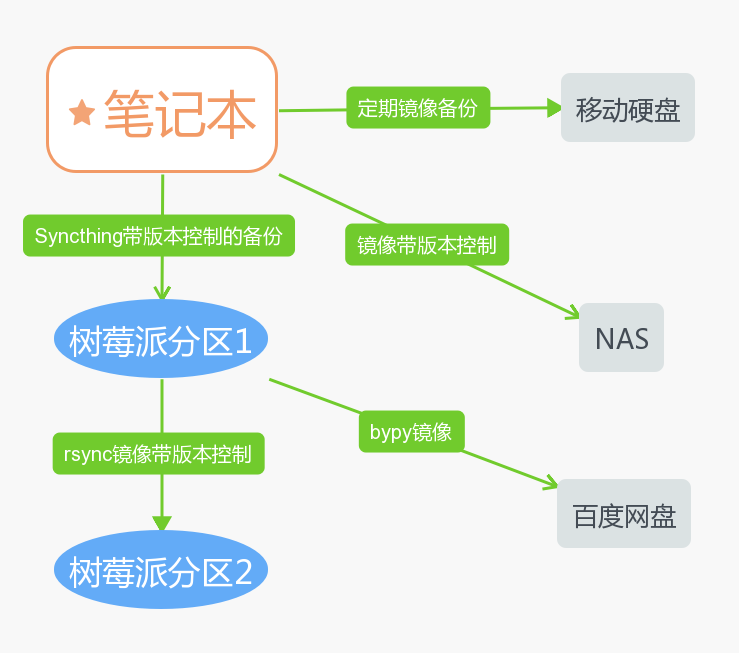

# 备份策略

总结：

- 备份 321 原则
- 一份数据，至少要有 2 个副本，也就是狡兔三窟，至少得有 3 窟，这是基本保证。
- 加密：日常使用的笔记本、移动硬盘得有加密措施。
- 备份的位置有：Home、工作、Backup 三个目录，这三个目录里不能有明文显示的敏感信息（密码、身份信息等）。

TODO：

- 检测到 NAS 硬盘问题、定时任务出错后，发送邮件给自己
- NAS 定期快照备份

## 思维导图

总体思路：

今天看了 [从 GITLAB 误删除数据库想到的](https://coolshell.cn/articles/17680.html) 这篇文章，深有感触，觉得有必要写篇文章总结一下自己的备份策略。

上次笔记本、硬盘丢了之后，庆幸自己做了 2 个独立完整的备份，所以即使移动硬盘中的备份丢失了，在家里和云上仍有一个完整的备份。但这只是侥幸，以后如果再有其它的状况发生，还能保证数据的完整么？

我总结了 3 点：

- 备份策略
- 紧急处理
- 恢复策略

## 加密措施

鉴于数据丢失后的隐私风险，有必要对数据进行强加密。

- 移动硬盘采用全盘加密，使用 Windows 自带的 Bitlocker。由于 bitlocker 不开源，考虑使用 VeraCrypt
- 重要数据采用 VeraCrypt 加密
- 不太重要数据采用加密压缩文档方法，优先使用 7zip

Gitlab 的事故告诉我们，光有备份是不够的，必须要有一套包含备份、测试、恢复的完整方案，甚至有必要定期预演一遍。==

## 风险评估

- 盗窃、丢失
- 火灾、洪水、地震等灾害
- 误操作。比如误删除、误操作导致数据损坏等。
- 设备损坏。包括电脑故障、硬盘故障等。

上次经历了盗窃，但火灾、设备损坏的风险依然存在。因此数据要备份至不同的地点，尽量降低风险。

风险化解：电脑上意外删除、破坏，没有发现，直接镜像至移动硬盘里，导致数据丢失。

解决方法：

> 除了移动硬盘采用镜像备份，其它的备份策略均采用阶段版本控制的备份，或是增量备份。保证源数据即使删除，也能找回。

## 最佳实践

考虑可能存在风险，接下来就是备份的策略了。

- 实时远程 NAS 备份。版本控制，保持半年的历史版本。要求有紧急断网功能，防止电脑丢失后，数据丢失。
- 云端备份，增量备份。至少每周备份一次。
- 移动硬盘备份，镜像备份。每周备份一次。注意保管好移动硬盘。
- 补充备份。代码使用 GitHub 托管，用脚本实现定期打包备份重要的资料、数据。

### 实时远程 NAS 备份

使用 树莓派 + syncthing 方案，未来考虑购买群辉 NAS。

优点：只要联网，就能实现实时备份，而且带版本控制功能。

风险：设备 7*24 在线，硬盘有损坏的风险，因此应做好硬盘检查，有问题及时发现。

### 云端备份

使用 bypy 备份至百度网盘。

优点：下载可以使用 pandownload

缺点：同步文件过多的话，速度会很慢

### 移动硬盘备份

最笨的方法，却也是一个选择。使用 windows 下的 robocopy 方案。

优点：备份速度超快，相比 FreeFileSync，Robocopy 首次运行之后，以后运行只对比不同的文件，所以同步速度极快。

缺点：不方便，存在丢失、损坏的风险。

## 紧急处理

电脑丢失、被盗，第一时间进行处理：

- 关闭 NAS 网络
- 更新 syncthing 的密钥
- 删除 GitHub 的密钥
- 修改云盘的密码
- 修改网络账户的密码

## 恢复策略

优先从 NAS 中恢复数据，因为只有 NAS 是实时备份，云盘也可以实现实时备份的效果，但是是增量备份，恢复比较麻烦，很多无用的文件、目录。

恢复方案：

NAS：更换 syncthign 密钥后，可以在局域网内使用 syncthing 将数剧从 NAS 中单向恢复过来。

移动硬盘：同样使用 robocopy，反过来将移动硬盘的数据镜像至电脑中。

云盘：云盘作为最后的保险。
