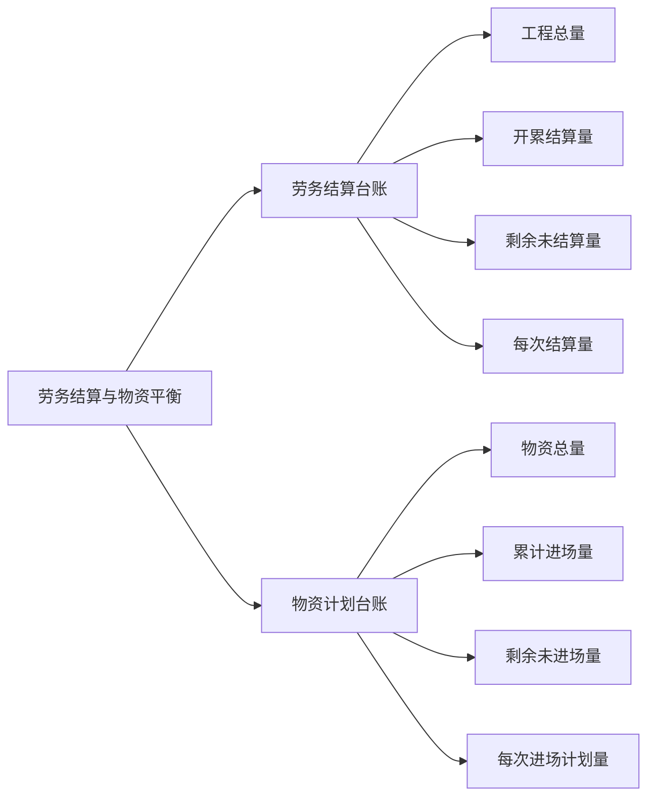

# 劳务结算与物资平衡

根据公司要求：

> 劳务结算的物资消耗不能超过物资进场总量。
>
> 物资进场量不能超过合同量。

因此每个工长需要做劳务结算台账、物资计划台账，以此控制劳务结算与物资计划。

要求：

1. 工程总量 与 物资总量 一致（考虑损耗）。
2. 开累结算量 ≤ 物资累计进场量。
3. 剩余未结算量不能为负，不允许超结工程总量。
4. 剩余未进场量不能为负，不允许进场物资超合同，否则需要增补物资合同。

注意：

1. 工长提报的 `物资进场计划单` 要与 `物资实际进场量` 匹配。

物资进场会有各种情况，导致物资进场计划单的量与 实际进场量不一致，需要及时更新台账，将其更新为实际进场量。

> 物资进场计划单提报后，厂家部分型号缺货，因此实际仅到场了部分材料。随着时间推移，厂家有可能忘记送剩余的部分，或是剩余部分现场不再需要，不需要厂家送货。
>
> 物资进场计划单提报后，厂家根据计算，不定尺材料（无缝钢管、镀锌钢板）实际发货的量与计划单中的量不一致。
>
> 物资进场计划单提报后，厂家刚好要送其它工长提报的材料，就将这次的计划单也一起配货送至现场。

物资进场后，需要清点数量，确保实际量与标称量一致。

>镀锌钢板：物资合同为“平方米”，进场的镀锌钢板标示的是重量，需要与厂家提前确定好计算方式。可以在物资合同中约定好计算方式。
>
>电线、保温材料、钢材等，需要抽查测量单盘电线长度、单卷保温材料面积、单根钢材长度。

## 实践方法

劳务结算台账：为方便查看每次结算是否超出 已进场物资量，可以增加物资名称、规格，便于查看。

物资计划台账：为方便每次提报计划，在物资计划台账上输入本次需要提报的量，一键生成物资进场计划单。

