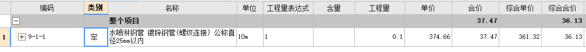
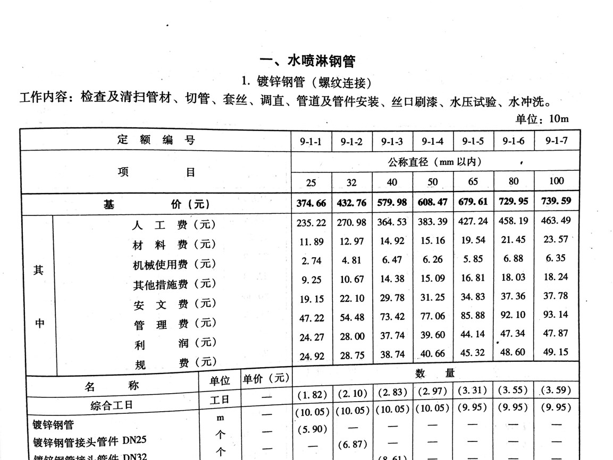

# 商务工作

商务工作贯穿于项目的投标、开工、施工、收尾全阶段。主要工作有商务资料整理（甲方通知单、会议纪要、设计变更、技术核定、现场签证）、商务策划、成本管理、分包合同管理、分包结算管理、商务管理、签证索赔、结算管理。

而降本增效作为商务工作的核心，最能体现商务工作的价值。即通过施工管理、分包管理、结算管理、商务策划等有步骤的方法，以达到降低施工成本、增加工程利润。

商务工作不仅仅是商务人员的工作，它需要项目所有人全员参与，统筹策划，通过管理施工进度、质量、安全、技术、结算、对量各个方面达到最终设定的目标。

商务工作基本分为两个方面，按公司的老话讲就是“开源节流”，基本上对应我们的对内商务管理和对外商务管理。

对内商务管理，重节流，通过我们内部的管理手段、技术手段到达节约成本的目的。对外商务管理则侧重开源，兼顾节流。为什么这样讲？因为只有在策划开的情况下，才能较大程度的增加项目收入，相应增加项目效益；但在当前价格指标比较透明的情况下，开源相对难度较大，而相应减少成本的策划可以相对容易的实施，进而可以达到实际效益增加的目的。

## 预算书

广联达的“新建预算“，共有以下 5 个选项：

应该使用“投标项目“或“单位工程/清单”，不应使用“定额项目”或“单位工程/定额”。原因如下：

根据《豫建设表[2016]24 号》文件中关于我省建筑业“营改增”后计价依据调整的意见，针对《河南省建设工程工程量清单综合单价（2008）》，机械费、企业管理费、安全文明费均需扣除增值。而“定额项目”或“单位工程/定额”在主界面显示的 人材机、费用、综合单价等均为未扣除增值税的金额。因此“定额”法会比“清单“法金额高。

## 单价/综合单价

单价为定额单价（基价），综合单价为根据相关文件调整后的单价。

## 工程量清单

根据《GB50500-2013_建设工程工程量清单计价规范》

全部使用国有资金投资或国有资金投资为主（以下二者简称国有资金投资）的建设工程施工发承包，必须采用工程量清单计价。

建设工程施工发承包造价由分部分项工程费、措施项目费、其他项目费、规费和税金组成。

分部分项工程和措施项目清单应采用综合单价计价。

措施项目清单中的安全文明施工费应按照国家或省级、行业建设主管部门的规定计价，不得作为竞争性费用。

规费和税金应按国家或省级、行业建设主管部门的规定计算，不得作为竞争性费用。
