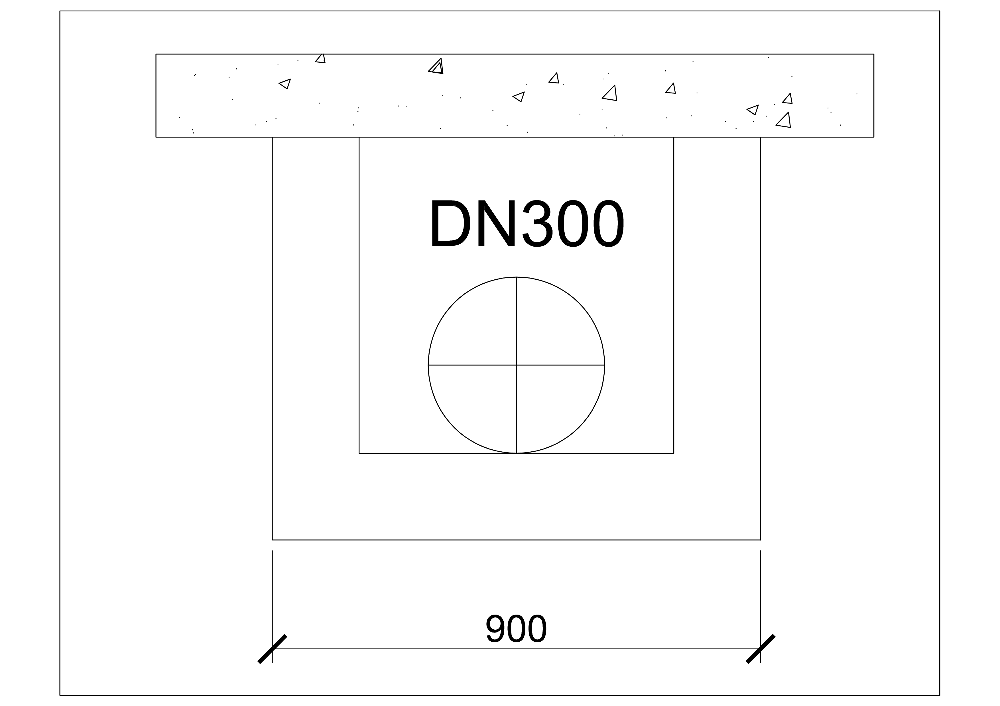
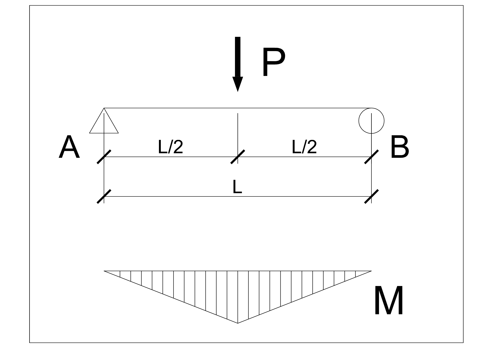
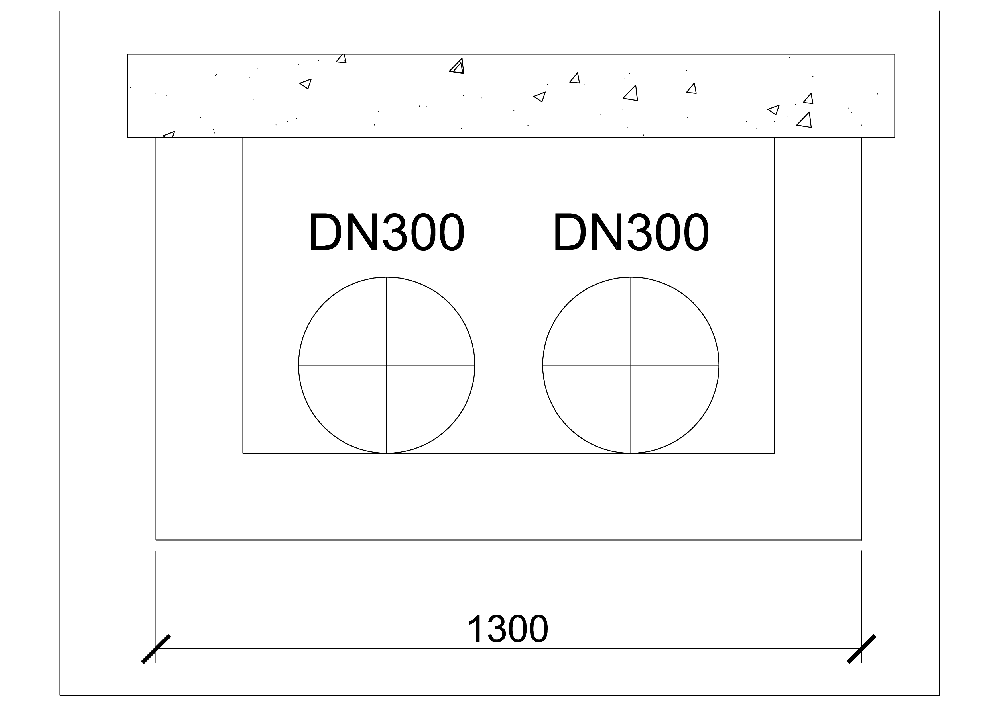
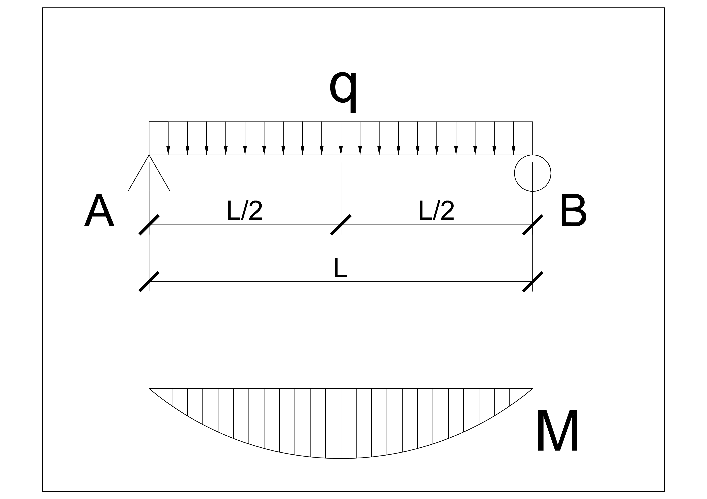

# 民用建筑机电专业综合支吊架选用的问题研究

## 一、现状分析

机电安装的支吊架选用，可参考的规范、图集较多。

有各个专业的施工验收规范、行业规范等：《GB50738-2011 通风与空调工程施工规范》、《GB50243-2016 通风与空调工程施工质量验收规范》、《GB51251-2017 建筑防烟排烟系统技术标准》、《GB50242-2002 建筑给水排水及采暖工程施工质量验收规范》、《GB/T 17116-2018 管道支吊架》、《JGJT 141-2017 通风管道技术规程》。

还有包含动力、暖通空调、给排水等专业的国家图集：《03S402 室内管道支架及吊架》、《05R417-1 室内管道支吊架》、《18R417-2 装配式管道支吊架（含抗震支吊架）》、《16CK208 装配式室内管道支吊架的选用与安装》、《19K112 金属、非金属风管支吊架（含抗震支吊架）》

钢结构相关的书籍、规范：《钢结构 (第三版)》戴国欣主编、《GB 50017-2017 钢结构设计标准》、《GB 50068-2018 建筑结构可靠性设计统一标准》

与机电安装相关的书籍则是更多，这么多规范、图集、书籍，难免有冲突的地方，一般来说，对于建筑机电施工，验收规范是最权威的规范（暖通还有一个施工规范）。

《GB50738-2011 通风与空调工程施工规范》的第 7 章“支吊架支座与安装”，列出了水平安装金属矩形风管的吊架型钢最小规格、水平管道支吊架的型钢最小规格（没有金属风管横担的规格）。

下面就以风管、水管的支吊架为例说明规范、图集、书籍中的各种问题。

### 1.1 结构设计方法不一致

根据《GB 50068-2018 建筑结构可靠性设计统一标准》，建筑结构设计宜采用以概率理论为基础、以分项系数表达的极限状态设计方法；当缺乏统计资料时，建筑结构设计可根据可靠的工程经验或必要的试验研究进行，也可采用容许应力或单一安全系数等经验方法进行。但根据《材料力学》 [邓宗白，陶阳，吴永端 编著] 2013 年，仍推荐使用了许用应力、安全系数等经验方法，明显已经不太合适。

根据《GBT 17116.1-2018 管道支吊架 第 1 部分：技术规范》的附录 A，钢板的许用应力 [σ]=105MPa=105N/mm2，即 n=215/105=2。根据“表 7 螺纹吊杆最大使用荷载”，M10 的螺纹吊杆最大使用荷载为 3.9kN。

《19K112 金属、非金属风管支吊架（含抗震支吊架）》中第 7 页，对吊杆通丝的选用，根据轴心受力构件的强度计算，设计拉力是标准拉力的 1.35 倍，即荷载分项系数取 1.35。根据图集中的示例计算，M10 通丝螺杆的最大使用荷载为 6.1kN。

### 1.2 规范中的选型不合理

以 DN300 的保温水管为例，横担长度为 0.6m，查表横担至少为 12.6 号槽钢。但经过受力核算，**则需要 5 号槽钢即可**。规范中的选型明显偏大。

### 1.3 部分图集中的设计参数过旧

钢结构验算应以《GB 50017-2017 钢结构设计标准》为准，支吊架验算时根据工程实践，适当考虑一定的余量。

角钢、槽钢、工字钢、H 型钢等型钢的截面特性应以最新的《GB/T 706-2016 热轧型钢》、《GB/T 11263-2017 热轧 H 型钢和剖分 T 型钢》为准。

荷载分项系数应以《GB 50068-2018 建筑结构可靠性设计统一标准》为准。根据此规范第 8.2 项条文规定，建筑结构的作用分项系数，应按表 8.2.9 采用，即当作用效应对承载力不利时，永久作用分项系数取γG=1.3（部分图集取值为 1.35）；可变作用分项系数取 γQ=1.5。

### 1.4 规范、图集中无法指导综合支架的选型

规范、图集中仅提供了单个水管、风管情况下的型钢选型，但是对于共建项目，地下空间、走道等位置，水管、风管、桥架密集，因此必须考虑使用综合支架，因此需要一个简便快捷的选用综合支架形式、规格的方法。

## 二、设计依据

### 2.1 计算公式

**构件的强度极限值计算公式：**

根据权威的《GB 50017-2017 钢结构设计标准》：

在主平面内受弯的实腹式构件，其受弯强度计算公式：
$$
\frac{M_x}{γ_xW_{nx}}+\frac{M_y}{γ_yW_{ny}}≤f
$$

轴心受拉构件，除采用高强度螺栓摩擦型连接者外，其截面强度的计算公式：

$$
σ=\frac{N}{An}≤f
$$

**实际应用中构件的强度计算公式：**

《钢结构设计标准》规范中的计算公式都是计算的钢材极限值，在机电管道支架及吊架的实际计算中，一般会考虑一定的余量，因此参考《03S402 室内管道支架及吊架》，使用下面的公式：

支吊架横担受弯强度计算公式：
$$
\frac{1.5M_x}{γ_xW_{nx}}+\frac{1.5M_y}{γ_yW_{ny}}≤0.85f
$$

吊架截面强度的计算公式：

$$
σ=\frac{1.5N}{0.85An}≤f
$$

### 2.2 设计参考

>《GB 50017-2017 钢结构设计标准》
>
>《GB/T 706-2016 热轧型钢》
>
>《钢结构 (第三版)》戴国欣主编
>
>**设计参数：**
>
>x 轴塑性发展系数，对于工字型截面、槽钢、箱型截面 $$γ_x=1.05$$。
>
>根据《GB 50017-2017 钢结构设计标准》，Q235 钢厚度或直径小于等于 16mm 时，抗拉、抗压、抗弯 `f=215N/mm2`，抗剪 `fv=125N/mm2`。
>
>支吊架横梁挠度控制： `L/250`。
>
>对于工程用结构钢，钢的弹性模量  $E=206000N/mm^2$。
>
>恒荷载分项系数取  $$γ_G=1.3$$。

根据《钢结构 (第三版)》第 5.6 节“型钢梁的设计”，单向弯曲型钢梁的设计比较简单，通常先按抗弯强度（当梁的整体稳定性有保证时）或整体稳定（当需要计算整体稳定时）求出需要的截面模量：

$$
W_{nx}=\frac{M_{max}}{γ_xf}
$$

或

$$
W_x=\frac{M_{max}}{φ_bf}
$$

式中的整体稳定系数 $$φ_b$$ 可估计假定。由截面模量选择合适的型钢（一般为 H 型钢或普通工字钢），然后验算其他项目。由于型钢截面的翼缘和腹板厚度较大，不必验算局部稳定；端部无大的削弱时，也不必验算剪应力。而局部压力也只在有较大集中荷载或支座反力处才验算。

综上，一般来说机电安装使用的支吊架形式可以使用简支梁模型，可以先根据抗弯强度求出需要的惯性模量 Wx 的值，然后选择出最小的型钢，再验算梁的挠度、梁的整体稳定性，如果全部符合要求，则选型成功，否则加大一号型钢，继续验算。

## 三、支架选型示例

### 3.1 集中荷载受力的支架选型

支架长度 L=0.9m，一根 DN300 的水管，支架间距 4.5m，选择合适的横担形式。

根据支架形式，单跨梁形式为简支梁，荷载受力形式为中心集中荷载，受力分析如图：

DN300 水管满水状态的米重为 203kg/m，荷载标准值为：
$$
P_k=203*4.5*9.8=8952.3N
$$
荷载设计值为（荷载分项系数取 1.35）：
$$
P=P_k*1.35=12085.6N
$$
1）、横梁的强度验算

> 中心集中荷载的最大弯矩计算公式：
> $$
> M_x=\frac{qL^2}{4}=\frac{(\frac{P}{L})L^2}{4}=\frac{PL}{4}
> $$

最大弯矩设计值为：
$$
M_x=\frac{PL}{4}=\frac{12085.6*0.9}{4}=2.72kN·m=2.72*10^6N·mm
$$
>单个方向受力的强度验算公式：
>$$
>\frac{1.5M_x}{γ_xW_{nx}}≤0.85f
>$$

根据抗弯强度选择截面，需要的截面模量 $W_x$ 为：
$$
W_{nx}≥\frac{1.5M_x}{0.85γ_xf}=\frac{1.85*2.72*10^6}{0.85*1.05*215}=21.26*10^3mm^3
$$

> 式中：Q235B 钢材的抗弯设计值 $f=215N/mm^2$。
>
> γx —— x 轴塑性发展系数，对于工字型截面、槽钢、箱型截面 `γx=1.05`。

选用槽钢 [8（$W_x=25.3*10^3mm^3$，$I_x=101*10^4mm^4$ ），跨中无孔眼削弱，此 Wx 大于需要的 $21.26cm^3$ ，梁的抗弯强度已足够。

由于型钢的腹板较厚，一般不必验算抗剪强度。

2）、横梁的刚度验算

跨中一个集中荷载下的最大挠度在梁的跨中，最大挠度由荷载标准值产生（不考虑荷载分项系数和动力系数），其值为：
$$
Y_{max}=\frac{P_kL^3}{48EI_x}=\frac{8952.3*900^3}{48*206000*51.2*10^4}=1.289mm<\frac{L}{250}=\frac{900}{250}=3.6mm
$$

符合要求。

3）、横梁的整体稳定性验算

槽钢 [8 的参数：h=80mm，b=43mm，t=8mm。

轧制槽钢简支梁的整体稳定系数的值为（参考《钢结构设计标准 GB50017-2017》的附录 C）：
$$
φ_b=\frac{570bt}{l_1h}·ε_k^2=\frac{570*43*8}{900*80}*1^2=2.72>0.6
$$

> 式中：式中：h、b、t——槽钢截面的高度、翼缘宽度和平均厚度。
>
> $l_1$ —— 次梁间距。简支梁没有次梁，l1 就等于梁的跨度 L。
>
> $ε_k$ —— 钢号修正系数。根据《钢结构设计标准 GB50017-2017》的条文说明 2.2，钢材牌号为 Q235 时，εk=1。

φb 大于 0.6 时，使用φb ' 替代φb。
$$
φ_b'=1.07-\frac{0.282}{φ_b}=1.07-\frac{0.282}{2.72}=0.97≤1.0
$$
验算整体稳定性：
$$
σ=\frac{M_x}{φ_b'·W_x}=\frac{2.72*10^6}{0.97*16.3*10^3}=172.03N/mm^2<f=215N/mm^2
$$
> 式中：
>
> Mx ——  绕强轴作用的最大弯矩设计值 (N·mm)；
>
> Wx ——  按受压最大纤维确定的梁毛截面模量，当截面板件宽厚比等级为 S1 级、S2 级、S3 级或 S4 级时，应取全截面模量；当截面板件宽厚比等级为 S5 级时，应取有效截面模量，均匀受压翼缘有效外伸宽度可取 15εk，腹板有效截面可按本标准第 8.4.2 条的规定采用 (mm3)；
>
> φb ——  梁的整体稳定性系数，应按本标准附录 C 确定。
>
> φb' ——   整体稳定系数 φb 是按弹性稳定理论求得的。研究证明，当求得的 φb 大于 0.6 时，梁已进入非弹性工作阶段，整体稳定临界应力有明显的降低，必须对φb 进行修正。当梁的整体稳定承载力不足时，可采用加大梁的截面尺寸或增加侧向支撑的办法予以解决，前一种办法中尤其是**增大受压翼缘的宽度**最有效。

稳定性验算通过。

**结论：应至少使用槽钢 [8 作为横担。**

吊杆按轴心受拉构件计算，吊杆净面积需满足：
$$
A_n≥\frac{1.5N}{0.85f}=\frac{1.5P/2}{0.85f}=\frac{1.5*12085.6/2}{0.85*215}=49.6mm^2
$$

> 式中：An ——  吊杆净截面积（$mm^2$）
>
> N —— 吊杆拉力设计值（N）
>
> f —— 抗拉强度设计值 (MPa)

槽钢 [8 的截面积为 $1024mm^2$ ，满足要求。

实际施工中为了美观，门型吊架一般吊杆与横担尺寸相同，而角钢、槽钢的横截面积很容易满足强度要求，因此一般情况下可以不予计算。

### 3.2 均布荷载受力的支架选型

支架长度 L=1.3m，2 根 DN300 的水管，支架间距 4.5m，选择合适的横担形式。

根据支架形式，单跨梁形式为简支梁，荷载受力形式为均布荷载，受力分析如图：

DN300 水管满水状态的米重为 203kg/m，线荷载标准值为：
$$
q_k=\frac{203*4.5*9.8}{1.3}*2=13772.8N/m=13.77N/mm
$$
荷载设计值为（荷载分项系数取 1.35）：
$$
q=q_k*1.35=18.59N/mm
$$

> x 轴塑性发展系数 `γx=1.05`。Q235B 钢材的抗弯设计值 $f=215N/mm^2$。对于工程用结构钢，钢的弹性模量 $E=206000N/mm^2$。

1）、横梁的强度验算

最大弯矩设计值为：
$$
M_x=\frac{qL^2}{8}=\frac{18.59*1.3^2}{8}=3.93kN·m=3.93*10^6N·mm
$$
根据抗弯强度选择截面，需要的截面模量为：
$$
W_{nx}=\frac{1.5M_x}{0.85γ_xf}=\frac{1.5*3.93*10^6}{0.85*1.05*215}=30.72*10^3mm^3
$$
选用槽钢 [10（$W_x=39.7*10^3mm^3$，$I_x=198*10^4mm^4$ ），跨中无孔眼削弱，惯性模数 Wx 大于需要的 $30.72cm^3$ ，梁的抗弯强度满足。

由于型钢的腹板较厚，一般不必验算抗剪强度。

2）、横梁的挠度验算

跨中一个集中荷载下的最大挠度在梁的跨中，其计算公式：
$$
Y_{max}=\frac{5q_kL^4}{384EI_x}=\frac{5*13.77*1300^4}{384*206000*101*10^4}=2.46mm<\frac{L}{250}=\frac{1300}{250}=5.2mm
$$

符合要求。

2）、横梁的整体稳定性验算

槽钢 [10 的参数：h=100mm，b=48mm，t=8.5mm，轧制槽钢简支梁的整体稳定系数的值为：

$$
φ_b=\frac{570bt}{l_1h}·ε_k^2=\frac{570*48*8.5}{1300*100}*1^2=1.79>0.6
$$

φb 大于 0.6 时，使用φb ' 替代φb。修正后：
$$
φ_b'=1.07-\frac{0.282}{φ_b}=1.07-\frac{0.282}{1.79}=0.91≤1.0
$$
验算整体稳定性：
$$
σ=\frac{M_x}{φ_b'·W_x}=\frac{3.93*10^6}{0.91*39.7*10^3}=108.78N/mm^2<f=215N/mm^2
$$
整体稳定性验证通过。

**结论：应至少使用槽钢 [10 作为横担。**
