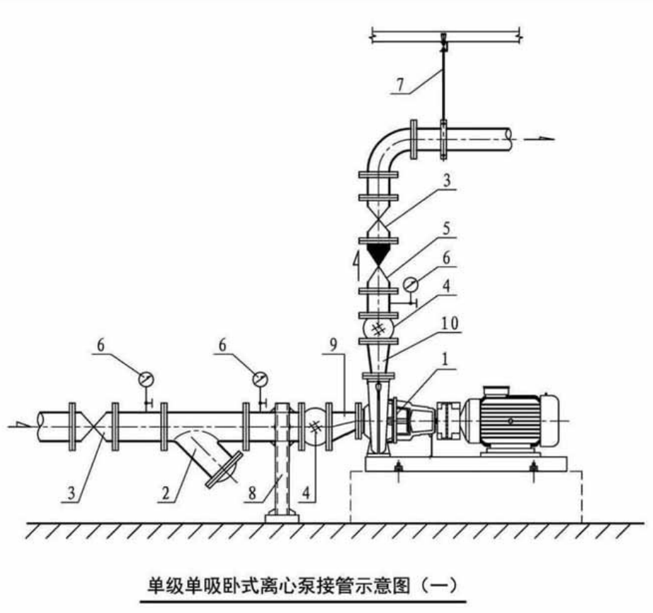
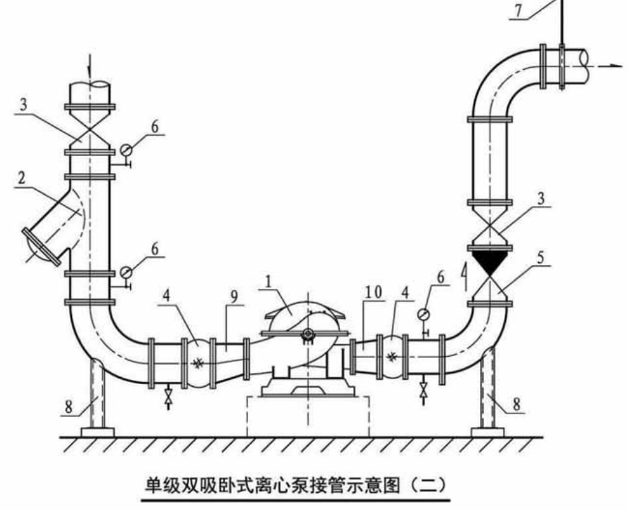
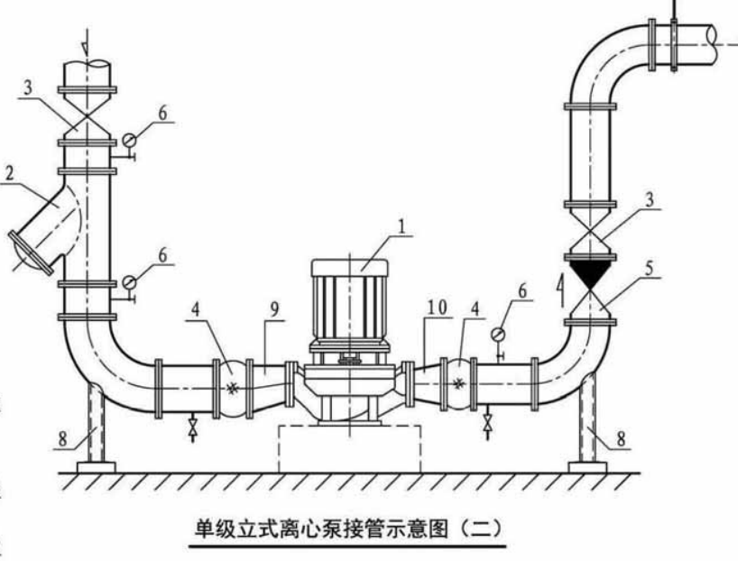

# 水泵

## 参考规范图集

《GBT 16907-2014 离心泵技术条件 (Ⅰ类)》

《GBT 5656-2008 离心泵 技术条件 (Ⅱ类)》

《GBT 5657-2013 离心泵技术条件 (Ⅲ类)》

《GBT7021-2019 离心泵名词术语》

## 笔记

空调水泵介质一般是清水，因此适用最低要求的规范《GBT 5657-2013 离心泵技术条件 (Ⅲ类)》即可。

空调水泵一般采用：

* 单级单吸卧式离心水泵。接管方式为直进上出。
* 单级双吸卧式离心水泵。接管方式为侧进侧出。
* 单级立式离心水泵。接管方式为侧进侧出。

水泵的样式

单吸泵是指叶轮只有一端进水，双吸泵是叶轮两端均进水，即两个进口。口径相同两者流量相差不大，我们根据现场使用要求选择 2 个进口还是一个进口。双吸泵的口径一般较大，在工业上运用的比较多。

首先，双吸泵主要是介质在叶轮两端吸入，叶轮两侧各有一个密封腔。而不是泵有两个吸入口。双吸泵的抗气蚀能力比单吸泵要强。由于介质在叶轮两端吸入，会形成水力对称，这样双吸泵的平衡轴向推力作用比单吸泵要好，运行起来更平稳。而且介质的流速较低，叶轮不容易产生气蚀现象。但是双吸泵比单吸泵要多一个密封腔，所以其成本相对较高。

其次，双吸泵更适合输送大流量，要求运行平稳的工况。当泵的流量要求很高时，如果是单吸泵则要有很大的泵入口和出口口径，同时，转速不能太大，需稳定在 1450rmp 左右。若采用双吸泵，泵的尺寸和重量都可以相对减小，转速也可以提高，容积效率增加。

单级单吸离心泵一般流量范围在 10~1000m3/h，实际使用中，一般流量大于 900m3/h 就最好采用双吸泵。
