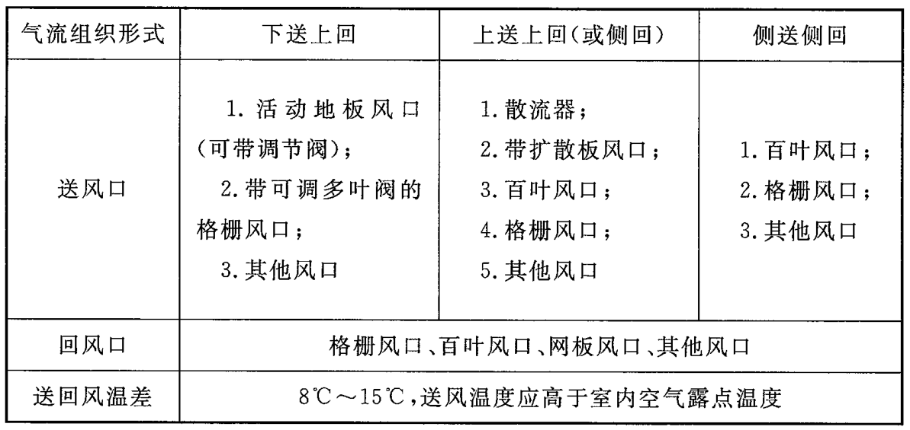

# 工艺阀门

## 笔记

参考：《07K506 多联式空调机系统设计与施工安装》

* 2 台室外机间距不得小于 0.5m。
* 室内机接管处的天花板上开 500x500mm 的检修孔，需保证维修人员有足够操作空间。
* 嵌入式室内机凝结水排放通常采用机械强制排水，及自带冷凝水提升泵。
* 暗装式室内机有自然排水和机械强制排水两种排水方式，根据实际情况选择是否配置冷凝水提升泵。

## 精密空调

厂家要求生产周期 30 天，需提前 30 天下单。安装周期 25~30 天。

1. 精密空调室内机静电地板下做拦水坝（拦水坝边长应大于空调尺寸 0.6m 以上，高度 10cm），防止空调漏水流到其它区域，需要设置地漏排水或其他排水措施，避免积水。
2. 空调承重架按空调尺寸定做高度与静电地板一致，承重支架需结合静电地板设置，需由甲方完成支架安装。
3. 空调主电缆应放到空调最远端位置并预留 2 米。
4. 空调加湿给水管宜预留至室内机附近，预留管径不应小于 DN20。（给排水图纸上预留的为 DN15，与厂家沟通满足要求。）
5. 外机水泥台应大于室外机尺寸长宽各 40 公分。高度 300mm。
6. 精密空调的送风形式，应参考《GB50174-2017 数据中心设计规范》。

主机房空调系统的气流组织形式应根据电子信息设备本身的冷却方式、设备布置方式、设备散热量、室内风速、防尘和建筑条件综合确定，并应采用计算流体动力学对主机房气流组织进行模拟和验证。当电子信息设备对气流组织形式未提出特殊要求时，主机房气流组织形式、风口及送回风温差可按表 7.3.1 选用。

表 7.3.1 主机房气流组织形式、风口及送回风温差

气流组织形式选用的原则是：有利于电子信息设备的散热，建筑条件能够满足设备安装要求。电子信息设备的冷却方式有风冷、水冷等，风冷有上部进风、下部进风、前进风后排风等。影响气流组织形式的因素还有建筑条件，包括层高、面积等。因此，气流组织形式应根据设备对空调系统的要求，结合建筑条件综合考虑。采用 CFD 气流模拟方法对主机房气流组织进行验证，可以事先发现问题，减少局部热点的发生，保证设计质量。本条推荐了主机房常用的气流组织形式、送回风口的形式以及相应的送回风温差。

对单台机柜发热量大于 4kW 的主机房，宜采用活动地板下送风 (上回风)、行间制冷空调前送风 (后回风) 等方式，并宜采取冷热通道隔离措施。

从节能的角度出发，机柜间采用封闭通道的气流组织方式，可以提高空调利用率。采用水平送风的行间制冷空调进行冷却，可以降低风阻。随着电子信息技术的发展，机柜的容量不断提高，设备的发热量将随容量的增加而加大，为了保证电子信息系统的正常运行，对设备的降温也将出现多种方式，各种方式之间可以相互补充。

在有人操作的机房内，送风气流不宜直对工作人员。
