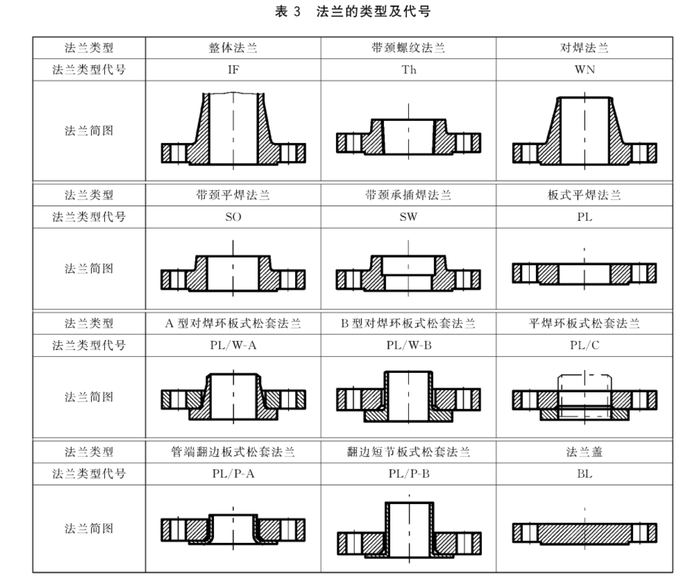
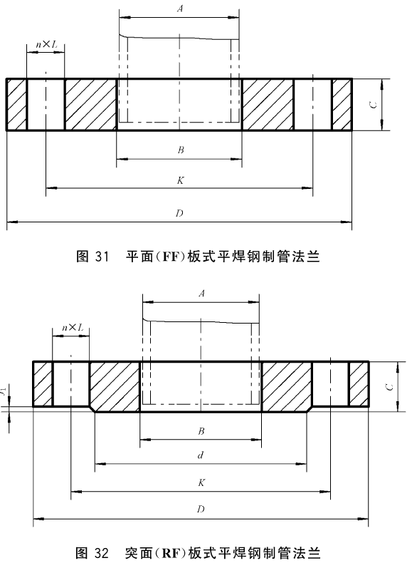
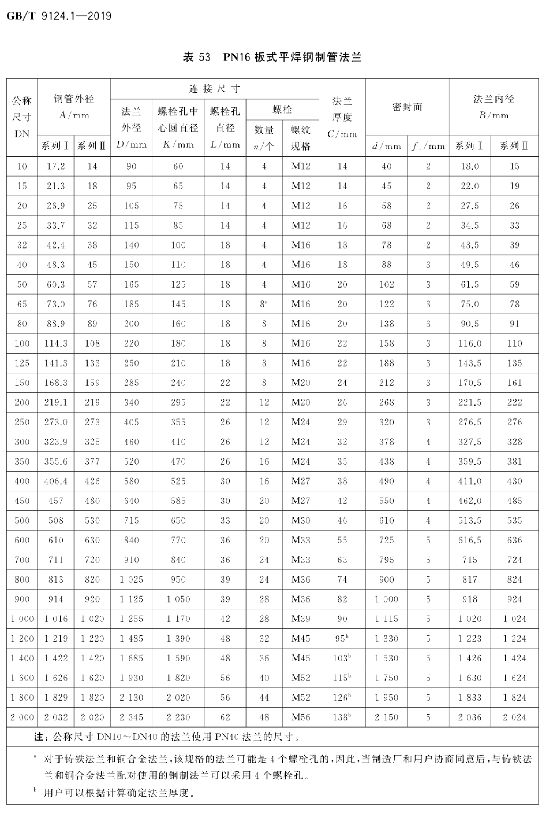
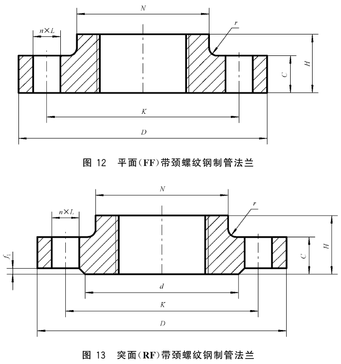
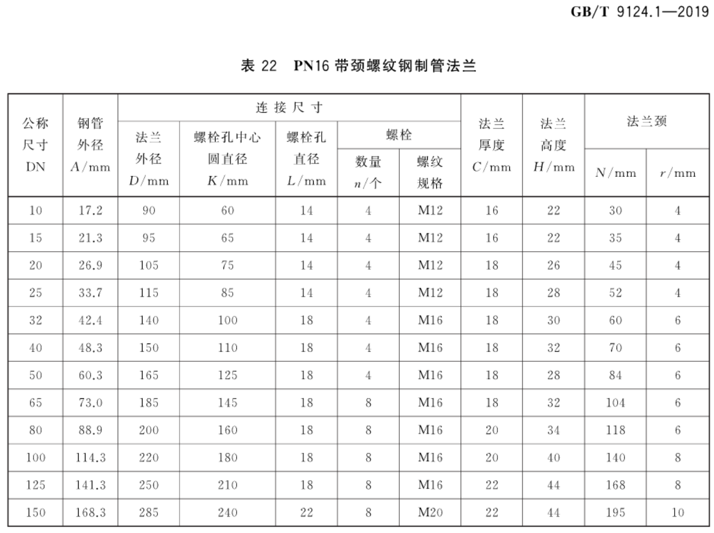
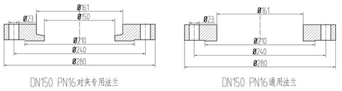
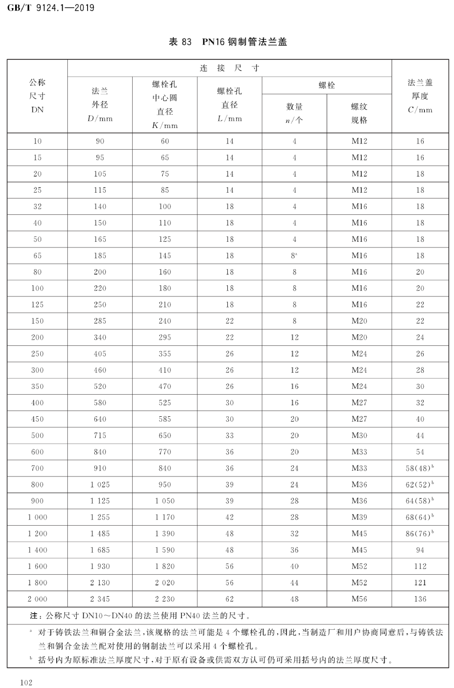
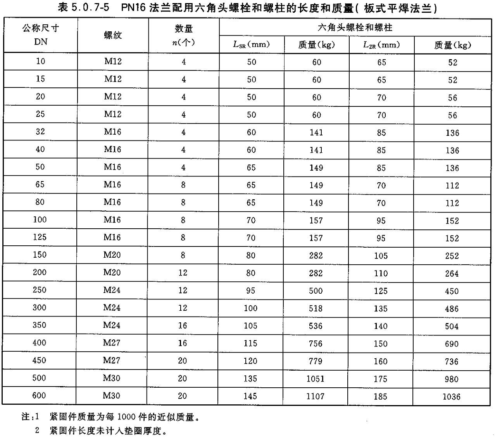
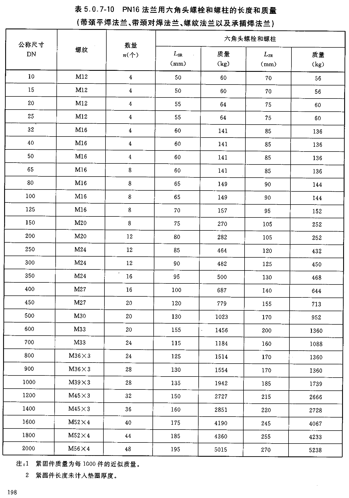

# 钢制法兰

## 钢制法兰的选用

钢制法兰需要明确接管外径，否则市场上的钢制法兰 DN100~DN250 大多是参考无缝管外径的（国标中的系列 2 非通用系列）

> 机房外：DN＞300 的管件主材；法兰为主材。
>
> 机房内：管件都为主材，法兰都为主材，螺栓都为主材。

参考：<https://zhuanlan.zhihu.com/p/39999705>
阀门主要连接方式有三种：螺纹连接、法兰连接、焊接连接。

> 对于水暖行业，如果采用法兰连接，一般 DN≤50 使用带颈螺纹法兰，DN≥65 使用焊接法兰（板式平焊法兰 PL）。

* 焊接连接阀门
  在公称直径较大，使用条件荷刻，温度较高的场合，阀体常采用坡口对焊接，同时，对焊接缝有原格要求，必须选用技术过硬的焊工完成此项工作。公称通径在 50mm 以下的焊接阀门通常具有焊接插口来承接荷平面端的管道。由于承插焊接在插口与管道间形成缝隙，因而有可能使缝隙受到某些介质的腐蚀，同时管道的振动会使
  连接部位疲劳，因此承插焊接的使用受到一定的限制。焊接连接适用于各种压力和温度，在较荷刻的条件下使用时，比法兰连接更为可靠。但是焊接连接的阀门拆卸和重新安装都比较困难，所以它的使用限于通常能长期可靠地运行，或使用条件荷刻、温度较高的场合。如火力发电站、核能工程、乙烯工程的管道上。
* 螺纹连接阀门
  螺纹连接的阀门主要是公称通径在 **50mm 及以下** 的阀门。如果通径尺寸过大，连接部的安装和密封十分困难。螺纹连接通常是将阀门进出端部加工成锥管或直管螺纹，可使其连接到锥管螺纹接头或管路上。由于这种连接可能出现较大的泄漏沟道，故可用密封剂、密封胶带或填料来堵塞这些沟道。如果阀体的材料是可以焊接的，但膨胀系数差异很大，或者工作温度的变化幅度范围较大，螺纹连接部必须进行蜜封焊。为了便于安装和拆卸螺纹连接的阀门，在管路系统的适当位置上可用管接头。公称通径在 50mm 以下的阀门可使用管套节作为管接头，管套节的螺纹将连接的两部分连接在一起。
* 法兰连接阀门
  法兰连接的阀门，其安装和拆卸都比较方便，但是法兰连接比螺纹连接的阀门笨重，相应价格也价高，因此它适用于各种通径和压力的管道连接。当温度超过 350 度时，由于螺栓、垫片和法兰一变松弛，也明显地降低螺栓的负荷，对受力很大的法兰连接可能产生泄漏。

按现行标准《钢制管法兰类型与参数》GB/T 9124—2019 的规定，国标钢制管法兰的类型分为两类，一类是 PN 标记法兰（即欧洲体系法兰或欧标法兰），在我国最为常用。另一类是 Class 标记法兰（即美洲体系法兰或美标法兰），主要用于石油天然气化工行业。这两种体系法兰的类型和代号下面都有介绍。

## 法兰的类型及代号

还有一种对夹蝶阀专用法兰，规范上没有相应的内容。

## 法兰规格

### 钢制平焊法兰 PL

《GB/T 9124.1-2019 钢制管法兰 PN 系列》P62

《GB/T 9124.1-2019 钢制管法兰 PN 系列》P66

### 带颈螺纹法兰

《GB/T 9124.1-2019 钢制管法兰 PN 系列》P31

《GB/T 9124.1-2019 钢制管法兰 PN 系列》P33

### 对夹蝶阀专用法兰

对夹式蝶阀专用法兰和普通的法兰片的主要区别在于法兰的内径，专用法兰的内径是刚好跟所需蝶阀的公称通径吻合在后面的一个槽，这个槽可以把连接的钢管插入里面，保证了对夹式蝶阀的密封效果，如果用普通的法兰片，蝶阀的密封效果就得不到保障。另外对夹式蝶阀专用法兰的外径、厚度、中心距及螺栓孔都是一样的，使用的螺栓是双头的螺栓。而对于螺栓的使用则是对应不同的使用的温度而改变的。

螺栓的规格、数量与普通法兰一致，但长度没有一个对应的标准。下面是参考网上的资料。

| 对夹蝶阀规格 | 双头螺栓规格*数量 | 长度 mm |
| :----------: | :---------------: | :----: |
|     DN50     |       M16*4       |  130   |
|     DN65     |       M16*8       |  140   |
|     DN80     |       M16*8       |  140   |
|    DN100     |       M16*8       |  150   |
|    DN125     |       M16*8       |  150   |
|    DN150     |       M20*8       |  165   |
|    DN200     |      M20*12       |  175   |
|    DN250     |      M24*12       |  185   |

### 法兰盖 BL

《GB/T 9124.1-2019 钢制管法兰 PN 系列》P102

## 法兰螺栓长度

国家规范里没有相应的内容。

平焊法兰用螺栓，参考《HG/T20613-2009 钢制管法兰用紧固件》P194。

参考《HG/T20613-2009 钢制管法兰用紧固件》P198。

