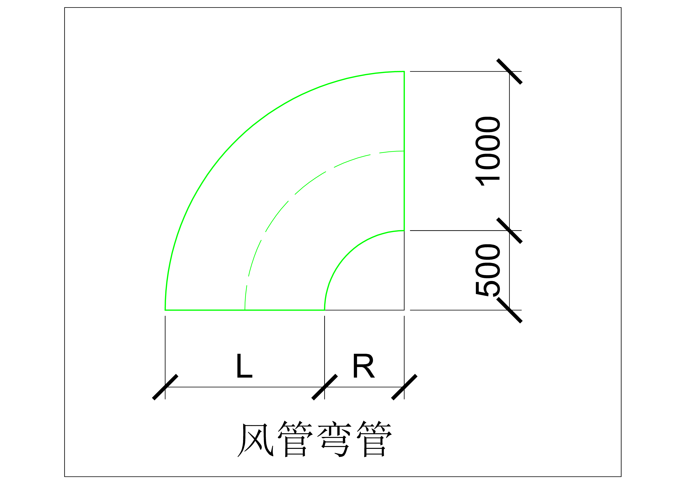
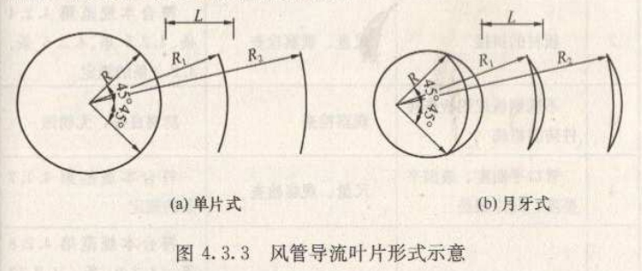
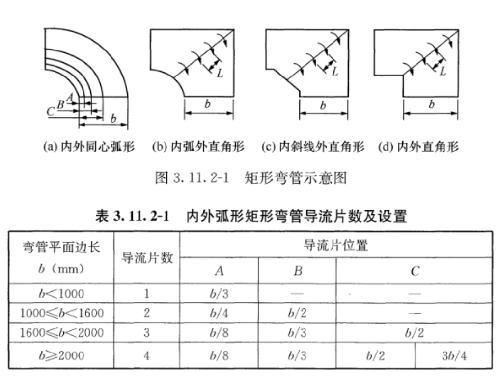
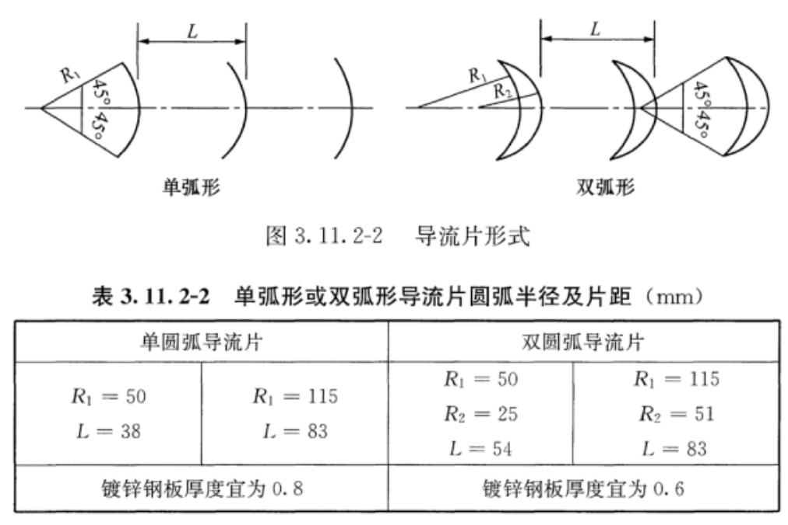
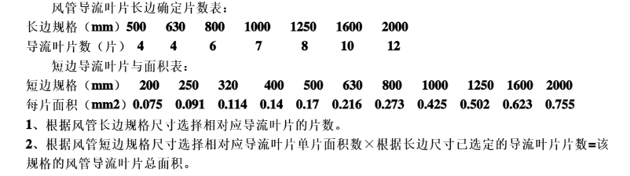

# 风管导流叶片

## 规范中关于导流叶片的规定

### 验收规范

根据《GB50243-2016 通风与空调工程施工质量验收规范》

>**4.3.6** 矩形风管弯管宜采用曲率半径为一个平面边长，内外同心弧的形式。当采用其他形式的弯管，且平面边长大于 500mm 时应设弯管导流片。

根据规范说明，如果不加导流叶片，需满足：R+L/2≥L，即：R/L≥0.5，风管弯头内弧半径≥风管边长的一半。

如果不满足上述条件，需要设风管导流叶片。

结论：

>为满足《GB50243-2016 通风与空调工程施工质量验收规范》，现场加工风管弯管应满足 R/L≥0.5。否则当 L>500mm 时，加导流叶片。

### 施工规范

根据《GB 50738-2011 通风与空调工程施工规范》

>**4.3.3** 矩形风管弯头的导流叶片设置应符合下列规定：
>
>1 边长大于或等于 500mm，且内弧半径与弯头端口边长比小于或等于 0.25 时，应设置导流叶片，导流叶片宜采用单片式、月牙式两种类型 (图 4.33)；
>
>2 导流叶片内弧应与弯管同心，导流叶片应与风管内弧等弦长；
>
>3 导流叶片间距 L 可采用等距或渐变设置的方式，最小叶片间距不宜小于 200mm，导流叶片的数量可采用平面边长除以 500 的倍数来确定，最多不宜超过 4 片。导流叶片应与风管固定牢固，固定方式可采用螺栓或铆钉。

### 通风管道技术规程

根据《JGJT 141-2017 通风管道技术规程》

>**3.11.2** 矩形弯管分为内外同心弧形、内弧外直角形、内斜线外直角形及内外直角形 (图 3.11.2-1)，其制作应符合下列规定：
>
>1 矩形弯管宜采用内外同心弧形，弯管曲率半径宜为一个平面边长，圆弧应均匀。
>
>2 矩形内外弧形弯管平面边长大于 500mm，且内弧半径 r 与弯管平面边长 b 之比小于或等于 0.25 时应设置导流片。导流片弧度应与弯管弧度相等，迎风边缘应光滑，片数及设置位置应符合表 3.11.2-1 的规定。
>
>
>
>3 矩形内外直角形弯管及边长大于 500mm 的内弧外直角形、内斜线外直角形弯管可选用单弧形或双弧形导流片 (图 3.11.2-2)。导流片圆弧半径及片距宜符合表 3.11.2-2 的规定。
>
>

### 网上的计算方式

下面表格是网上给的导流叶片计算方式：

明显与规范有冲突，施工规范中规定：

> 最小叶片间距不宜小于 200mm，导流叶片的数量可采用平面边长除以 500 的倍数来确定，最多不宜超过 4 片。

导流叶片平面边长确定片数表：

|  平面边长（mm）  | 500  | 630  | 800  | 1000 | 1250 | 1600 | 2000 | 2500 |
| :--------------: | :--: | :--: | :--: | :--: | :--: | :--: | :--: | :--: |
| 导流叶片数（片） |  1   |  1   |  1   |  2   |  2   |  3   |  4   |  4   |

## 总结

如何判断是否设导流叶片：

>为满足《GB50243-2016 通风与空调工程施工质量验收规范》，现场加工风管弯管应满足 R/L≥0.5。否则当 L>500mm 时，加导流叶片。

根据河南省科技馆导流叶片情况估算，一个项目可以根据项目风管总面积估算导流叶片的面积，一般为风管总面积的 2%~4%。

如果图上明确画的有导流叶片示意，能够数出需要做导流叶片弯头的个数，那么计算方法如下：

> 导流叶片平面边长确定片数表：
>
> |  平面边长（mm）  | 500  | 630  | 800  | 1000 | 1250 | 1600 | 2000 | 2500 |
> | :--------------: | :--: | :--: | :--: | :--: | :--: | :--: | :--: | :--: |
> | 导流叶片数（片） |  1   |  1   |  1   |  2   |  2   |  3   |  4   |  4   |
>
> 短边导流叶片与面积表：
>
> | 短边规格（mm） |  200  |  250  | 320   | 400  | 500  | 630   | 800   | 1000  | 1250  | 1600  | 2000  |
> | :------------: | :---: | :---: | ----- | ---- | ---- | ----- | ----- | ----- | ----- | ----- | ----- |
> | 每片面积（m2） | 0.075 | 0.091 | 0.114 | 0.14 | 0.17 | 0.216 | 0.273 | 0.425 | 0.502 | 0.623 | 0.755 |
