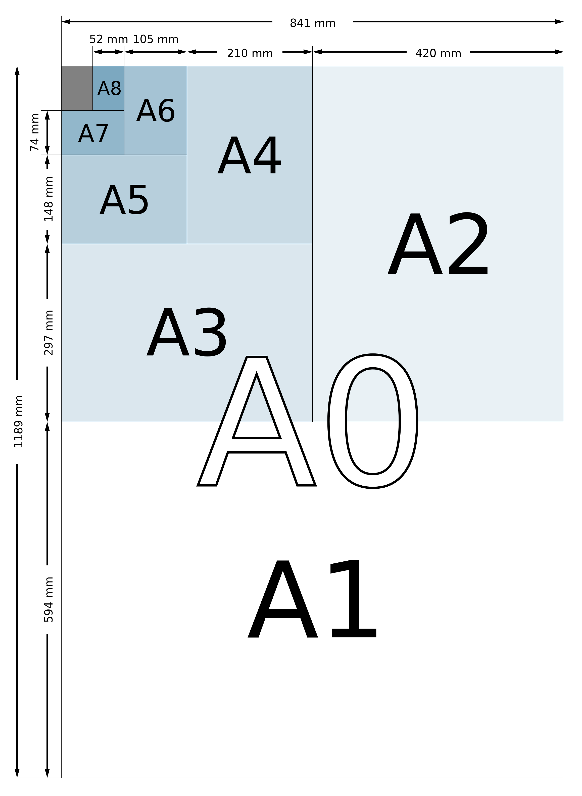

# 纸张尺寸

**ISO 216**是国际标准化组织（ISO）所定义的纸张尺寸国际标准，为今日世界上大多数国家（除北美和拉丁美洲部分地区外）所使用。该标准定了“A”、“B”和“C”系列的纸张尺寸，知名的A4纸张尺寸即由此标准所定义，这是世界上最常用的纸张尺寸。我国现行的规范《GB/T 148-1997 印刷、书写和绘图纸幅面尺寸》参考了ISO 216。

ISO规范定义了A、B、C三组纸张尺寸。C组纸张尺寸主要使用于信封。

A组纸张尺寸的长宽比都是√2（1.414）:1，然后舍去到最接近的毫米值。A0定义成面积为一平方米，长宽比为√2:1的纸张。接下来的A1、A2、A3……等纸张尺寸，都是定义成将编号少一号的纸张沿着长边对折，然后舍去到最接近的毫米值。最常用到的纸张尺寸是A4，它的大小是210乘以297毫米。

A系列纸张尺寸表：

| 尺寸     | 尺寸（mm）      |
|:------:|:-----------:|
| A0     | 841×1189    |
| A1     | 594×841     |
| A2     | 420×594     |
| A3     | 297×420     |
| **A4** | **210×297** |
| A5     | 148×210     |
| A6     | 105×148     |
| A7     | 74×105      |
| A8     | 52×74       |
| A9     | 37×52       |
| A10    | 26×37       |

A系列纸张尺寸示意图：

# 照片尺寸

照片的尺寸通常以英寸为单位，1英寸≈2.54厘米 。X寸照片是指照片长的一边为X寸（1寸照为短的一边）。如5寸照片的长为2.54x5=12.7cm；12寸照片的长为2.54x12=30.5cm。身份证、体检表等多采用小一寸22×32mm，第二代身份证照片尺寸为26mm×32mm，普通一寸照则为25mm×35mm。中国护照/旅行证照片的尺寸为48mm×33mm，其中，头部宽度为15mm～22mm，头部长度为28mm～33mm。

## 常规尺寸

| 常用叫法    | 英寸    | 对应厘米          | 说明              |
|:-------:|:-----:|:-------------:| --------------- |
| 1寸      | 1*1.5 | 2.5cm*3.5cm   | 证件照             |
| 2寸      | 1.5*2 | 3.5cm*4.9cm   | 标准2寸照片          |
| 大1寸/小2寸 |       | 3.3cm*4.8cm   | 中国护照/签证 [2]     |
| 5寸/3R   | 5*3.5 | 12.7cm*8.9cm  | 最常见的照片大小        |
| 6寸/4R   | 6*4   | 15.2cm*10.2cm | 国际上比较通用的照片大小    |
| 7寸/5R   | 7*5   | 17.8cm*12.7cm | 放大              |
| 8寸      | 6*8   | 15.2cm*20.3cm | 大概是A5大小         |
| 小12寸    | 8*12  | 20.3cm*30.5cm | 大概是A4大小         |
| 12寸     | 10*12 | 25.4cm*30.5cm | A4打印纸是21*29.7厘米 |
