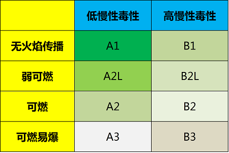
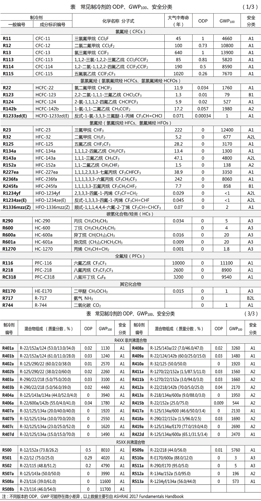
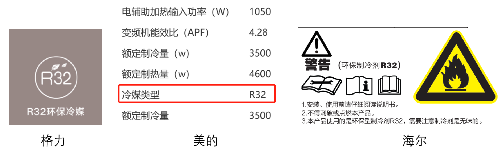

# 空调制冷剂分析

参考：https://www.buildenvi.com/zhuanti/abc/zlj/141111c5

国家标准《制冷剂编号方法和安全性分类》

制冷剂对全球环境的影响指标主要有臭氧消耗潜能（ODP）和全球变暖潜能（GWP）；除了对环境的影响，制冷剂还应具有可接受的安全性，以保障人民的生命财产安全。

**ODP（Ozone Depletion Potential，臭氧消耗潜能）**

ODP表示大气中氯氟碳化物质对臭氧层破坏的能力与R11对臭氧层破坏的能力之比值，R11的ODP=1.0。ODP值越小，制冷剂的环境特性越好。根据目前的水平，认为ODP值小于或等于0.05的制冷剂是可以接受的。

**GWP（Global Warming Potential，全球变暖潜能）**

GWP是温室气体排放所产生的气候影响的指标，表示在一定时间内（20年、100年、500年），某种温室气体的温室效应对应于相同效应的CO2的质量，CO2的GWP=1.0。通常基于100年计算GWP，记作GWP100，《蒙特利尔议定书》和《京都议定书》都是采用 GWP100。

**制冷剂的安全分类**

制冷剂应具有可接受的安全性，安全性主要包括毒性和可燃性，国家标准 《制冷剂编号方法和安全性分类》GB/T 7778-2017将制冷剂的毒性分为A类（低慢性毒性）、B类（高慢性毒性），将可燃性分为第1类（无火焰传播）、第2L类（弱可然）、第2类（可然）、第3类（可燃易爆）。根据GB/T 7778-2017，制冷剂安全性细分为8类，分别为：A1、A2L、A2、A3、B1、B2L、B2、B3，其中，A1最安全，B3最危险。

常见制冷剂的安全分类

## 一、常用制冷剂

现在国内销售的分体空调，美的、格力、海尔全部都是采用 R32 制冷剂。

现在中国空调市场上冷媒大概就是三种：R22，R410A，R32。这几个东西有什么区别呢？

| 指标        | R22     | R410A   | R32     |
|:---------:|:-------:|:-------:|:-------:|
| 工作压力      | 低       | 中       | 高       |
| ODP值      | 0.05    | 0       | 0       |
| GWP值      | 1700    | 2100    | 675     |
| 安全等级      | A1，无毒难燃 | A1，无毒难燃 | A2，无毒可燃 |
| 摩尔质量g/mol | 86.47   | 72.58   | 52.02   |
| 标准沸点℃     | -40.8   | -51.4   | -51.7   |
| 临界温度℃     | 96      | 70.5    | 78.1    |
| 临界压力MPa   | 7.97    | 4.81    | 5.78    |
| 相对充注量     | 1.19    | 1       | 0.71    |
| 容积制冷量·    | 0.71    | 1       | 1.41    |

ODP：ODP(ozone depletion potential)臭氧消耗潜值(臭氧衰减指数)，用于考察物质的气体散逸到大气中对臭氧破坏的潜在影响程度。规定制冷剂R11的臭氧破坏影响作为基准，取R11的ODP值为1，其他物质的ODP是相对于R11的比较值。R22的ODP值为0.05，对臭氧层同样有破坏作用。

GWP：又称全球增温潜势，是基于充分混合的温室气体辐射特性的一个指数，用于衡量相对于二氧化碳的，在所选定时间内进行积分的，当前大气中某个给定的充分混合的温室气体单位质量的辐射强迫。

## 二、制冷剂对比

### 2.1 R22制冷剂

比较老的空调用R22，这种冷媒价格低廉，能效比又比较高，对相关的设备要求又不高，所以以前广泛使用。

根据中华人民共和国生态环境部的[《环办函〔2004〕55号》文件](http://www.mee.gov.cn/gkml/zj/bgth/200910/t20091022_174098.htm)，按照《蒙特利尔议定书》有关规定，我国作为第五款国家（发展中国家）可以生产和使用R-22作为致冷剂到2040年，其间2016年将对生产实施冻结，冻结在2015年的水平，然后逐年淘汰，到2040年生产和消费降到零。

### 2.2 R32制冷剂

容积制冷量越大，空调的管路尺寸和效率就越高，这意味着制造同样性能的空调，可以更省钱。**很明显，R32容积制冷量最大。**但是R32工作压力最高，意味着各种阀 ：四通阀, 高低压阀, 单相阀,电磁阀等耐压强度增加，动作压力增加，对管路的焊接，弯曲要求也高，相关零件和生产比较困难，所以之前采用R32的空调比较少。

### 2.3 R410A制冷剂

R410A是由R32/R125，质量组成50%/50%组成的近共沸混合工质，具有无毒、不可燃、化学性能稳定、ODP为零等优点。

这两种冷媒在制热能力、排气温度及运行范围比较相似，所以可以替代R22应用于热泵系统。但是，R410A的工作压力比较高，容积制冷量又远远高于R22，所以必须重新设计压缩机，两器，相应的制造工艺和设备也得改进。简单的说，厂家如果生产使用R410A冷媒的空调，物料成本会变低，因为可以少用铜！前提是把生产线改了，销售规模够大，就能赚回来。

缺点：

1）、R410A的确不破坏臭氧层了，但是它是一种很厉害的温室气体。

2）、R22、R32制冷剂少量泄露，泄露多少补多少，但是由于R410A是混合制冷剂，只要制冷剂泄露，都需要先彻底排空、抽真空，再重新加注。对使用者来说，使用R410A冷媒空调在加制冷剂时费用会比较高。

### 2.4 对比分析

根据以上分析，得出以下对比表：

| 制冷剂 | R22           | R32                            | R410A                             |
|:---:|:-------------:|:------------------------------:|:---------------------------------:|
| 成分  | 一氯二氟甲烷‑CHClF2 | 二氟甲烷CH­2F2                     | 50%R32（二氟甲烷）和50%R125（五氟乙烷CHF2CF3） |
| 优点  | 成本低  设备要求低    | 容积制冷量最大，节约管路，不破坏臭氧，GWP值低，ODP为0 | 容积制冷量比R22大，ODP为0                  |
| 缺点  | 破坏臭氧          | 管路压力高，可燃                       | 管路压力高，GWP值高，维修成本高                 |