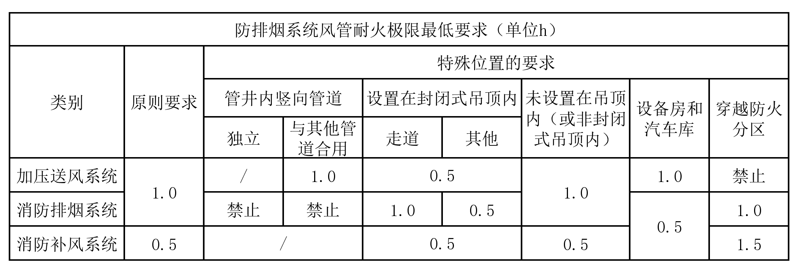

# 防排烟风管的耐火极限施工

参考：

* 国家规范：《GB 51251-2017 建筑防烟排烟系统技术标准》
* 国家图集：《22K311-5 防排烟系统设备及部件选用与安装》

《建筑防烟排烟系统技术标准》GB51251-2017自2018年8月1号开始实施，经过多年的验收经验，部分项目仍未满足该技术标准，质监站甚至内部发文要求验收时需重点关注此部分。

## 风管耐火极限时间总结如下：

## 规范的详细条文如下：

### 加压送风管

* 3.3.8-1 竖向设置的机械加压送风管道应独立设置在管道井内，当确有困难时，未设置在管道井内或与其他管道合用管道井的送风管道，其耐火极限不应低于 1.00h。
* 3.3.8-2 水平设置的机械加压送风管道，当设置在吊顶内时，其耐火极限不应低于 0.50；当未设置在吊顶内时，其耐火极限不应低于 1.00h。
* 3.3.9 机械加压送风系统的管道井应采用耐火极限不低于 1.00h 的隔墙与相邻部位分隔，当墙上必须设置检修门时应采用乙级防火门。

### 排烟风管

* 4.4.8-2 竖向设置的排烟管道应设置在独立的管道井内，排烟管道的耐火极限不应低于 0.50h。
* 4.4.8-3 水平设置的排烟管道应设置在吊顶内，其耐火极限不应低于 0.50h；当确有困难时，可直接设置在室内，但管道的耐火极限不应小于 1.00h。
* 4.4.8-4 设置在走道部位吊顶内的排烟管道，以及穿越防火分区的排烟管道，其管道的耐火极限不应小于 1.00h，但设备用房和汽车库的排烟管道耐火极限可不低于 0.50h。
* 4.4.9 当吊顶内有可燃物时，吊顶内的排烟管道应采用不燃材料进行隔热，并应与可燃物保持不小于 150mm 的距离。
* 6.3.1-5 排烟风管的隔热层应采用厚度不小于 40mm 的不然绝热材料，绝热材料的施工及风管加固、导流片的设置应按现行国家标准《通风与空调工程岗施工质量验收规范》GB 50243 的有关规定执行。

### 消防补风风管

* 4.5.7 消防补风管道耐火极限不应低于 0.5h，当补风管道跨越防火分区时，管道的耐火极限不应小于1.5h。

### 施工情况

耐火极限：

|                            做法                             |    耐火极限时长    |         价格         |                      备注                       |
| :---------------------------------------------------------: | :----------------: | :------------------: | :---------------------------------------------: |
| 镀锌钢板风管 + 50mm厚带铝箔贴面的离心玻璃棉（密度60kg/m3）  | 满足 0.5h 耐火极限 |                      | 依据《22K311-5 防排烟系统设备及部件选用与安装》 |
| 镀锌钢板风管 + 45mm厚带铝箔贴面的离心玻璃棉（密度120kg/m3） |  满足 1h 耐火极限  |                      | 依据《22K311-5 防排烟系统设备及部件选用与安装》 |
|         镀锌钢板风管 + 50mm厚离心玻璃棉 + 9mm防火板         | 满足2小时耐火极限  | 科技馆单价约230元/m2 | 依据《22K311-5 防排烟系统设备及部件选用与安装》 |

方案1：风管穿墙2m内做50mm厚离心玻璃棉保温+防火板防火包裹（满足2小时耐火极限），单价执行科技馆单价约230元/m2。其余排烟风管做50mm厚的离心玻璃棉，单价执行科技馆单价约54元/m2（满足0.5h耐火极限）。离心玻璃棉最快3天进场，工人10人，施工7天。

方案2：采用安普博格40mm/50mm防火卷材（分别满足 1h/2h 耐火极限）包覆通风管道，单价约130/140元/m2。

