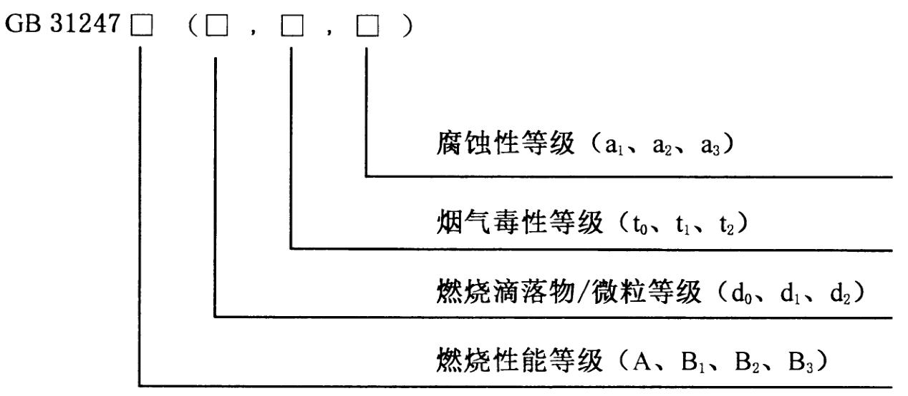

## 电线电缆阻燃、燃烧等级

参考：https://zhuanlan.zhihu.com/p/362329082

https://mp.weixin.qq.com/s/ULtKgO_TuDGzQiD7FJ176g

依据：《GBT50786-2012 建筑电气制图标准》

《GBT 19666-2019 阻燃和耐火电线电缆或光缆通则》

《GB 31247-2014 电缆及光缆燃烧性能分级》

建筑电气杂志2018年第9期李燕《如何正确选择阻燃电缆级别》

现实中很多厂家会生产标注为WDZB1-BYJ的电线，其实这种标注是错误的。

电线燃烧、阻燃等级两种标识方法：

a）、根据《GB/T 19666-2019 阻燃和耐火电线电缆或光缆通则》的表示方法：阻燃电缆在原型号前增加阻燃代号，阻燃类别分为A、B、C、D四个等级。

例如：WDZA-YJV-8.7/10 3x240，表示无卤低烟、阻燃A级、XLPE绝缘、PVC护管、8.7/10kV、3x240mm2电缆。阻燃测试方法依据《GB/T 18380.33-2008 电缆和光缆火焰条件下的燃烧试验 第33部分 垂直安装的成束电线电缆火焰垂直蔓延试验 A类》

b）、依据《GB 31247-2014 电缆及光缆燃烧性能分级》的表示方法：

例如：GB31247B1-(d0,t1,a1) 表示电缆或光缆的燃烧性能等级为B1级，燃烧滴落物/微粒等级为 d0 级，烟气毒性等级为 t1 级，腐蚀性等级为 a1 级。

方法a依据的规范GB/T 19666、GB/T 18380，参考的是IEC 60332，IEC是国际电工委员会（International Electro technical Commission，简称IEC）

方法b依据的规范 GB 3124，参考的是欧盟标准 EN50399:2011。

两个组织IEC、欧盟检测、评定方法都不一样。通过上述两个系列阻燃电缆的试验方法及要求的对比，可以看出方法b不仅要考核火焰蔓延高度（即炭化高度），还要考核电缆的热释放、产烟特性等参数，更能客观反映火灾现场情况以及对周围环境影响。 按照 GB 31247-2014 分级标准（A、 B1、 B2、 B3） 对不同类型的建
筑物选用不同阻燃级别的电缆做出规定， 将更加科学合理。

