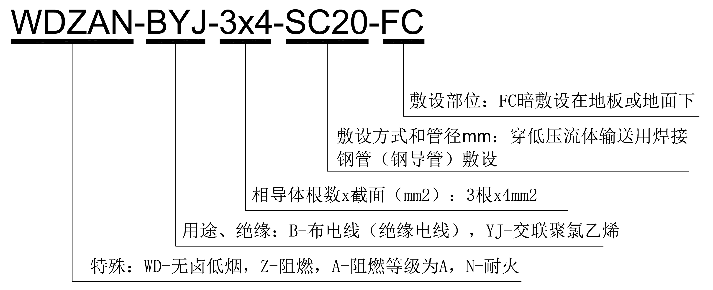
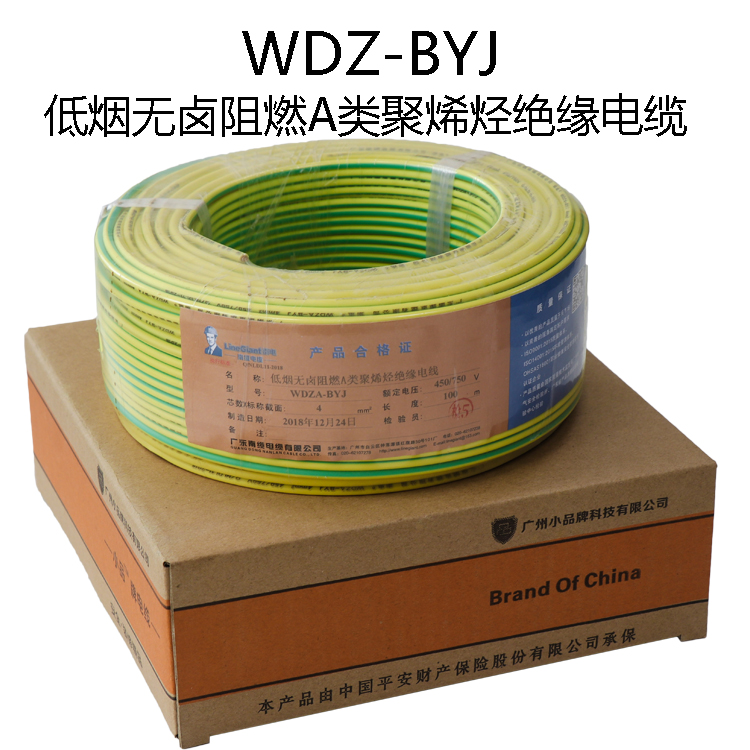
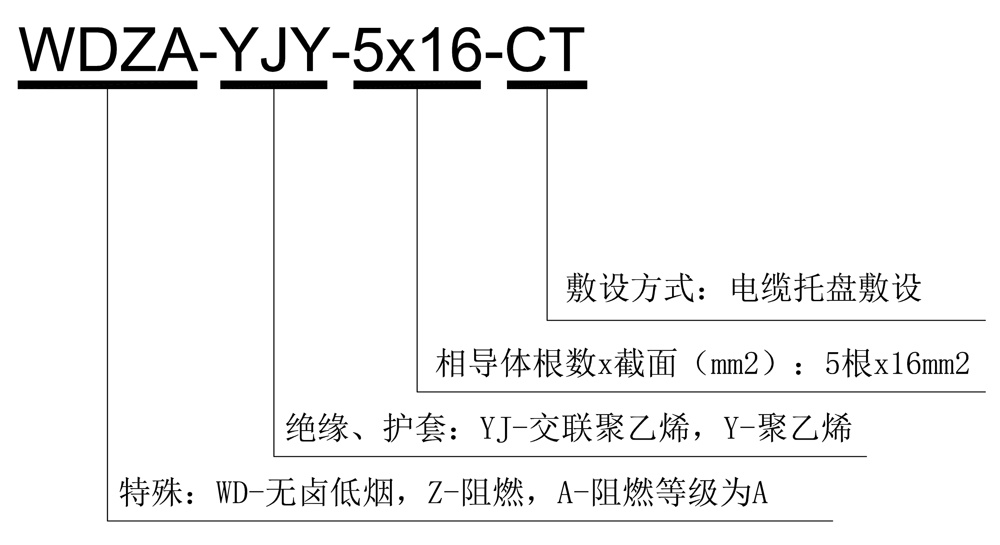
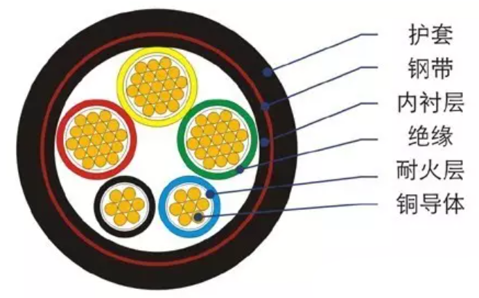

# 电线电缆

## 定义

广义的电线电缆亦简称为电缆。狭义的电缆是指绝缘电缆。它可定义为：由下列部分组成的集合体，一根或多根绝缘线芯，以及它们各自可能具有的包覆层，总保护层及外护层。电缆亦可有附加的没有绝缘的导体。

我国的电线电缆产品按其用途分成下列五大类：

1.裸电线；

2.绕组线；

3.电力电缆；

4.通信电缆和通信光缆；

5.电气装备用电线电缆。

电线电缆的基本结构：

1.导体：传导电流的物体，电线电缆的规格都以导体的截面表示。

2.绝缘：外层绝缘材料按其耐受电压程度。

## 规范

《GB 5023.1-2008 额定电压 450/750V 及以下聚氯乙烯绝缘电缆 一般要求》

## 电线电缆表示形式

低烟无卤阻燃 A 类聚烯烃绝缘电线

## 电力电缆表示形式

铜芯无卤低烟 A 级阻燃交联聚乙烯绝缘电力电缆

线缆敷设方式：

| 符号 |                  名称                  |          英文名称           |
| :--: | :------------------------------------: | :-------------------------: |
|  SC  | 穿低压流体输送用焊接钢管（钢导管）敷设 | Run in welded steel conduit |
|  CT  |              电缆托盘敷设              |   Installed in cable tray   |
|  CL  |              电缆梯架敷设              |  Installed in cable ladder  |

线缆敷设部位：

| 符号 |         名称         |           英文名称            |
| :--: | :------------------: | :---------------------------: |
|  CE  |   沿吊顶或顶板面敷   | Along ceiling or slab surface |
|  CC  |     敷设在顶板内     | Concealed in ceiling or slab  |
|  WC  |     暗敷设在墙内     |       Concealed in wall       |
|  FC  | 暗敷设在地板或地面下 |      In floor or ground       |
