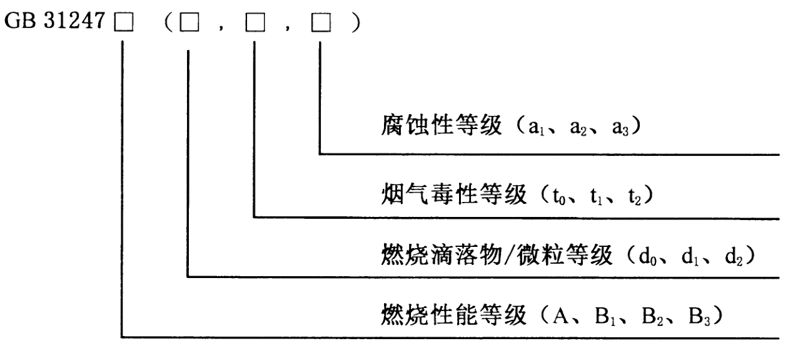

# 电线电缆阻燃、燃烧等级

参考：<https://zhuanlan.zhihu.com/p/362329082>

<https://mp.weixin.qq.com/s/ULtKgO_TuDGzQiD7FJ176g>

依据：《GBT50786-2012 建筑电气制图标准》

《GBT 19666-2019 阻燃和耐火电线电缆或光缆通则》

《GB 31247-2014 电缆及光缆燃烧性能分级》

建筑电气杂志 2018 年第 9 期李燕《如何正确选择阻燃电缆级别》

现实中很多厂家会生产标注为 WDZB1-BYJ 的电线，其实这种标注是错误的。

电线燃烧、阻燃等级两种标识方法：

a）、根据《GB/T 19666-2019 阻燃和耐火电线电缆或光缆通则》的表示方法：阻燃电缆在原型号前增加阻燃代号，阻燃类别分为 A、B、C、D 四个等级。

例如：WDZA-YJV-8.7/10 3x240，表示无卤低烟、阻燃 A 级、XLPE 绝缘、PVC 护管、8.7/10kV、3x240mm2 电缆。阻燃测试方法依据《GB/T 18380.33-2008 电缆和光缆火焰条件下的燃烧试验 第 33 部分 垂直安装的成束电线电缆火焰垂直蔓延试验 A 类》

b）、依据《GB 31247-2014 电缆及光缆燃烧性能分级》的表示方法：

例如：GB31247B1-(d0,t1,a1) 表示电缆或光缆的燃烧性能等级为 B1 级，燃烧滴落物/微粒等级为 d0 级，烟气毒性等级为 t1 级，腐蚀性等级为 a1 级。

方法 a 依据的规范 GB/T 19666、GB/T 18380，参考的是 IEC 60332，IEC 是国际电工委员会（International Electro technical Commission，简称 IEC）

方法 b 依据的规范 GB 3124，参考的是欧盟标准 EN50399:2011。

两个组织 IEC、欧盟检测、评定方法都不一样。通过上述两个系列阻燃电缆的试验方法及要求的对比，可以看出方法 b 不仅要考核火焰蔓延高度（即炭化高度），还要考核电缆的热释放、产烟特性等参数，更能客观反映火灾现场情况以及对周围环境影响。按照 GB 31247-2014 分级标准（A、B1、B2、B3）对不同类型的建
筑物选用不同阻燃级别的电缆做出规定，将更加科学合理。
