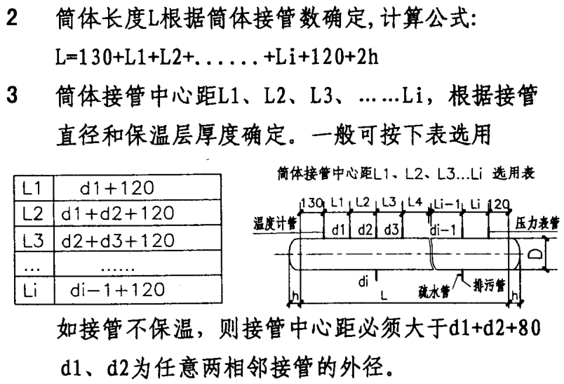

# 分集水器

参考《GBT 9019-2015 压力容器公称直径》，压力容器公称直径指的是容器圆筒的内径。

图集《05K232 分（集）水器 分气缸》仅适用于筒体直径小于等于1000mm的分集水器。

根据图集《05K232 分(集)水器 分汽缸》：

1、在筒体上开孔的最大开孔直径应小于筒体内径的0.5倍；接管中心距根据本图集选用表确定，保温后的管间净距宜大于等于100mm，排污管及疏水管按照本图集选用。

# 螺杆式热泵机组

## 螺杆式地源热泵机组CH-B1-4~5

制冷/制热功率：

水源热泵：WPS600.2CFFST-B 满液式（超高效普温型），机组制热最高出水温度55℃，电源3相380V，机组启动方式采用星三角启动。

## 螺杆式地源热泵机组CH-B1-6

WPS110.1CFFME-C 满液式（高效普温型），机组制热最高出水温度55℃，电源3相380V，机组启动方式采用星三角启动。

# 风机盘管

采用麦克维尔MCW-VC系列（没有使用直流无刷）

如果不制冷或制热，设备先不连通，冲洗后再试压。

# 风冷热泵

麦克维尔

# 风机

变频风机厂家不含控制箱。

不变频风机厂家包含控制箱。

1f南侧开闭所风机编号EF-1F-04 应为 EF-1F-05。

# 组空

选型注意事项：

* 与消防信号联锁，当发生火警时停止机组运行，风阀开关连锁（可选）。
* 组空包含控制箱。
* 麦克维尔的组空，取消新风口后，回风口的尺寸并没有变化。

1MF

3层空调机房共有

AHU-3F-03，3872x2568x2140（1.455t）

AHU-3F-04，3745x2187x2013（1.138t）

HRU-3F-07，6264x2926x4652(4.052t)

HRU-3F-08，6264x2926x4652(4.052t)

HRU-3F-09，6264x2926x4652(4.044t)

HRU带热回收机组，都是上下2层，Excel表里的上面的送风口应为排风口。

新风口、送风口均位于下层段，回风口、排风口位于上层段，

风阀控制原理，双位调节，开度调节。

EEX新风、送风位于下层段，回风、排风位于上层段

RAU-2F-01送回风有疑问。

HRU-2F-05、HRU-2F-06双层叠放，机组高度4.34m，2层建筑完成面14m，3层结构完成面23.9m，共9.9m，机房内中间一个南北梁800*200，净空高度8.93m，**净空不够**。

1、空调机组最大重量4.23吨（`6.264*2.926*5.132`），

2、空调机组层数，是否散件进场。

3、图纸上包含机组编号、长宽高、重量、基础尺寸（每侧外扩20cm）（单独的图层）。

4、双层叠放的机组。

# 冷却塔

冷塔共6台，2台为1组，一组的尺寸，7550x5550x6240mm，单个最大重量不超过1.5吨。

冷却塔散件进场。

安装需要考虑高度，进风位置，考虑气流影响。

冷塔接管（共6台）：

|   名称   | 规格  | 数量 |                 备注                 |
| :------: | :---: | :--: | :----------------------------------: |
| 自动补水 | DN50  |  1   |         浮球阀机械式自动补水         |
| 快速补水 | DN50  |  1   |               手动补水               |
|   满水   | DN80  |  1   | 水位过高时溢出，可以和排污管汇到一起 |
|   排污   | DN50  |  1   |                排污管                |
|  进水管  | DN150 |  2   |                                      |
|  出水管  | DN300 |  1   |                                      |
|  平衡管  | DN300 | 1/2  |      一组（2台）冷却塔1个平衡管      |

# 冷水机组（特灵）

特灵冷水机组尺寸4578x2182（底座尺寸），5337（长)×3315 (宽)×3102（高）（机组实际尺寸），基础尺寸：5000x2600x150mm（C30），共3台机组，基础间距至少2.5m，机组之间至少1.3m。

基础水平度小于1.6mm。

三个都是左接管（人站在控制面板前看，接水管方向在左侧）

冷凝器（冷却水）DN300

蒸发器（冷冻水）DN250

运输重量：14406kg，运行重量：17176kg。

# 多联机

品牌：格力

1、重新套新图20191231。检查设备变化，

2、立管每一层都套，尽量立管靠墙边。

3、屋顶检查与幕墙立柱碰撞，合理避开。

4、