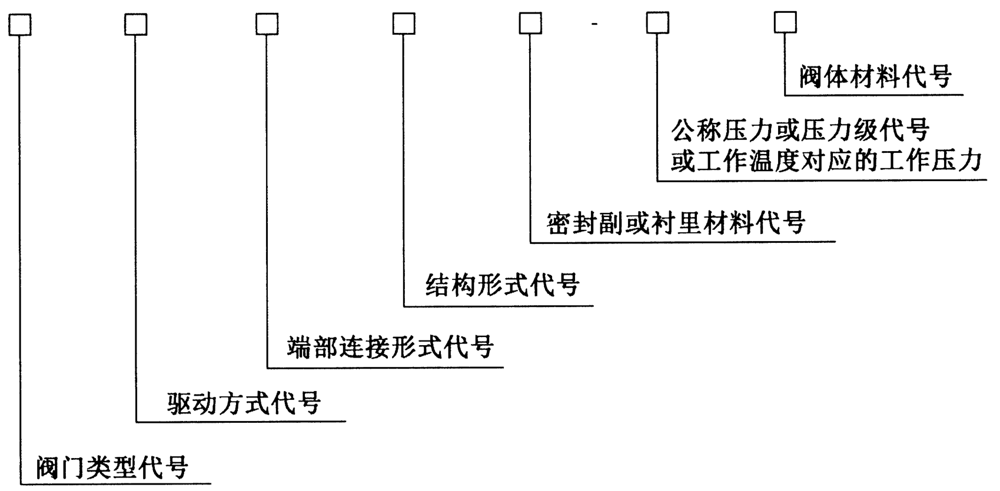
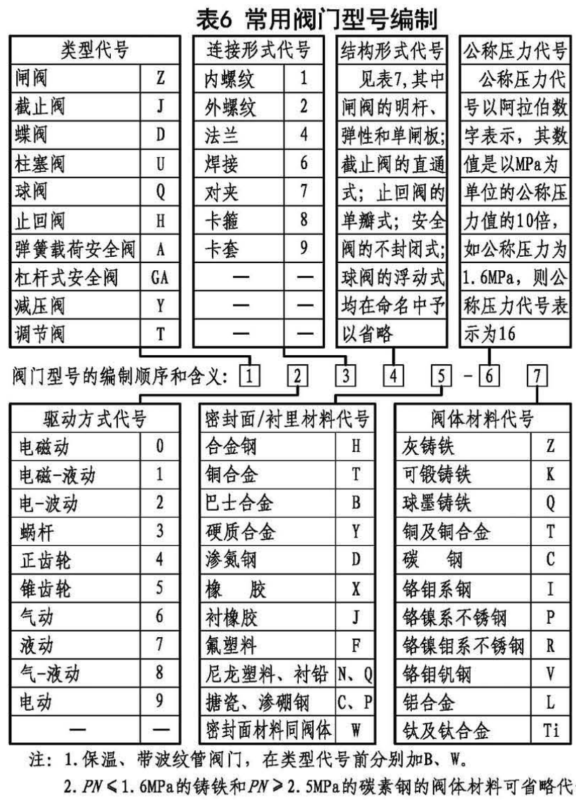

# 阀门

## 阀门型号编制

参考《GB/T 32808-2016 阀门型号编制方法》，阀门型号由阀门类型、驱动方式、连接形式、密封面或衬里材料、压力、阀体材料七部分组成，如图所示。

比如：D341F-C  表示：蝶阀 - 涡轮驱动 - 法兰式 - 中心对称垂直板 - 氟塑料-PN16-碳钢

常用阀门型号编制，参考图集《21K201 管道阀门选用与安装》。

## 电动阀门

电动阀门集采清单

1. 清单中电动蝶阀有对夹式，法兰式两种连接方式。集采只有对夹式一种，法兰式价格比对夹式高很多，建议采用对夹式。

## 阀门

1. 导热油、蒸汽用铸钢材质
2. 导热油系统一般采用波纹管截止阀。一般不用蝶阀，可以用波纹管截止阀、闸阀、球阀，其中球阀最贵。
3. 蒸汽凝结水系统一般采用波纹管截止阀。
4. 压力表：含表弯、旋塞阀、球阀。
5. 大于等于 DN65 的关断阀门，尽量选用闸阀，不用截止阀。
6. 真空系统，法兰垫片采用四氟乙烯衬垫
7. 热水系统一般采用不锈钢软接，尽量不使用橡胶软接。
8. 橡胶软接，招标时备注上带限位装置。
9. 不锈钢软接，小于等于 DN50，一般螺纹，采用不锈钢波纹软接；大于等于 DN65，一般法兰，采用不锈钢编织软接。
10. 压缩空气、氮气系统，一般小于等于 DN100，采用球阀，大于大于等于 DN125，采用蝶阀。大的球阀容易漏气。
11. 压缩空气、氮气、真空系统的阀门，招标时备注上“禁油”。
12. 不锈钢阀门，法兰材质也为不锈钢。
13. 导热油过滤器，网孔为 30 目。
14. 气体过滤器，网孔为 60 目。
15. 气体，蝶阀，橡胶全胶套密封。
16. 止回阀，材质：铸钢
17. 球阀，材质：铸钢
18. 导热油系统、蒸汽凝结水系统，止回阀一般采用旋启式止回阀
19. 密闭式凝结水回收装置，止回阀建议使用升降式止回阀，只能装在横管道上，效果更好。
20. 蒸汽、导热油，只保留球阀、波纹截止阀。
21. 球阀≥DN200，涡轮传动。
