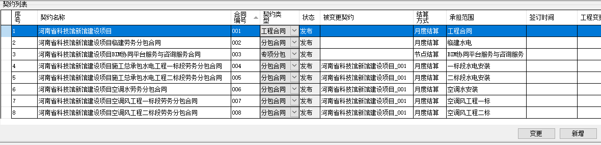
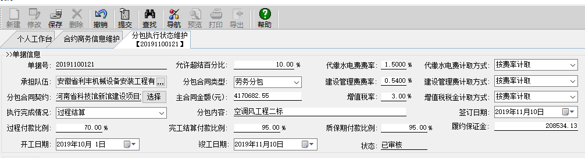

## 招标流转

* 行政办公 - 发文流程审批 - 我的草稿箱 - 点击“发文拟稿”。
* 选择“项目生产资源招标申请”，标题填写：“河南省科技馆新馆建设项目空调风工程劳务招标”，点击确定。
* 本地起草正文，然后上传“请示文件.docx”作为正文，保存并关闭。
* 添加附件，上传所有的附件，保存草稿。
* 发送给“项目总共/技术负责人”：郭镓琦。
* 同意后，发送给“项目部相关部门“：王亚峰、~~张广周~~。
* 同意后，发送给“经理部文书传阅”：张仲学。

## 结算单

结算单共 3 份，003 不需要主材消耗表。

结算单的项目名称为空，解决方法：

使用技术员权限，在项目基本信息——工程简介——修改“经理部名称”。

## 公司报量

**风管收入单价 142**

## 权限申请

权限申请：项目管理 - 项目管理 web 平台

## 结算步骤

1、填写表格：编制说明、汇总表、清单表

2、（管理员权限）工程成本维护，新增成本项 BC17-2，计划耗用修改计划单价，不含税总价、措施费各一项。

3、（管理员权限）项目商务管理 - 项目合约管理 - 服务 OBS - 关联队伍。

4、（项目副经理权限）生成工程量确认单。

## 项目副经理审核

项目综合管理 - 项目审批平台 - 业务审批平台，即可进行审批。

## 劳务合同录入

预算员权限：

项目商务管理 - 合约商务信息维护 - 新增“契约”

注意：一旦提交，无法修改，只能作废，无法删除。

项目商务管理 - 分包执行状态维护 - 新建

其中分包合同契约选择刚建立的契约。其中的费率、税率、分包内容是必填项。

已经提交的合同修改方式：项目商务管理 - 分包执行状态维护 - 查找，在下面选择对应的合同，再点击修改即可。
