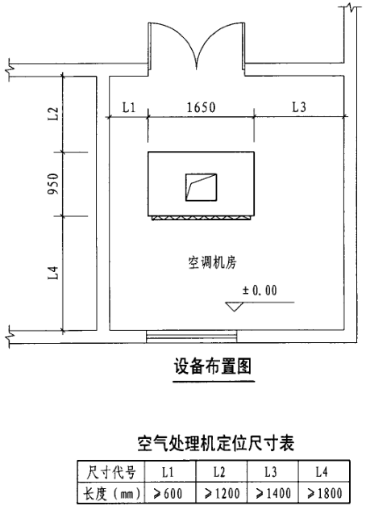

## 机房施工

* C 区 2 层双层组空机房，南侧有控制箱，风管应该尽量走高位。
* C 区 1MF 西北角组空机房，控制箱在机房北侧，机组下方有新风管。
* 机房内应该在做设备基础前就将机房内 BIM 排好，将机房上方的桥架、喷淋管道做好，管道尽量走高位，走在梁里面，避免影响后面设备、风管施工
* 风管、静压箱、设备等的落地支架不能使用带有穿孔的型钢。

## 深化设计

* 机房内组空回风口开口位置，首先要确定机房净空高度、机组高度，然后判断是否是够顶部回风。如果机房内空间狭小，回风口又在机房的一面墙上，这就应优先考虑顶回风，以便于回风立管上有足够的距离安装消声器。

* 机房内深化，要先大致确定组空位置，确定组空是否有静压箱，风机是吊装还是落地安装。
* 设备距墙至少 300mm，考虑到过人、检修应至少 600mm。
* 风机、组空等所有设备必须考虑设备高度，尤其是屋顶，如果有外立面。
* 哪一层的设备一定就要画到哪一层，避免出现结构错误，比如漏掉考虑柱子。
* 静压箱可以放在机组的端侧，也可以放在机组上方，根据机房内的高度确定，如果层高满足，且机房内空间受限，可以考虑放到机组上方，但是放到上方会比较浪费支架型钢。如果层高较低，或机房内空间充足，优先考虑将静压箱放到机组的端侧。
* PAU 安装情况（是否有基础，是否机房内）位于走道尽头房间，安装位置受限，建议改为端面送风。
* 组空基础需要画出开门方向（接管侧，也是排水沟的一侧），需要画出内部气流方向。
* 组空的位置应考虑现场已经预留的洞口，尤其是向其它楼层送回风的管道洞口，尽量避免风管不必要的翻弯。
* 组空的风管需考虑消声器、阀门的位置。
* 部分机房会预留有结构板洞口，需设备摆放需考虑机组周围有排水沟，需预留一定的位置。
* 机房内需考虑上方有大梁、异形梁，靠近幕墙位置，考虑红线附近有倾斜角的幕墙。
* 组空机房内排水沟宽度 100mm，深 50mm，截面为半圆形，排水沟距基础变 30mm，排水沟外侧刷 100m 的油漆，所以基础外 250mm 外才能有落地支架。
* 排水沟需要考虑：不能穿越风井洞，不能穿越立柱、斜柱，不能穿越集水坑。地漏下方不能有梁，地漏不能放在风井洞里。
* 根据图集《07K304 空调机房设计与安装》，组空的基础为 200mm。组空的平面布置：组空距门口最小 1.2m，组空距墙边最小 0.6m。

## 设备基础

水泵、组空等设备基础一般距完成面 100~200mm，一般取 200mm。

参考《12K101-1 轴流通风机安装》、《12K101-4 混流通风机安装》，风机基础距完成面≥350mm

轴流风机：混凝土强度≥C25，φ8@150x150 双向钢筋网

混流风机：混凝土强度≥C25，φ10@200

混流风机：混凝土强度≥C20，φ10@150
