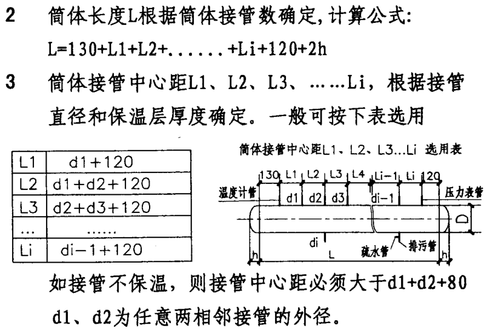

# 分集水器

参考《GBT 9019-2015 压力容器公称直径》，压力容器公称直径指的是容器圆筒的内径。

图集《05K232 分（集）水器 分气缸》仅适用于筒体直径小于等于 1000mm 的分集水器。

根据图集《05K232 分 (集) 水器 分汽缸》：

1、在筒体上开孔的最大开孔直径应小于筒体内径的 0.5 倍；接管中心距根据本图集选用表确定，保温后的管间净距宜大于等于 100mm，排污管及疏水管按照本图集选用。

## 螺杆式热泵机组

## 螺杆式地源热泵机组 CH-B1-4~5

制冷/制热功率：

水源热泵：WPS600.2CFFST-B 满液式（超高效普温型），机组制热最高出水温度 55℃，电源 3 相 380V，机组启动方式采用星三角启动。

## 螺杆式地源热泵机组 CH-B1-6

WPS110.1CFFME-C 满液式（高效普温型），机组制热最高出水温度 55℃，电源 3 相 380V，机组启动方式采用星三角启动。

## 风机盘管

采用麦克维尔 MCW-VC 系列（没有使用直流无刷）

如果不制冷或制热，设备先不连通，冲洗后再试压。

## 风冷热泵

麦克维尔

## 风机

变频风机厂家不含控制箱。

不变频风机厂家包含控制箱。

1f 南侧开闭所风机编号 EF-1F-04 应为 EF-1F-05。

## 组空

选型注意事项：

* 与消防信号联锁，当发生火警时停止机组运行，风阀开关连锁（可选）。
* 组空包含控制箱。
* 麦克维尔的组空，取消新风口后，回风口的尺寸并没有变化。

1MF

3 层空调机房共有

AHU-3F-03, 3872x2568x2140 (1.455t)

AHU-3F-04, 3745x2187x2013 (1.138t)

HRU-3F-07, 6264x2926x4652(4.052t)

HRU-3F-08, 6264x2926x4652(4.052t)

HRU-3F-09, 6264x2926x4652(4.044t)

HRU 带热回收机组，都是上下 2 层，Excel 表里的上面的送风口应为排风口。

新风口、送风口均位于下层段，回风口、排风口位于上层段，

风阀控制原理，双位调节，开度调节。

EEX 新风、送风位于下层段，回风、排风位于上层段

RAU-2F-01 送回风有疑问。

HRU-2F-05、HRU-2F-06 双层叠放，机组高度 4.34m，2 层建筑完成面 14m，3 层结构完成面 23.9m，共 9.9m，机房内中间一个南北梁 800*200，净空高度 8.93m，**净空不够**。

1、空调机组最大重量 4.23 吨（`6.264*2.926*5.132`），

2、空调机组层数，是否散件进场。

3、图纸上包含机组编号、长宽高、重量、基础尺寸（每侧外扩 20cm）（单独的图层）。

4、双层叠放的机组。

## 冷却塔

冷塔共 6 台，2 台为 1 组，一组的尺寸，7550x5550x6240mm，单个最大重量不超过 1.5 吨。

冷却塔散件进场。

安装需要考虑高度，进风位置，考虑气流影响。

冷塔接管（共 6 台）：

|   名称   | 规格  | 数量 |                 备注                 |
| :------: | :---: | :--: | :----------------------------------: |
| 自动补水 | DN50  |  1   |         浮球阀机械式自动补水         |
| 快速补水 | DN50  |  1   |               手动补水               |
|   满水   | DN80  |  1   | 水位过高时溢出，可以和排污管汇到一起 |
|   排污   | DN50  |  1   |                排污管                |
|  进水管  | DN150 |  2   |                                      |
|  出水管  | DN300 |  1   |                                      |
|  平衡管  | DN300 | 1/2  |      一组（2 台）冷却塔 1 个平衡管      |

## 冷水机组（特灵）

特灵冷水机组尺寸 4578x2182（底座尺寸），5337（长)×3315 (宽)×3102（高）（机组实际尺寸），基础尺寸：5000x2600x150mm（C30），共 3 台机组，基础间距至少 2.5m，机组之间至少 1.3m。

基础水平度小于 1.6mm。

三个都是左接管（人站在控制面板前看，接水管方向在左侧）

冷凝器（冷却水）DN300

蒸发器（冷冻水）DN250

运输重量：14406kg，运行重量：17176kg。

## 多联机

品牌：格力

1、重新套新图 20191231。检查设备变化，

2、立管每一层都套，尽量立管靠墙边。

3、屋顶检查与幕墙立柱碰撞，合理避开。

4、
