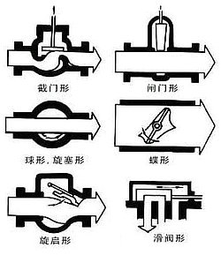

# 水阀门知识

**阀门标准简介：**

阀门标准分为强制性国标（GB）和推荐性国标（GB/T）。阀门国家标准的编号由国家标准的代号、国家标准发布的顺序号和国家标准发布的年号（发布年份）构成。阀门的国标标准包括两部分：一是对制造、结构长度、材质等进行规范，二是对每一类阀门的结构、尺寸、等进行规范搜索，用户根据需要的某一类型阀门，看相应的阀门标准。此标准主要为阀门通用标准以及技术条件标准做简单说明，详细的最新国家标准可在标准网最新发布的信息内查看。

**阀门国家标准代号：**

| 阀门标准代号 | 阀门标准名称                    | 阀门标准代号   | 阀门标准名称                             |
| :----------- | ------------------------------- | -------------- | ---------------------------------------- |
| GB12220-1989 | 《通用阀门 标志》               | GB12245-1989   | 《减压阀性能试验方法》                   |
| GB12221-1989 | 《法兰连接金属阀门的结构长度》  | GB12246-1989   | 《先导式减压阀》                         |
| GB12222-1989 | 《多回转阀门驱动装置的连接》    | GB12247-1989   | 《蒸汽疏水阀 分类》                      |
| GB12223-1989 | 《部分回转阀门驱动装置的连接》  | GB12248-1989   | 《蒸汽疏水阀 术语》                      |
| GB12224-1989 | 《钢制阀门一般要求》            | GB12249-1989   | 《蒸汽疏水阀 标志》                      |
| GB12225-1989 | 《通用阀门 铜合金铸件技术条件》 | GB12250-1989   | 《蒸汽疏水阀 结构长度》                  |
| GB12226-1989 | 《通用阀门 灰铸铁件技术条件》   | GB12251-1989   | 《蒸汽疏水阀 试验方法》                  |
| GB12227-1989 | 《通用阀门 球墨铸铁件技术条件》 | GB10868-1989   | 《电站减温减压阀技术条件》               |
| GB12228-1989 | 《通用阀门 碳素钢锻件技术条件》 | GB10869-1989   | 《电站调节阀技术条件》                   |
| GB12229-1989 | 《通用阀门 碳素钢铸件技术条件》 | GB/T1972-1992  | 《蝶形弹簧》                             |
| GB12231-1989 | 《阀门铸件外观质量要求》        | GB12234-1989   | 《通用阀门 法兰、对焊连接钢制闸阀》      |
| GB12232-1989 | 《通用阀门 法兰连接铁质闸阀》   | GB12237-1989   | 《通用阀门 法兰和对焊连接钢制球阀》      |
| GB1047-1970  | 《管子和管路附件的公称通径》    | GB12233-1989   | 《通用阀门 铁质截止阀与升降式止回阀》    |
| GB12236-1989 | 《通用阀门 钢制旋启式止回阀》   | GB9443-1988    | 《铸钢件渗透探伤及缺陷显示痕迹评级方法》 |
| GB1348-1988  | 《球墨铸铁件》                  | GB3323-1987    | 《钢熔化焊对接接头射线照相和质量分级》   |
| GB1048-1990  | 《管道元件公称压力》            | GB12235-1989   | 《通用阀门法兰钢制截止阀和升降式止回阀》 |
| GB11365-1989 | 《锥齿轮和准双曲齿轮精度》      | GB1851-1984    | 《船用 PN160 外螺纹青铜空气截止阀》        |
| GB4213-1984  | 《气动调节阀通用技术条件》      | GB8464-1987    | 《内螺纹闸阀、截止阀、球阀、止回阀通用》 |
| GB12238-1989 | 《通用阀门 法兰对夹连接蝶阀》   | GB8465.1～7-87 | 《内螺纹闸阀、截止阀、球阀、止回阀尺寸》 |
| GB8335-1987  | 《气瓶专业螺纹》                | GB5677-1985    | 《铸钢件射线照相及底片等级分类方法》     |
| GB10877-1989 | 《氧气瓶阀》                    | GB12230-1989   | 《通用阀门 奥氏体钢铸件技术条件》        |
| GB12239-1989 | 《通用阀门 隔膜阀》             | GB1804-1979    | 《公差与配合未注公差尺寸的极限偏差》     |
| GB12240-1989 | 《通用阀门 铁质旋塞阀》         | GB12244-1989   | 《铸钢件射线照相及底片等级分类方法》     |
| GB12241-1989 | 《安全阀一般要求》              | GB10879-1989   | 《溶解乙炔气瓶阀》                       |
| GB12242-1989 | 《安全阀性能试验方法》          | GB197-1981     | 《普通螺纹、公差与配合》                 |
| GB12243-1989 | 《弹簧直接载荷式安全阀》        | GB1239.2-1989  | 《冷卷圆柱螺旋压缩弹簧技术条件》         |
| GB11352-1989 | 《铸钢件技术条件》              | GB1239.4-1989  | 《热卷圆柱螺旋弹簧技术条件》             |
| GB596—83     | 《船用外螺纹青铜截止止回阀》    | GB10095-1986   | 《渐开线圆柱齿轮精度》                   |
| GB597-1983   | 《船用外螺纹青铜止回阀》        | GB9444-1988    | 《铸钢件磁粉探伤及质量评级方法》         |
| GB5796-1986  | 《梯形螺纹》                    | GB/T13927-1992 | 《通用阀门 压力试验》                    |
| GB7306-1987  | 《用螺纹密封的管螺纹》          | GB/T592-1993   | 《船用法兰铸铁止回阀》                   |
| GB7307-1987  | 《非螺纹密封的管螺纹》          | GB/T1852-1993  | 《船用法兰铸钢蒸汽减压阀》               |
| GB6414-1986  | 《铸件尺寸公差》                | GB/T12252-1989 | 《通用阀门 供货要求》                    |

## 阀门种类及阀门分类

阀门的用途广泛，种类繁多，阀门的分类难度也不断的增加，为了更好的认识阀门产品，多仪公司特将常见的阀门进行分类，阀门的种类是根据现场实际工况进行分类的，部分由厂家自行选型和特殊情况使用不同用途和作用原理就不同了。总的可分两大类：

第一类自动阀门：依靠介质（液体、气体）本身的能力而自行动作的阀门。如止回阀、安全阀、调节阀、疏水阀、减压阀等。

第二类驱动阀门：借助手动、电动、液动、气动来操纵动作的阀门，如蝶阀、球阀、闸阀，截止阀、节流阀、旋塞阀等。

目前国际、国内最常用的阀门分类方法还有以下几种：

 **一、按结构特征，根据关闭件相对于阀座移动的方向可分：**

 1． 截门形：关闭件沿着阀座中心移动。

 2． 闸门形：关闭件沿着垂直阀座中心移动。

3． 旋塞和球形：关闭件是柱塞或球，围绕本身的中心线旋转。

 4． 旋启形；关闭件围绕阀座外的轴旋转。

5． 碟形：关闭件的圆盘，围绕阀座内的轴旋转。

 6． 滑阀形：关闭件在垂直于通道的方向滑动。

 **二、按驱动方式，根据不同的驱动方式可分：**

1．电动：借助电机或其他电气装置来驱动。

 2．液动：借助（水、油）来驱动。

 3．气动；借助压缩空气来驱动阀门启闭。

4．手动：借助手轮、手柄、杠杆或链轮等，有人力驱动，传动较大力矩时，装有蜗轮、齿轮等减速装置。

**三、按用途，根据阀门的不同用途可分：**

1． 开断用：用来接通或切断管路介质，如截止阀、闸阀、球阀、蝶阀等。

2． 止回用：用来防止介质倒流，如止回阀。

3． 调节用：用来调节介质的压力和流量，如调节阀、减压阀。

4． 分配用：用来改变介质流向、分配介质，如三通旋塞、分配阀、滑阀等。
5． 安全阀：在介质压力超过规定值时，用来排放多余的介质，保证管路系统及设备安全，如安全阀、事故阀。

6． 其它特殊用途：如疏水阀、放空阀、排污阀等。

| （四）按阀门的公称压力                 | 五）按阀门工作的温度                     |
| -------------------------------------- | ---------------------------------------- |
| 【1】真空阀：小于大气压力即压力<0.1MPa | 【1】常温阀门：适用于介质温度 -40 425℃    |
| 【2】低压阀：公称压力 PN≤1.6MPa         | 【2】高温阀门：适用于介质温度 425 600℃    |
| 【3】中压阀：公称压力 PN2.5—6.4MPa      | 【3】超高温阀门：适用于介质温度 600℃以上  |
| 【4】高压阀：公称压力 PN10.0—80.0MPa    | 【4】低温阀门：适用于介质温度 -40 -150℃   |
| 【5】超高压阀：公称压力 PN≥100.0MPa     | 【5】超低温阀门：适用于介质温度 -150℃以下 |

| **（六）按阀门的公称通径**             | **（七）按阀门的连接方式**                  |
| :------------------------------------- | :------------------------------------------ |
| 【1】微型阀门：公称通径 DN1-10mm        | 【1】法兰阀门：阀体带有法兰，采用法兰连接   |
| 【2】小口径阀门：公称通径 DN<40mm       | 【2】螺纹阀门：阀体带有内螺纹或外螺纹       |
| 【3】中口径阀门：公称通径 DN50～300mm   | 【3】焊接阀门：阀体带有焊口，采用焊接连接   |
| 【4】大口径阀门：公称通径 DN350～1200mm | 【4】夹箍阀门：阀体上带有夹口，采用夹箍连接 |
| 【5】特大口径阀门：公称通径 DN≥1400mm   | 【5】卡套阀门：采用卡套与管道连接           |
