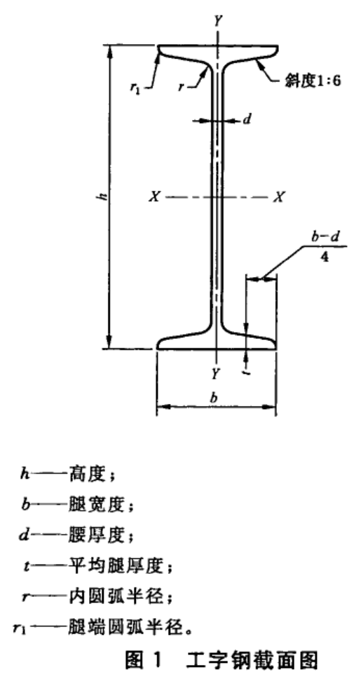
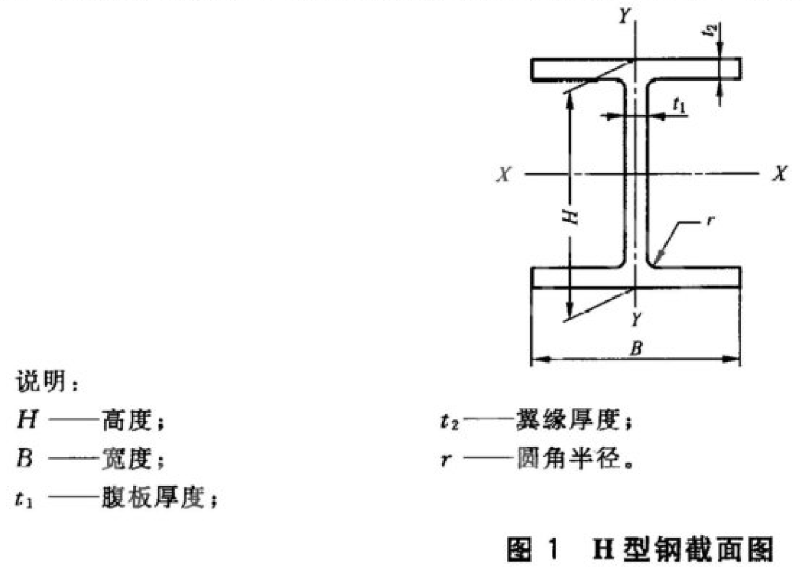

# 设备支架

## 支架

1、空调水支架需考虑膨胀伸缩，需设置固定支架。

## 膨胀螺栓的选用

参考国家图集《16CK208 装配式室内管道支吊架的选用与安装》，膨胀螺栓的机械性能不得小于极限荷载值，并核算实际受力不能超过许用荷载（极限荷载除以安全系数，安全系数不小于 2），使用表 1 时应注意区分静止或悬吊状态，悬吊状态（如丝杆吊架）的承载能力明显小于静止状态（如固定吊架）的承载能力。

表 1 膨胀螺栓极限荷载表

| 螺栓规格 | 抗拉荷载（kN）静止/悬吊 | 抗剪荷载（kN）静止/悬吊 |
| :------: | :---------------------: | :---------------------: |
|    M6    |       2.35/1.677        |       1.77/1.226        |
|    M8    |       4.31/2.354        |       3.24/1.765        |
|   M10    |        6.86/4.31        |        5.1/3.236        |
|   M12    |       10.1/6.355        |        7.26/5.1         |
|   M14    |       14.56/8.228       |       10.69/6.178       |
|   M16    |      19.02/10.101       |       14.12/7.257       |
|   M18    |       24.31/13.37       |      18.232/10.027      |
|   M20    |      31.02/16.441       |      23.265/12.331      |

## 工字钢

《GBT 706-2016 热轧型钢》

根据《GBT 706-2016 热轧型钢》，里面有工字钢，如图示：

## H 型钢

机电安装中管道支架一般使用 H 型钢，一般不使用工字钢。根据《GBT 11263-2017 热轧 H 型钢和剖分 T 型钢》，H 型钢表示如图：

H 型钢分为四类，其代号如下：

宽翼型 H 型钢 HW（W 为 Wide 英文字头）

中翼型 H 型钢 HM（M 为 Middle 英文字头）

窄翼型 H 型钢 HN（N 为 Narrow 英文字头）

薄壁 H 型钢 HT（T 为 Thin 英文字头）

表示方法：`HW350*350*12*19`，即：宽翼型 H 型钢：高度（H）350mmx 宽度（B）350mmx 腹板厚度（t1）12mmx 翼缘厚度（t2）19mm。
