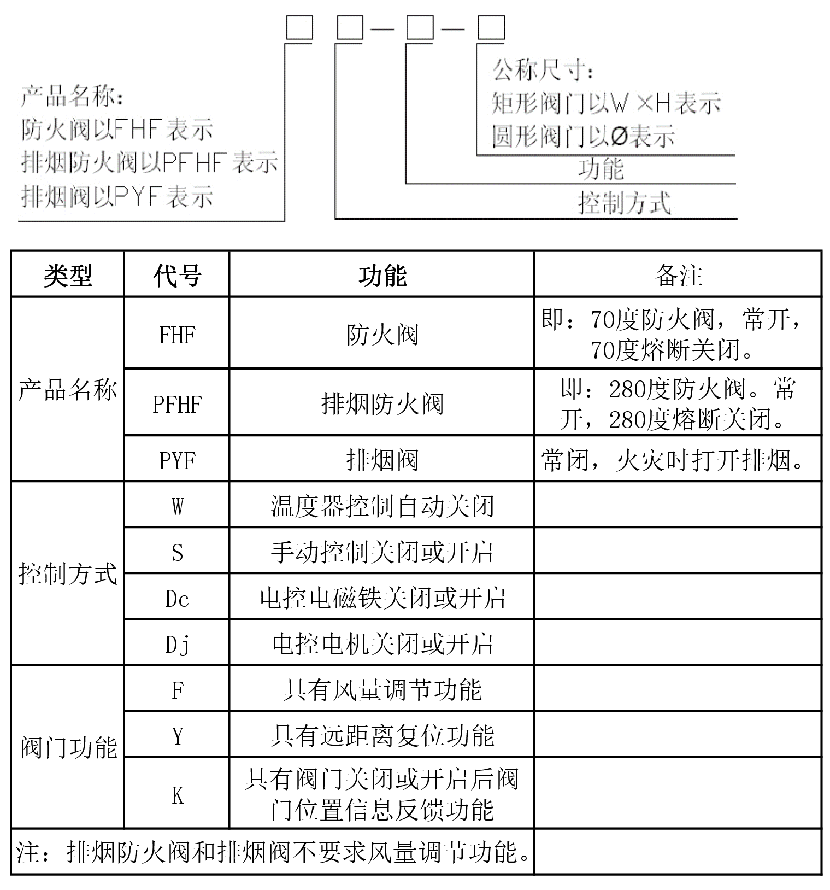

## 风口颜色

1、展厅、临时展厅风口为黑色。

2、其它未吊顶区域（包括：餐饮部、地下室走道、功能房间等）风口为白色。

3、侧墙回风口为白色。

## 风口算量

* 确定风口是面部尺寸，还是颈部尺寸？
* 排气扇是否有风口？（AH200x200）
* 中庭条形风口，是否由精装修单位采购、安装？（待定）
* 中庭内的 E4 风口，是否带静压箱及调节阀？（静压箱待定，调节阀装到支管上）
* 中庭地送风、多功能岛是否由精装修单位采购安装？（精装修单位采购、施工）
* 走道内风盘（C 区 1MF）侧送、回风口，装不装？（安装）
* 风盘回风口带滤网（风盘回风口统一用带滤网、门铰式回风百叶口 HH/F）
* D 区一层南侧“10KV 电业开闭所”，风口、风机是否安装？（待定）
* C 区一夹层内多种尺寸相同的风阀 1000x200，有 E2、AH、BH、AH/D、BH/D，是否可以统一风口类型？（招标按所有种类招标，后期再考虑风口形式的优化）（1-5C 东侧可能不精装修，没有必要带调节阀。）（风盘送风的 E2 建议 BH，空调送风建议也 BH，原因层高低，缝太宽。）
* D 区二层，图纸上 XF D400，是否改为 D315。（待定）
* C 区 3 层西北角 XF 风口，考虑到层高仅为 2.5m，改为 DH 风口。
* D 区 4 层北侧一排风机盘管，精装修风口为通长风口。（后期根据精装修造型，提通长风口。）
* D 区 4 层，高空 XF D400，是否应为 DUK400。（为 DUK 风口）
* C 区 4 层短期展厅风口？（维持现状，后期安装 E2 风口）餐厅？（维持现状，右侧餐厅后期开 BH 风口）
* B1F 中庭风口，是否按照蓝图施工？（按照 1231 图纸施工）
* C 区 4 层 E2，静压箱现场镀锌铁皮制作，带一个 250x250 的风口。
* 中庭屋顶桁架内侧百叶风口，没有节点详图。（待定）

需现场核对尺寸的风口：

* C 区 4 层西北角室外设备平台。
* 楼梯间送风口

## 风口笔记

* C 区 2 层 HRU-2F-05 的回风口尺寸为 4400x6000
* D 区屋面南侧风阀尺寸为 630*630
* D 区 4 层航空航天展厅，大厅侧风口为 DUK，D400，固定角度。

## 风口选型

风口选型：

* 中庭风管支管接风口，无论图上是否有调节阀，都安装手动调节风阀。

风机盘管风口：回风口是否含过滤网，风口形式（是否门铰式）

回风口：门铰式，带滤网。

风口都是颈部尺寸、面部尺寸。

超大型风口，如何拆分，风口大于 2000mm 的拆分，包含固定框。

风口颜色、材质。

特殊风口：

|    名称     | 位置 | 参数                                      | 厂家选型                                             |
| :---------: | :--: | :---------------------------------------- | ---------------------------------------------------- |
| DUK 球形喷口 | 位置 | 风量、侧喷/下喷，安装高度，最大喷射距离。 | 地下室中庭、D 区 4 层、中庭的 DUK 风口：固定好 -15 度角度。 |
| XF 旋流风口  |      | 全部尺寸为 D315，                          |                                                      |

中庭的 DUK、DUF 风口，向设计询问是否为鼓形风口（王淮回复：是球形喷口）。

## 精装修

金博大：北塔、南塔。

康利达：中庭、东塔。

5 月 27 日收到的精装修图纸变化：

A3 区 1 层短期展厅取消天花吊顶，改为原顶，顶面乳胶漆。

C 区 4 层短期展厅取消天花吊顶，改为原顶，顶面乳胶漆。

## 风阀控制

参考规范《》

## 风阀

根据《GB 15930-2007 建筑通风和排烟系统用防火阀门》，排烟防火阀和排烟阀不要求风量调节功能。

有远程手动控制的风阀：BEC、BEV、PS、GS（GP 因为距地安装了，所以不需要远程手动控制）

主馆没有 BEV，仅独立车库有 3 个 BEV，A 区屋顶的一个 BEV，是设计院画错了。

B 区地下室有一个 GS，其余地方没有。

RF 层桁架的风阀，暂时都未提进场计划，ESF-RF-10 的也没有提。4 层 ESF-RF-05 的风阀也没有提。

2 层西北角的风阀尺寸，参考管井尺寸，为`2000*800`。

机房内的阀门还没提：

4 层西北角风机房`4000*630`的风管，改为`4000*800`。

C 区 2 层 HRU-2F-05、06 的回风口，图纸上为 `4400*2500` 共 4 个，改为 1 个。
