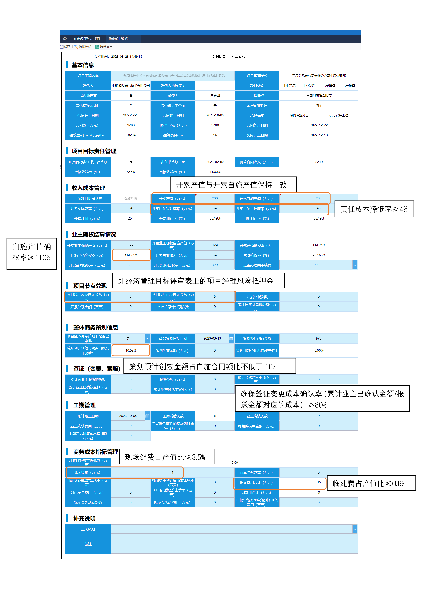

## 局报填写

每个季度最后一个月填写。

自施利润率 - 承接效益率>2%

填写内容：

1. 中建三局商务信息系统 - 成本报表 - 项目基本信息列表 - 项目商务，新项目首次需填写项目基本信息。
2. 中建三局商务信息系统 - 成本报表 - 在建项目列表 - 项目商务经理，每个季度填写。

操作流程：

商务经理填写成本报表 - 保存 - 报送 - 项目经理权限点击报送

>亚菲发的填写注意事项：
>
>①目标责任状签订率 100%。即项目必须签订目标责任状。
>
>②责任成本降低率≥4%。即：(开累自施目标成本 - 开累自施实际成本)/开累自施目标成本≥4%。
>
>③临建费占产值比≤0.6%。即：临设费用合计/测算合同收入≤0.6%。
>
>④现场经费占产值比≤3.5%。即：现场经费/测算合同收入≤3.5%。
>
>⑤确保签证变更成本确认率（累计业主已确认金额/报送金额对应的成本）≥80%。
>
>⑥产值确权率≥110%。即：开累产值确权率≥110%。
>
>⑦商务策划书编制率达到 100%，预计创效金额占自施合同额比不低于 10%，且不低于项目风险金额的 150%。年度风险化解金额不低于应化解金额的 50%。在建项目专项商务策划年度立项数量不少于 10 项。(即满足：101015)

2023 年二季度局成本报表填写注意事项：

>一、总体目标
>
>确立 2023 年 5 月和 6 月为“过程创造能力提升月”按督办要求，确定分项目标：
>
>1.签证变更事实确认率 100%，成本确认率达到 100%。
>
>2.开累效益率下滑项目数量压降至 10% 以内。
>
>3.非我方责任导致的工期延误实现 100% 签证率
>
>4.产值确权率提升至 108% 以上。
>
>5.商务策划提升至公司要求“101015”。

2023 年三季度局成本报表填写注意事项：

>三季度局成本报表完成时间 9 月 17 日。@全体成员
>重点注意事项：（未尽事项详见《局季度商务报表注意事项交底 6.27》）
>1、数据：系统上填写 2023 年 9 月报表，截止 2023 年 9 月 10 日
>2、表中明确要求按照总包口径报送的数据就按总包口径，没有要求按总包口径的就按照自施口径。
>3、合同额含税，其他不含税。
>4、收入：不含税，并且扣除配合费。
>5、成本：不含税，与财务核对，成本要计全，并注意：配合费不再计入成本中，与局经济活动分析要求一致。
>6、管理费：不应含季度奖。
>7、确权：确权是否为最新确权金额（按业主确权金额填报，没有土建分割单的，但已与业主确权的要算进来，即：按合同主体最新确权数据填报），且确权需扣除配合费。
>8、专项策划：策划创效金额可以手填。
>9、核对数据的逻辑性：商务数据不应小于上季度填报数据。实际效益率是否正常，与上季度效益率是否差异很大，差异是否合理。合同应收款 - 实际已收款（财务实际收到的工程款），结果是否合理，分析是否拖欠工程款。
>10、指标未完成的需分析原因：
>（以下为公司及局下达的指标，其中红色为局报内涉及到的指标）
>①目标责任状签订率 100%。
>②责任成本降低率≥4%
>③临建费占产值比≤0.6%
>④现场经费占产值比≤3.5%
>⑤确保签证变更成本确认率（累计业主已确认金额/报送金额对应的成本）≥80%
>⑥产值确权率≥110%
>⑦商务策划书编制率达到 100%，预计创效金额占自施合同额比不低于 10%，且不低于项目风险金额的 150%。年度风险化解金额不低于应化解金额的 50%。在建项目专项商务策划年度立项数量不少于 10 项。

填写注意事项：

