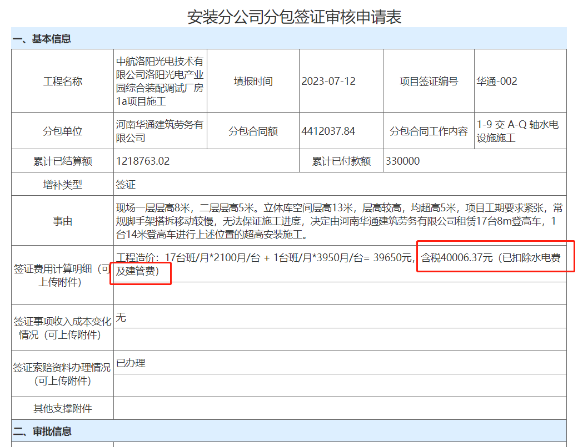

# 签证

## 操作步骤

OA 系统，安装分公司单位空间（总包安装）- 我的模板 - 公共模板 - 安装分公司分包签证审核申请表（总包安装），上传 签证扫描件 报送审批。

审批成功后，将“安装分公司分包签证审核申请表”下载为 PDF，在 财务一体化 结算中作为附件。

申请表中的签证费用需填写上含税（除水电费及建管费）的金额 B。计算方法：可以把 不含税金额 A 填到月度结算表中，生成一个含税金额；或者采用计算公式

```ini
劳务分包：
含税金额B = 不含税金额A*(1-1.5%-0.54%)*(1+3%)

专业分包：
含税金额B = 不含税金额A*(1-1%-0.54%)*(1+9%)
```


