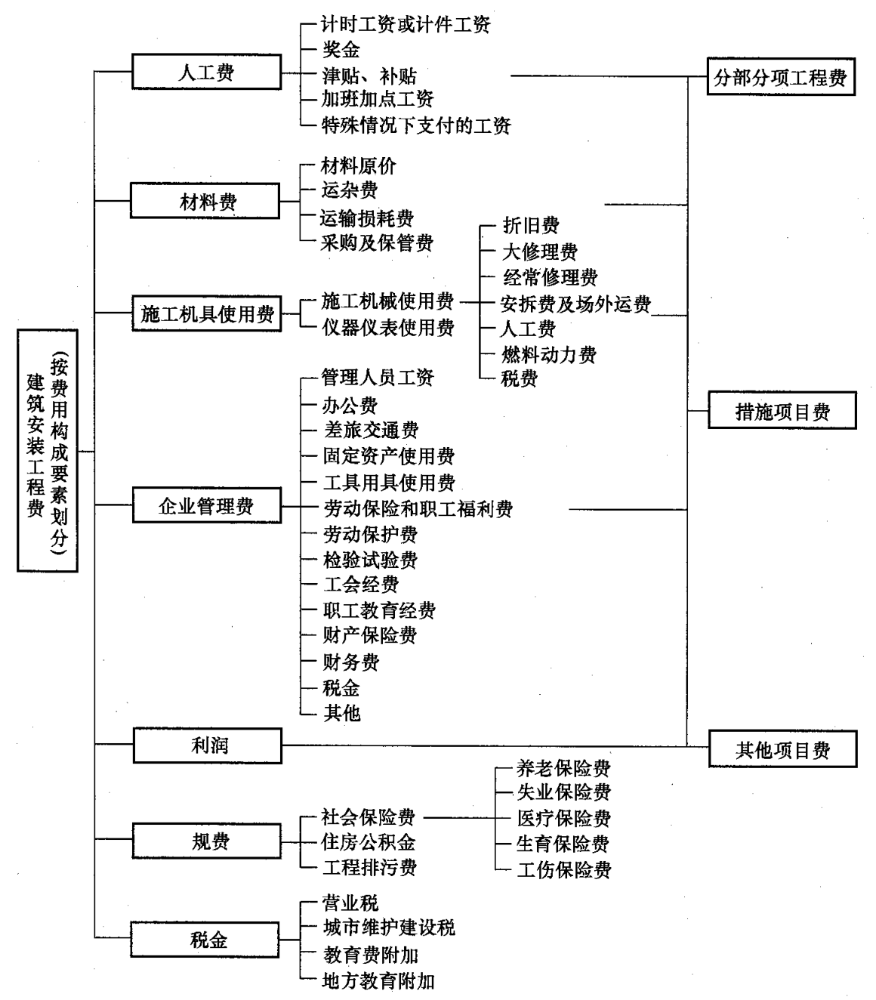

# 两算对比

三算：基本建设工程投资估算、设计概算和施工图预算，简称为“三算”。

公司的两算对比表是指收入预算和施工预算对比。

两算对比的意义：

一、两算对比是成本分析的基础。

通过两算对比，对项目成本进行分析，找出项目的盈亏点，然后编写针对性的商务策划方案。

二、两算对比是竣工结算的基础。

## 收入清单

两算对比核心是对比 基准价（人工费 + 辅材费 + 机械费）、主材费。因此需要在广联达中设置报表格式，导出包含人工费、辅材费、机械费、主材单价（含损耗）、综合单价的报表，然后测算基准价、主材费。

1. 收入清单 GBQ 导入 RPTS 文件，载入报表方案。
2. 导出报表，包含：人工费、辅材费、机械费、主材单价（含损耗）、综合单价。
3. 计算基价（基价=人工费 + 辅材费 + 机械费）。
4. 将报表按照对应列导入至两算对比表格中。

## 施工图预算

公司的“劳务分包综合单价表” ，包含了定额的基准价、综合工日。其中综合工日用来测算措施费。

1. 清单套项。每项清单套出劳务综合单价的唯一序号。
2. 根据劳务综合单价的唯一序号查询出分项工程名称、基准价（不含税）、综合工日（用来计算措施费）。
3. 将基准价填入两算对比表格。
4. 根据清单表述，填入主材单价。
5. 依据施工图算量，填入施工图预算工程量。

## 简单方法

上面的方法，同时分析了基准价、主材费、工程量，较为麻烦。根据一般经验，只要投标时没有重大错误，人工费、辅材费一般不会亏损，因此对于时间紧的项目，可以考虑不用分析基准价，仅分析工程量，再单独做一个主材分析对比即可。

