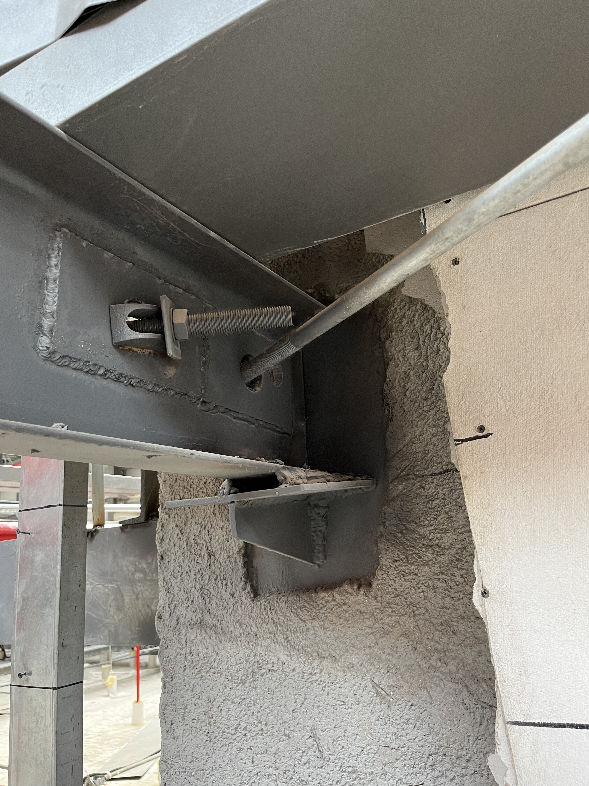
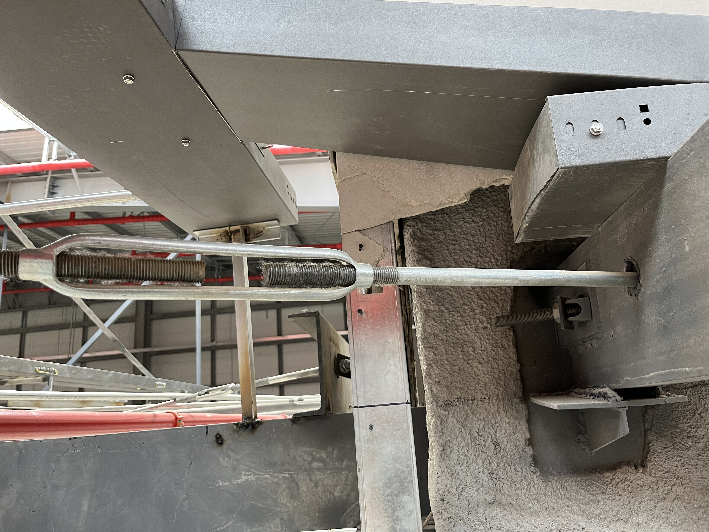
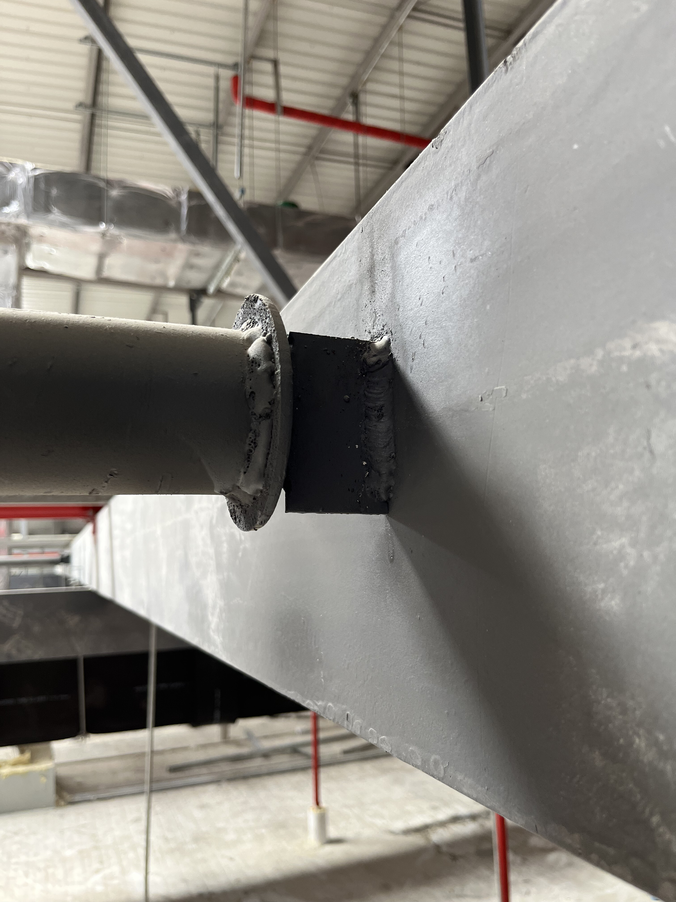
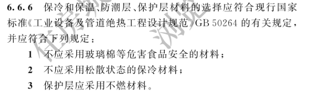
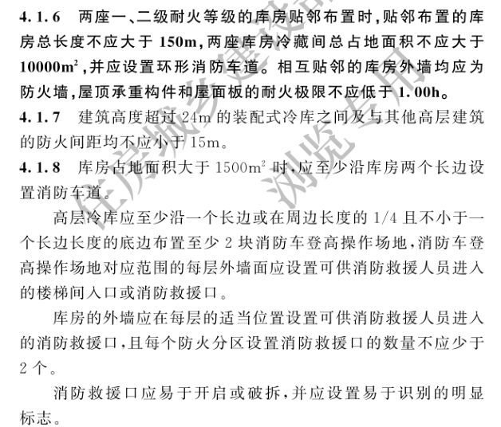

## 1、冷库转换层

转换层钢梁下挂：

转换层连接件：

## 冷库

制冷剂：R404A，安全等级 `A1`，最高安全等级。工作压力：，试验压力：。

冷库内部是否需要设置防排烟。如果设置，需考虑冷量泄漏、冷凝水、结霜。

挡烟垂壁

冷库内排烟阀、风口设置有手动装置。

冷库内通风，换气次数要求。

## 问题

1、请明确保温材料。

2、冷库顶板耐火极限不应低于 1h，应设置环形消防车道。

3、自控原理（压差控制、）
