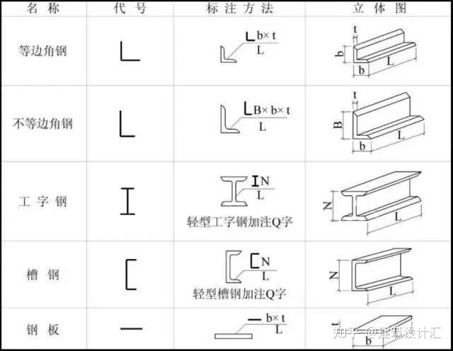

# 钢结构识图

参考：[钢结构图纸基本识图，看这篇就够了！](https://zhuanlan.zhihu.com/p/481929811)

[钢结构识图基础讲义](https://zhuanlan.zhihu.com/p/51121487)

《GBT 324-2008 焊缝符号表示法》

一、型钢的代号及标注

二、钢结构中型钢的连接方法

这里主要分为三种连接方式——焊接、铆接、螺栓连接

1、焊接：将需要连接的型钢的连接部位加热融化，凝结后变成不可分割的一个整体。类型又分为：坡口焊缝、贴角焊缝、塞焊缝。

焊缝符号

1.焊缝基本符号（常用）：表示焊缝横截面形状的符号

2.辅助符号：表示焊缝表面形状特征的符号

3.补充符号：补充说明焊缝的某些特征而采用的符号

4.尾注：是对焊缝的要求进行备注，一般说明质量等级，适用范围、剖口工艺的具体编号等。

焊缝表达举例：

