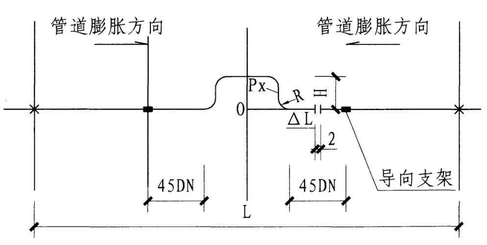

## 笔记

散热器所有规格接管都是 DN20

需要明确同侧上进下出，接管尺寸 DN20

散热器应该配套多提一部分配件，包括挂钩、排气阀、溪水丝堵，按 1~5% 考虑。

## 采暖阀门

华通 0708 图纸与 0930 图纸一样

伟翔 现场环管按照 0708 图纸施工的，所以阀门应该按照 0708 图纸提计划。

铁军、德轼蔓按照 0930 图纸施工的，所以阀门应该按照 0930 图纸提计划。

## 外网

外网包括：货运区外网、综合楼地下室、飞行区外网。

D38、D45 管道壁厚没有变化。

## 螺纹连接

气暖供热管道、是不可以使用（生料带）做密封填充料的）因为、气暖的温度比较高、有比较干燥、生料带经过几次的高温、冷却、就会融化、改变固体的体积形态、，管道接口容易密封不严、造成跑气现象、所以不可以使用----应该使用；细麻丝、加铅油、做填充料为宜，以为细麻丝通过铅油的油性滋润、不至于通过干燥的高温烤焦、又有任性，铅油又可以滋润丝扣不生锈，会更好的保护管道丝扣连接的密封性

**水暖安装中常用的一种辅助用品 麻绳：** 连接丝头用。把麻皮缠绕到丝头上在抹点铅油或者在缠绕点生料带 (聚四氟乙烯) 拧到螺母中防漏。一般都是用麻皮，不能用麻绳，堵漏效果不如麻皮。麻是一种植物，麻绳是用此植物的皮加工成。

**暖气安装接口用麻没有铅油用其他油可以代替吗？用生料带可以代替吗？** 可以用，现在生料带已经基本替代麻丝了。但实际上还是“麻丝 + 铅油”更好，因为麻丝有遇水膨胀的特点，这一点生料带是无法比拟的。因此生料带更适合气体管道，比如天然气、煤气管道，而水管、暖气管用麻丝更好。尤其是当接口部分密封不是很好时，用麻丝即使有些许渗漏，也会自己止住的。

## 补偿器

参考国家图集《14K206 金属管道补偿设计与选用》。

方形补偿器**通常水平安装**，只有在空间上较狭窄不能水平安装时，才允许垂直安装。补偿器弯可朝上也可朝下，朝上配置时应在最高点安装排气装置；朝下配置时应在最低点安装泄水装置。方形补偿器一般布置在两固定支架中间。

## 热力小室安装

参考《15K502 供热计量系统设计与安装》图集：

热量表安装位置应保证仪表正常工作要求，在热量表前后必须留有足够长的直管段。对于超声波热量表和机械式热量表，其前后安装直管段要求分别为 10D 和 5D；如现场不允许时，至少要保证前 5D 后 2D。直管段范围内不允许安装任何管件或压力、温度测量仪表等影响流量特性的元件。

对于超声波、电磁式热量表，可以水平、垂直或以一定的角度安装。

热水用热量表不能安装在整套管路的最高处，防止长期积气影响计量精度。

当被测介质含有较多杂质时，应根据不同形式热量表的要求，在热量表直管段前加装过滤装置。在热量表流量传感器的前后应设置关断阀，且关断阀应设与过滤器、压力表接口等所有需检修设备的两侧。

热量表要安装在合适的位置，以便于数据读取、操作、维护、检修。

集中供热系统中，建筑物热力入口宜安装静态水力平衡阀，并应对系统进行水力平衡调试。

当室内供暖系统为变流量系统时，不应设自立式流量控制阀。

静态水力平衡阀或自立式控制阀的规格应按热媒设计流量、工作压力及阀门允许压降等参数经计算确定；其安装位置应保证阀门前后有足够的直管段，没有特别说明的情况下，阀门前直管段长度不应小于 5 倍管径，阀门后直管段不应小于 2 倍管径。
