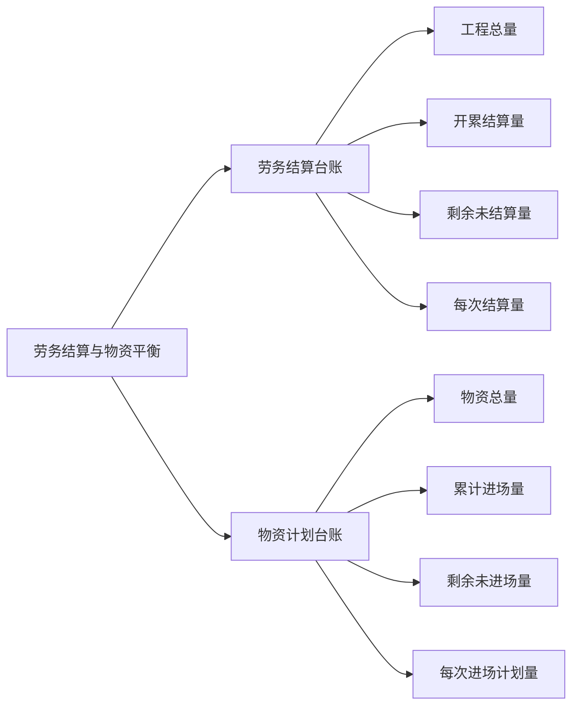

# Markdown 语法指南

## 基本语法

### 段落

|                           效果                           |                            代码                             |         语法标准         |
| :------------------------------------------------------: | :---------------------------------------------------------: | :----------------------: |
|                    内嵌 `python` 代码                    |                    内嵌 \`python\` 代码                     | GitHub Flavored Markdown |
|                         **加粗**                         |                         `**加粗**`                          | GitHub Flavored Markdown |
|                          *斜体*                          |                          `*斜体*`                           | GitHub Flavored Markdown |
|                        ~~删除线~~                        |                        `~~删除线~~`                         | GitHub Flavored Markdown |
|                        ^^下划线^^                        |                        `^^下划线^^`                         |    PyMdown Extensions    |
|                       ==高亮显示==                       |                       `==高亮显示==`                        |    PyMdown Extensions    |
|                       下标：H~2~O                        |                        `下标：H~2~O`                        |    PyMdown Extensions    |
|                    上标：x^2^+y^2^=z                     |                     `上标：x^2^+y^2^=z`                     |    PyMdown Extensions    |
| 内嵌公式：$\Gamma(z) = \int_0^\infty t^{z-1}e^{-t}dt\,.$ | `内嵌公式：$\Gamma(z) = \int_0^\infty t^{z-1}e^{-t}dt\,.$` |    PyMdown Extensions    |
|               快捷键：++ctrl+alt+delete++                |               `快捷键：++ctrl+alt+delete++`                |    PyMdown Extensions    |

### 任务列表

- [x] Run ruff when the python file is saves
- [ ] Use Import Optimizer

### 无序列表

- 一级无序列表
- 一级无序列表
  - 二级无序列表
  - 二级无序列表
    - 三级无序列表
    - 三级无序列表

### 有序列表

1. 一级有序列表

2. 一级有序列表

    1. 二级有序列表

    2. 二级有序列表

        1. 三级有序列表

        2. 三级有序列表

### 代码

```python
# python 语言
import os

def func(a, b):
    r = a + b
    return r

if __name__ == '__main__':
    func(1, 2)
# ---------------------
# -->  ==>  != >= <= ++
```

### 引用

>这是一个普通的引用
>
>这是一个普通的引用

### 表格

|  Method  | Description                          |
| :------: | ------------------------------------ |
|  `GET`   | :material-check:     Fetch resource  |
|  `PUT`   | :material-check-all: Update resource |
| `DELETE` | :material-close:     Delete resource |

### 整行公式

$$
\operatorname{ker} f=\{g\in G:f(g)=e_{H}\}{\mbox{.}}
$$

### 思维导图



## 扩展语法

扩展语法参考：<https://facelessuser.github.io/pymdown-extensions/>

下面是常用的扩展语法

### Admonitions

Material for MkDocs 支持的扩展语法

!!! note "这是一个 note 标记，支持 tittle 标题"
    支持的标记：note, abstract, info, tip, success, question, warning, failure, danger, bug, example, quote。

!!! info
    这是一个 info 标记

!!! warning
    这是一个 warning 标记

!!! danger
    这是一个 danger 标记

!!! example
    这是一个 example 标记

!!! quote
    这是一个 quote 标记

### 警报

GitHub 独有的警报格式

> [!NOTE]
> Useful information that users should know, even when skimming content.
