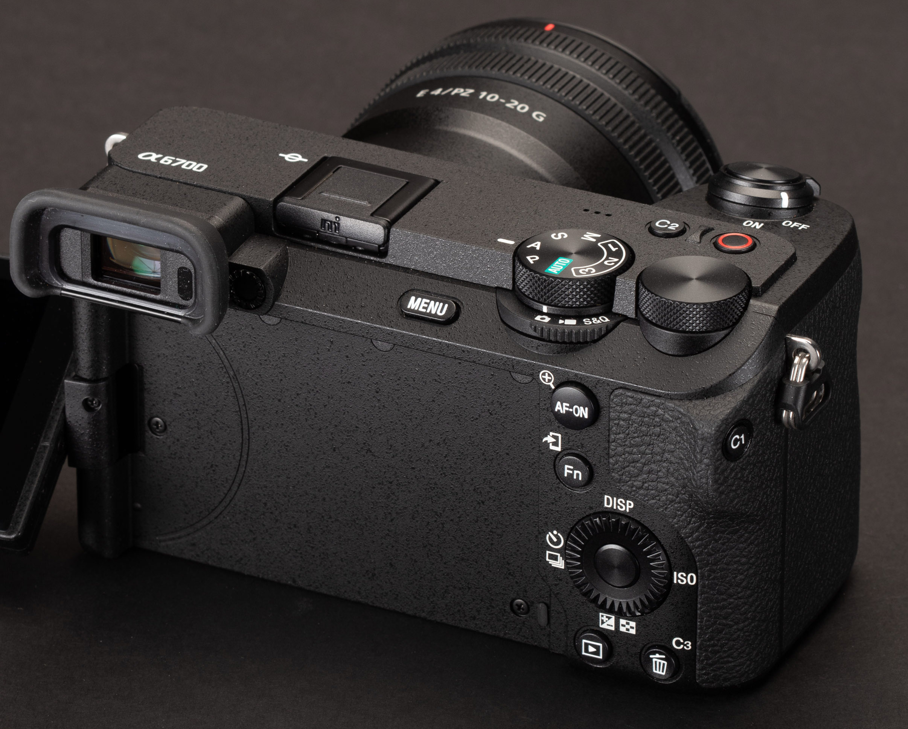

# 照片拍摄

## 拍照笔记

1. 人像拍摄时，如果光比过大，适当避免背景出现死白，会很难看。
2. 人像拍摄时，曝光一般已脸部曝光为准，后期增加提亮，会增加噪点，脸部会很脏，所以前期脸部曝光一定要准确，脸部太亮了后期压暗就行了。
3. 多人合影时，光圈不能太大，F5.6~F8 是镜头的最佳光圈，否则会造成合焦的人清晰、没合焦的人不清晰。选择 40~50mm 焦段比较合适。
4. 抓拍娃时，没必要过度追求大光圈，光线好的时候，光圈降到 F4.0 就差不多了。
5. 光线过强时，大光圈容易产生色散、紫边、对比度下降。
6. 小技巧：一般情况下对焦区域设置为广域，偶尔拍风景、小物件时无法对焦至想要的位置，切换对焦区域又很麻烦，可以将想要对焦的位置置于画面中央，按住 AF-ON 按键锁住对焦点，然后移动相机至想要的构图，按快门拍照即可。
7. 拍的照片景别有些单一，缺少有意境的远景照片，需要多观察环境，寻找合适机位。

## 快捷键

|    按键    |         拍照模式         |    视频模式    |
| :--------: | :----------------------: | :------------: |
|    C2 键    |    取景器、显示屏切换    | 与拍照模式一致 |
| 视频录制键 |         对焦区域         |   白平衡锁定   |
|    C1 键    |        显示屏亮度        | 与拍照模式一致 |
|    C3 键    |      触摸屏幕开/关       | 与拍照模式一致 |
|   前拨轮   | 曝光补偿（M 档下为快门）  | 与拍照模式一致 |
|   后拨轮   | 光圈/快门（M 档下为光圈） | 与拍照模式一致 |

## 拍照设置

### 自定义档位设置

主要以拍娃为主，因此相机要优先考虑抓拍，快门速不能过低，一般拍摄人像时，在开启多重测光人脸优先时，曝光补偿一般设置为 +0.7~1.3EV，脸部的曝光会比较好。

| 自定义档位 |    模式     | 曝光补偿 |            ISO AUTO 最小快门速度             |   连拍速度    |         ISO          |  斑马线  |
| :--------: | :---------: | :------: | :-----------------------------------------: | :-----------: | :------------------: | :------: |
|     U1     | A 档光圈优先 |  +2/3EV  |  FAST 高速（50mm 焦距下最小快门速度 1/160 秒）  | LO（3 张/秒）  | ISO 自动（100~6400）  | 下限 109+ |
|     U2     | A 档光圈优先 |  +2/3EV  | FASTER 更快（50mm 焦距下最小快门速度 1/320 秒） | MID（6 张/秒） | ISO 自动（100~8000）  | 下限 109+ |
|     U3     | A 档光圈优先 |  +2/3EV  |                   1/500S                    | HI（8 张/秒）  | ISO 自动（100~12800） | 下限 109+ |

最高的连拍速度 HI+ 速度为 10 张/秒（无损压缩 RAW 格式）。

ISO AUTO 最小快门速度设置为 STD 标准，50mm 焦距下最小快门速度 1/80 秒。

索尼 A6700 闪光灯同步速度为 1/160 秒，晚上使用没有高度同步的闪光灯，可以使用 S 档，快门速度根据情况设为 1/80~1/160S。

### 常用设置

|           名称           |  设置值  |                             备注                             |
| :----------------------: | :------: | :----------------------------------------------------------: |
|         对焦区域         |   广域   | 索尼相机的对焦还是很靠谱的，基本不用为对焦操心，虚焦的概率蛮低的。 |
|     多重测光人脸优先     |   开启   | 当［被摄体识别］下的 AF 中的被摄体识别］设为［开］并且［识别目标］设为［人］以外的项目时，［多重测光人脸优先］不工作。 |
|         曝光补偿         | +2/3~1EV | 人像拍照：在多重测光人脸优先开启情况下，光比大的情况下曝光补偿可以无脑设置为 +2/3EV，光比小时，可以适当提高至 +1EV |
|       动态范围优化       |   关闭   |          DRO-OFF，会影响 RAW 文件的曝光值，建议关闭。          |
|       拍照文件格式       |   RAW    |                                                              |
|       RAW 文件类型        | 无损压缩 |                                                              |
|       长时曝光降噪       |   关闭   |              开启的化，拍摄完机内降噪速度非常慢              |
|        高 ISO 降噪         |   开启   | 这个降噪速度很快，影响 JPG 格式，不影响 RAW 文件；但是影响 RAW 文件内嵌缩略图 |
|        网格线显示        |   开启   |                                                              |
|      录制时强调显示      |   开启   |                                                              |
| 自动关显示屏（静止影像） |   5 秒    |                                                              |
|      NTSC/PAL选择器      |   NTSC   |                       解锁 30P/60P 视频                        |
|      AF-S 优先级设置      |    AF    |            优先对焦。到被摄体合焦为止不释放快门。            |
|      AF-C 优先级设置      |    AF    |            优先对焦。到被摄体合焦为止不释放快门。            |

### 快捷键

|                 快捷键                 |                    功能                    | 备注 |
| :------------------------------------: | :----------------------------------------: | :--: |
| 长按 Fn 直到显示屏上出现“已锁定。”信息 |        锁定前转盘、后转盘和控制拨轮        |      |
|    同时长按 MENU 按钮和 Fn 按钮 5 秒     | 锁定除了快门按钮以外的所有按钮、转盘和拨轮 |      |

## 特殊拍摄

### 夜景车流光轨拍摄

使用三脚架，A 档，光圈 F8~F16（快门 10S~30S），ISO 固定为 100，手动选择对焦点

### 夜景烟花拍摄

使用三脚架，A 档，光圈 F10（快门 3~10S），ISO 固定为 100，手动选择对焦点

### 包围曝光拍摄 HDR 照片（连续阶段曝光）

1EV5 张，拍摄后使用 LR 合成 HDR。

>注意：光线不足时，如果 ISO 升高，则意义不大。此时应该使用三脚架，ISO 值固定 100，再进行包围曝光拍摄。

### 摇拍

快门优先 S 模式，快门优先，快门设置为 1/30S，然后手持跟随拍摄。

### 延时摄影

两个方法：机内合成、机外合成。

1、缩时摄影

记录帧速率：【60p】

间隔时间：［3S］（4K 格式时，最高设置到 5S）

记录设置：【4K/H265/100M/422/10bit】

由于是机内合成，容易过热，官方给出的数据是 4K 格式最长录制 1 小时。

2、间隔拍摄

间隔拍摄：［开］；

拍摄开始时间：［3S］；

拍摄间隔：［3S］（人群和车流 2-4 秒  云层流动 3-5 秒  城市日转夜 12-15 秒  花卉 30 分钟一张）；拍摄次数：［300 次］（30 帧 x10S）；

AE 跟踪灵敏度：［低］；

间隔内的快门类型：［电子快门］；

拍摄间隔优先：［关］（光线暗时，快门时间可能会超过拍摄间隔时间）

> **注意：**
>
> 防抖：关闭防抖
>
> 对焦：屏幕选中对焦点后，切换至手动对焦。（尼康可以设定 关闭每次拍摄之前对焦）
>
> 白平衡：手动设置白平衡值（白天可以 5500K），或是先锁定白平衡，再开始拍摄。
>
> ISO 最小速度：4s
>
> ISO 范围：100~400

## 技术

### 宁欠勿曝、向右曝光？

<https://www.sony.com/zh-cn/electronics/support/articles/00077788>

<https://qiuliang.com/techniques/20130114_expose_to_right.htm>

结论：宁欠勿曝：保证能拍到；向右曝光：最大化相机 CMOS 画质。

理论：1、欠曝提亮后会增加噪点。2、曝光越高，信噪比越大，画质越好（前提：曝光不超过相机的极限）

分析：单反时代，取景器无法实现所见即所得，经验不足的情况下，可能无法准确掌握曝光，为了能够快速抓拍到，避免过曝后细节丢失，所有才有了宁欠勿曝的说法。微单时代，取景器和显示屏都能实现所见即所得，加上“斑马线”、“多重测光人脸优先”等辅助工具，很容易掌握曝光，而为了榨干 CMOS 性能，就有了向右曝光的说法。

实战：使用微单的情况下，CMOS 动态范围优秀，最简单的方法就是直接拍摄到准确曝光的照片（后期不需要调整曝光）。现场光比较小、画质要求高、非转瞬即逝画面等情况下，如果不嫌麻烦，可以适当提高曝光，后期再降低曝光，理论上画质会更好。

向右曝光本质上就是一种尽可能提高信噪比的技术，如果你面对的场景对比度很大，甚至超出相机的动态范围，显然你根本不必考虑向右曝光。向右曝光更适合于反差相对较小的场合，通过在直方图左侧区域留下部分空白以充分利用直方图的右侧区域。

* 向右曝光是为了保证画质，向左曝光是为了保证拍到。
* 在不过曝的前提下，尽量向右曝光；
* 如果人像拍摄，面部仍曝光不足（比如逆光拍摄时），则根据情况再适当增加曝光，根据情况让背景过曝也无所谓了。
* 如果是儿童抓拍场景，根本没时间反复设置参数，没必要刻意追求最佳曝光，根据经验保持曝光补偿 +2/3EV 比较合适。

### 斑马纹

经过反复测试，RAW 格式拍照模式下，设置过曝提示斑马纹为 109+，可以及时地发现过曝部分。也可以使用最佳亮度拍摄人像，设置斑马线的值在 70~80 之间，然后调节曝光，直至斑马线出现在人物的脸部。

### 后键对焦

参考：秋凉的 [AF-ON 与后键对焦：尼康高级自动对焦控制技术](https://qiuliang.com/nikon_guide/03_af-bbaf/af_bbaf_p1.htm)

### 等效光圈

光圈越大、与被摄对象距离越近、焦距越大，则虚化越大、景深越浅。

焦距相同，虚化程度一样。道理很简单，固定好全画幅相机机位，采用 50mm 焦距拍摄照片，同样机位下半画幅拍摄，相当于在在全画幅拍摄的照片中裁切了中间区域。

但是相同焦距下，全幅和半幅的视角是不一样的，想要获得一样的视角，半画幅需要更小的焦距（约 33mm），因此半幅相机的虚化会变小。

## 规格

### 索尼 A6700

实际像素数：6192x4128=25560576 像素=25.56MP

背照式传感器，双增益 ISO

|      PP 值       | 第一档 | 第二档 |
| :-------------: | :----: | :----: |
|      关闭       |  100   |  320   |
|    PP10 HLG3    |  125   |  400   |
| PP11 S-Cinetone |  125   |  400   |
|      SLOG3      |  800   |  2500  |

### 适马 18-50 F2.8

F5.6-F8 是最佳成像光圈
