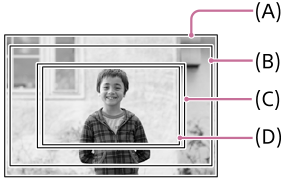
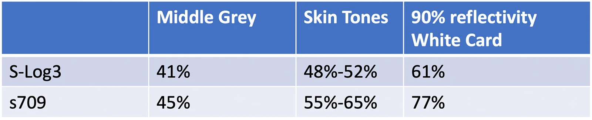

# 视频拍摄

## 笔记

## 视频拍摄参数

视频拍摄快捷设置

| 自定义档位 |       模式       |   伽马曲线    |            视频格式            |    档位     |         ISO          | 曝光补偿 |         LUT         | 显示 LUT |        测光        | 斑马线  |
| :--------: | :--------------: | :-----------: | :----------------------------: | :---------: | :------------------: | :------: | :-----------------: | :-----: | :----------------: | :-----: |
|     U1     |      SLOG3       | S-Gamut3.Cine | XAVC HS 4K，45M/420/10bit/60P  | A 档光圈优先 | ISO 自动（100~12800） |   0EV    | LC709，AE 偏移 +2.0EV |   开    | 多重测光、人脸优先 | 下限 99+ |
|     U2     |      SLOG3       | S-Gamut3.Cine | XAVC HS 4K，100M/422/10bit/60P | A 档光圈优先 | ISO 自动（100~12800） |   0EV    | LC709，AE 偏移 +2.0EV |   开    | 多重测光、人脸优先 | 下限 99+ |
|     U3     |       PP10       |     HLG3      | XAVC HS 4K，45M/420/10bit/60P  | A 档光圈优先 | ISO 自动（100~12800） |  +1.0EV  |          /          |    /    | 多重测光、人脸优先 | 下限 99+ |
|    A 档     |       PP11       |  S-Cinetone   | XAVC HS 4K，45M/420/10bit/60P  | A 档光圈优先 | ISO 自动（100~12800） |  +0.7EV  |          /          |    /    | 多重测光、人脸优先 |  109+   |
|  HDR 视频   |       PP10       |     HLG3      | XAVC HS 4K，45M/420/10bit/60P  | A 档光圈优先 | ISO 自动（100~12800） |  +1.0EV  |          /          |    /    | 多重测光、人脸优先 |   99+   |
|     /      | SLOG3 还原 LUT 直出 | S-Gamut3.Cine | XAVC HS 4K，45M/420/10bit/60P  | A 档光圈优先 | ISO 自动（100~12800） |  -1/3EV  | LC709，AE 偏移 +2.0EV |   开    | 多重测光、人脸优先 |  109+   |

> 注：索尼 A6700 拍摄出来的 60P 实际为 59.94 fps，120P 实际为 119.88 fps。
>
> 索尼的 XAVC HS 视频格式就是 H265 编码格式。
>
> SLOG3 模式，不开启 LUT 监看，斑马线确实是 94+，但开启 LUT 监看功能后，斑马线是 99+（受还原 LUT 影响，部分 LUT 是 98+）。
>
>`SLOG3还原LUT直出` 其实就是关闭 LOG 拍摄模式，直接使用自定义的图片配置文件，相机就自动开启了 LUT 烧录直出模式了，设置方法：
>
>1. 将 `LC709.cube` 文件拷贝至 SD 卡 `\PRIVATE\SONY\PRO\LUT` 目录内。
>2. 将相机切换至视频模式。
>3. MENU - 曝光/颜色 - 颜色/色调 - 管理用户 LUT - User1 中导入 `LC709.cube`，AE 水平偏移设置为 +2EV。
>4. 关闭 LOG 拍摄。
>5. 图片配置文件选择 PPLUT1。

## 视角

A6700 的 4K60P 是 6K 超采，裁切系数 1.04，画质最顶。



| 序号 |                   录制模式                   | 裁切系数（视角系数） |               备注                |
| :--: | :------------------------------------------: | :------------------: | :-------------------------------: |
|  A   |                 拍摄静止影像                 |         1.0          |                                   |
|  B   |      录制动态影像时（4K 120p/100p以外）      |         1.04         |                                   |
|  C   | 拍摄慢动作/快动作动态影像时（240fps/200fps） |         1.5          |                                   |
|  D   |         拍摄 4K120p/100p 动态影像时          |         1.6          | 对焦会有一定下降，需要 V60 的 SD 卡。 |

## 防抖

A6700 拍摄的视频包含有陀螺仪数据，可以使用 Gyroflow 软件后期增稳，经过实测，开启机身防抖，不影响后期使用陀螺仪数据增稳效果，我的两个镜头 适马 18-50/F2、唯卓仕 56/F1.7 两个镜头都没有镜头防抖，所以无法测试镜头防抖的影响，但根据网络上的说法，如果要使用后期陀螺仪数据增稳需要关闭镜头防抖。

## 慢和快设置

最高 1080P240P，需要 V90 的 SD 卡才能解锁这些功能。只要不是有 240P 的需求，V60 卡已经完全满足了，直接拍 4K120P 的视频就可以了。

## Slog3

### 官方 LUTS

<https://sonycine.com/resources/luts/>

**SLog3SGamut3.CineToLC-709** ：此 LUT 效果是低反差偏正常影调，高光区和阴影区都被轻微压缩，以便后期进行扩展调色。（该 LUT 针对黑电平有 2% 细微地提升，在调色中给予阴影细节更多地调整空间），此 LUT 还原了较好的肤色，整体色彩是低饱和度低对比度的 709 色域，可为后期调色提供更多空间，这是一个中规中矩的 Log 还原 709 LUT。

**SLog3SGamut3.CineToLC-709TypeA** ：此 LUT 是 LC-709 的电影版，对比度比 LC-709 更低。它模拟了 Sony HDW-F900 和 Alexa 的风格，颜色上有轻微的电影质感。它的中间调对比度和 LC-709 相同，但肤色段和 LC-709 有轻微不同。画面的黑点进行了一定程度的偏移以适配常规摄影机（黑电平提升 5%，红色与艾丽莎略微不同）。

**SLog3SGamut3.CineToCine+709**  此 LUT 适用于在电视平台上模拟胶片色彩。它再现了使用彩色电影负片拍摄，再用正片冲洗出来的色彩效果。冲洗用的正片本身比负片有更大的反差，所以最终对比反差会很大。实际上压缩了高光和阴影，建议慎用。

### Phantom LUTS

<https://www.joelfamularo.com/colour-a7s3>

**Neutral 中性** 非常接近模拟 ALEXA Rec709 LUT 的调色预设，具有 ALEXA 的完美肤色再现效果。显着提高所有原色和肤色的色彩准确性。

**Tungsten 钨丝灯** 稍微偏暖的的调色预设，用于钨丝灯下的拍摄对象，对拍摄环境有要求。

**Utopia 乌托邦**  最具电影感调色预设，包含血红色和电影般的蓝绿色，对比度略有增强。

**Ice Blue 冰蓝** 冷色调，带有强烈的深蓝色（在蓝眼睛的拍摄对象上看起来很棒），个人感觉这个不太适合亚洲人，拍摄时太阳特别足，但套完预设有点像阴天的感觉。

**Jamaica 牙买加** 绿色和金色风格，有点片港式电影，可以表现绿色和肤色。

## 曝光

参考：<https://sonycine.com/articles/how-correctly-expose-s-log3---a7s-iii---fx3---fx6---fx9/>

<https://helpguide.sony.net/di/pp/v1/en/contents/TP0000909109.html>

在 S-Log3 曲线下，皮肤的最佳曝光范围为 48~52%，可以设置斑马线为 61%±2，当皮肤上被斑马纹覆盖，说明皮肤曝光正常。

注意：这里说的 S-Log3 都是不开启 LUT 显示，如果开启了，那么跟 s709 就差不多了。



## 达芬奇

让达芬奇支持 H265 编码：<https://github.com/xzh767/Microsoft-HEVCVideoExtension>

免费版的达芬奇软件不支持 422 格式视频。

## 视频播放

进入 `%APPDATA%\mpv`，新建 `mpv.conf` 文件，

```ini
# 参考：https://github.com/hooke007/MPV_lazy
# %APPDATA%\mpv\mpv.conf
vo = gpu-next   # <gpu|gpu-next> 视频输出驱动。许多渲染相关的选项也只能在这两项下正常工作。当前版本首选 gpu
                # gpu 最高普适性和完成度；gpu-next 查看此处讨论 https://github.com/hooke007/MPV_lazy/discussions/39
image-lut = "D:\Home\Docs\相机\索尼A6700\LUT\标准\SLog3SGamut3.CineToLC-709.cube"
image-lut-type = normalized


hwdec                  = auto         # 指定应使用的硬件视频解码 API，默认值 no 为软解。值 auto 或 auto-safe（等效值 yes）即优先尝试原生硬解，但不支持部分设置/滤镜。
                                      # 它也可以是多个值组成的优先级列表，例如值 vulkan-copy,nvdec-copy,dxva2-copy 表示依次尝试这些解码模式
                                      # 更多详情参见 Wiki 的 FAQ 页面下的“软硬解的选择”部分
auto-window-resize     = yes          # <默认 yes|no> 是否允许自动调节窗口大小
           # 如果使用这项参数将无效化以下选项 --autofit --autofit-larger --autofit-smaller --window-scale
autofit-larger         = 80%x80%      # 窗口自动拉伸时（初起动/切换文件）防止太大（例值 80%x80%），默认为空。使用 --autofit 系列的参数将无效化 --window-scale
idle                   = yes          # <yes|默认 no|once> 是否空闲待机（中止播放或所有文件播放后依旧保持 mpv 运行）
```
