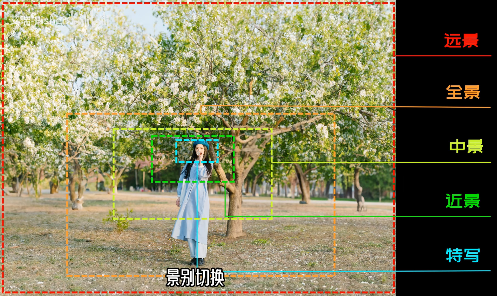
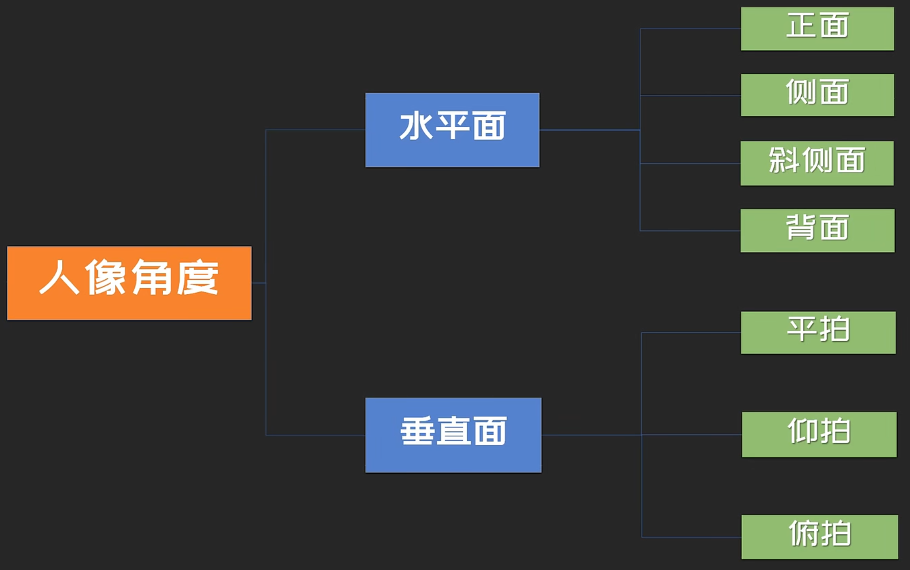
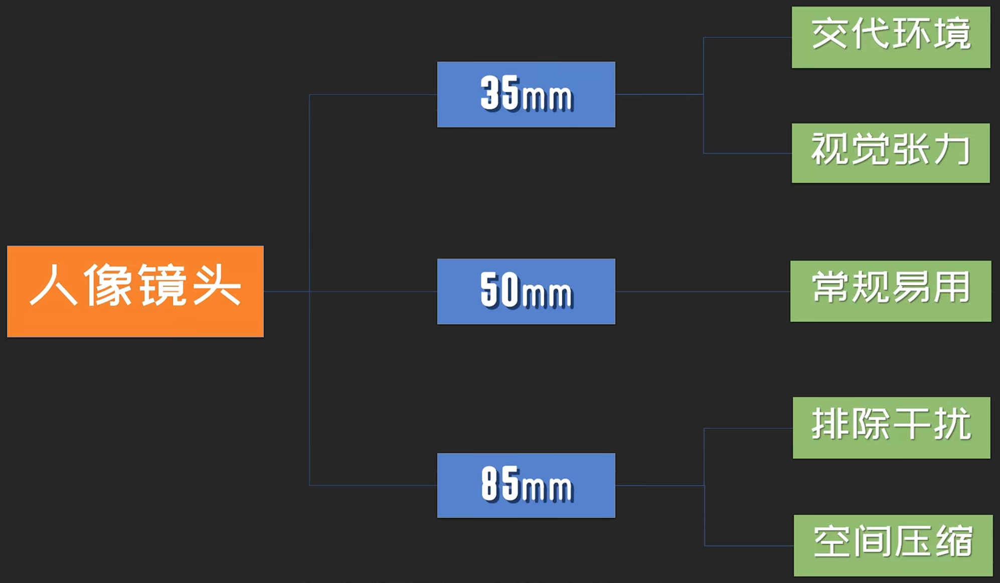
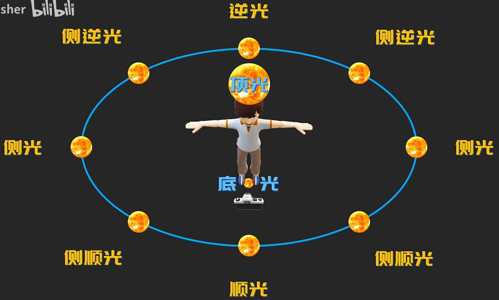
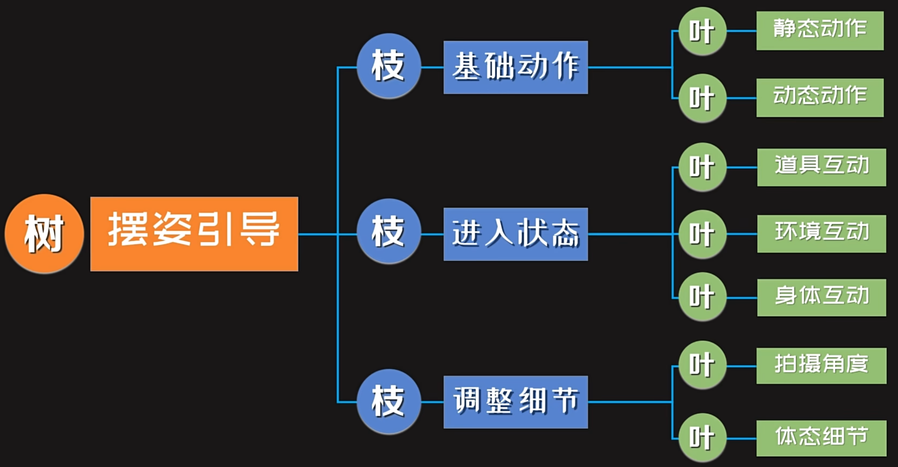

# 人像摄影

## 一、构图

常用的构图

1. 居中构图
2. 三分线构图
3. 对角线构图
4. 引导线构图
5. 前景构图
6. 框架构图
7. 对称构图
8. 水平构图
9. 填充构图
10. 留白构图

## 二、常用景别

常用景别：远全中近特

## 三、人像角度

常用人像角度

## 四、人像焦段

常用的人像焦段：

其他的，还可以使用超广角，更有张力。

## 五、人像光位

主要使用：顺光、侧顺光、测光、侧逆光、逆光，偶尔也可以用下顶光。

## 六、常用技巧

1. 巧用道具
2. 动态抓拍
3. 不看镜头
4. 镜头互动
5. 边走边拍
6. 多种角度
7. 面部特写
8. 不止拍脸
9. 精简画面
10. 利用前景
11. 动态模糊
12. 利用光线
13. 光线时间
14. 尝试逆光（发丝光、轮廓光）

## 七、人像前期色彩搭配

色相搭配、色彩感受、色彩性格、色调特点

## 八、人像摆姿引导

## 九、前期策划

选题

模特

场景

服装

道具

妆造

时间

## 十、提升审美

收集优秀的作品
