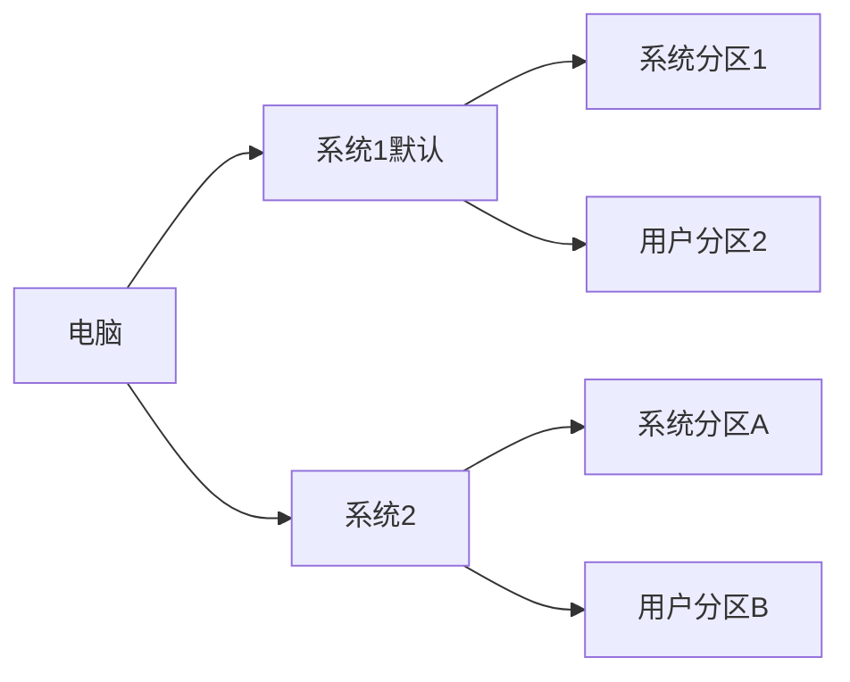

# 家庭电脑多用户使用设置

场景：

家庭里 1 台电脑，会有多人使用，希望有 2 个账户，各自安装软件、文件所有的东西都是隔离的，所有的操作都互不影响。

解决方案：

方案一：使用 Windows 账户，但是软件还是可能会安装到系统目录，两个账户的软件相互交叉。不满足需求。

方案二：创建 2 个相互隔离的系统，2 个系统使用不同的分区，每个系统使用不同的数据分区，不属于用户的数据分区设置为隐藏，防止访问其他用户的文件，不同的用户甚至可以设置启动密码，防止进入到其他用户的系统。

方案二能较好实现需求，下面是具体操作步骤：

1、创建 4 个分区，分别为：系统分区 1、用户分区 1，系统分区 2、用户分区 2。系统分区 2、用户分区 2 在系统 1 下不可见。

2、使用 GRUB 管理系统启动，为系统 2 设置密码保护，默认直接启动到系统 1 无须密码。

虽然稍显麻烦，但是这是目前为止最为完美的解决方案，由于是 2 个真正独立的操作系统，可以做到真正意义上的隔离。

