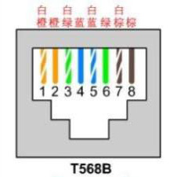

# 网线接法

RJ45 通用 8 针网线制作方法。

我们使用网线钳的剥皮功能剥掉网线的外皮，会看到彩色与白色互相缠绕的八根金属线。橙、绿、蓝、棕四个色系，与他们相互缠绕的分别是白橙、白绿、白蓝、白棕，有的稍微有点橙色，有的只是白色，如果是纯色，千万要注意，不要将四个白色搞混了。我们分别将他们的缠绕去掉，注意摆放的顺序是：橙绿蓝棕，白在前，蓝绿互换。也就是说最终的结果是：

白橙、橙、白绿、蓝、白蓝、绿、白棕、棕（电脑与路由器接，两头水晶头都是一样的）

一般两头都采用 T568B 接法：

## 六类网线

​  2002 年 6 月 17 日，TIA/EIA 委员会正式发布综合布线六类标准（标准号：ANSI/TIA/EIA-568-B.2-1），TIA568B 从此真正成为一个能够全面满足目前的网络发展状况，解决网络建设的基础标准集。尽管网络的发展日新月异，但就网络建设来说，千兆网络即将成为网络建设的普遍需求时，作为网络的骨架，六类标准的推出可以说成为千兆网络的及时雨，为建设基于千兆以太网的企业新一代网络在物理层面打下了坚实的基础。

  六类布线系统在传输速率上可提供高于超五类 2.5 倍的高速带宽，在 100MHz 时高于超五类 300% 的 ACR 值。在施工安装方面，六类比超五类难度也要大很多。六类布线系统的施工人员必须按照国际标准要求的规范去执行。因为"越是高级的铜缆对外界的异常就越敏感。随着传输速率的上升，安装施工的正确与否对系统性能的影响就越大"。不合理的管线设计，不规范的安装步骤，不到位的管理体制，都会对六类布线的测试结果（包括物理性能和电气性能）带来影响，而且有些会成为难以修复的故障，甚至只能重新敷设一条链路来更替。
