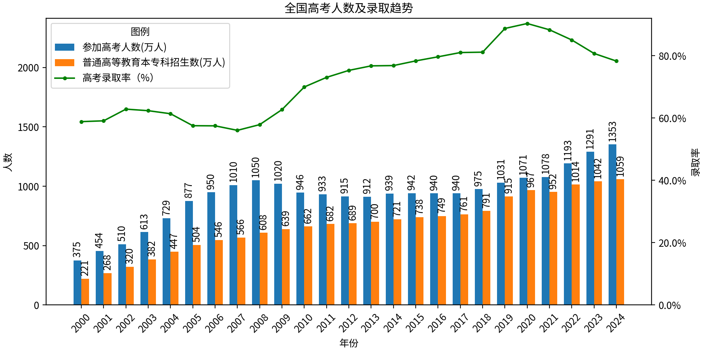

# 投资笔记之宏观市场分析

历史不会重演，但会惊人的相似。

投资是个长跑运动，需要有耐心、毅力，能够坦然面对全仓后的暴跌、空仓后的暴涨踏空，笑看风云，才能纵横与股市，否则只会沦为股市中一颗新的韭菜。

## 宏观分析

长期来看，中国与美国资本市场还是差距非常大的，美国大部分为机构投资者，中国为散户。单单分析股市是不全面的，与美国相比，中国的政治、法律、公民思想意识全方面地落后，因此要走的路还很长。

中国的集体诉讼制度不健全，公司退市机制不健全，做空制度不健全，公司财务造假、操纵股价获利的犯罪成本极低。种种原因，投资 A 股伴随着极大的风险，而且不可控。但是中国经济腾飞，未来 10 年发展速度肯定会比美国高，高收益伴随着更高的风险。

美股：

* 长期上涨，担心回落。
* 做空机制健全，公司造假违法成本高，集体诉讼制度健全。
* SEC 监管健全。
* 指数投资费率低。

A 股：

* 做空机制不合理。A 股有做空机制，但又好像没有。A 股的股指期货有 50 万的准入门槛，直接导致大部分股民只能做多，无法做空。政策对做空天然的敌意，认为做空就是破坏社会稳定。2015 年股灾时，公安局长亲自下场，严厉打击“恶意做空者”，这是什么鬼逻辑，做空做多无非是人逐利的表现，按照这个逻辑，应该还有恶意做多者。美股能够数十年坚挺，与强健的做空机制密不可分，任何一支股票的上涨，都会受到做空者的施压，这就能保证股票的上涨是理性的、合理的、坚挺的。而反观 A 股，大家都在做多，看似股票更容易上涨，其实即使是上涨，很有可能是虚假的繁荣，这样的上涨也是不坚挺的，经不起一点风吹草动。如果没有做空股票就能一直上涨，那规定股票只能上涨，不能下跌，岂不是更好？
* A 股退市机制不合理。A 股变成了公司的取款机，每年新上市的公司多，退市的少，每个上市的新公司都会融资大量金额，都是无情的吸血虫，从地方政府到公司高管，都将从股市融资作为公司上市的最重要目的，其结果就是上市公司从股市吸血，如果新进入的韭菜股民不够，股市就会一直不涨，甚至下跌。而政府其实也不真正关心股市的涨跌，主要关心的是新上市的公司能不能融到资，如何保证这个呢，股市可以不涨，但是不能暴跌，暴跌会导致韭菜股民流失，因此政府的首要任务是保证股市不暴跌即可，能保证公司的融资即可，实现政府业绩、公司的双赢，坑的却是广大股民。
* 公司财务造假、操纵股价获利、高管违法转移利润的犯罪成本极低，缺少惩罚性赔款。
* 缺失集体诉讼，缺少惩罚性赔款。
* 科技、技术、专利环境不友好。Linus torvalds 为何搬去美国？如果把 Linux 基金会设在中国，他估计活不了一年。以 Android 手机为例，现在除了苹果、三星，其他的手机厂家基本都是中国的，中国完全可以领头制定标准，但是这么多年了，手机推送、充电协议、无线传送协议、应用市场，没有一个成功的，这方面有其他的各种其他的原因。
* 对大股东套现太苛刻。公司为什么上市？从创始人角度看，就是为了钱，一个是给公司融资让公司发展，另一个就是套现。如果不让套现，那上市有什么意义，再说套现不一定代表创始人不看好自己的公司，可能就是需要钱，需要钱做自己想做的事情。

## 历年宏观市场分析

### 2025 年

A 股高位运行，没有投资价值。

美股暴跌，待跌到合适价位开始建仓，计划标普 500 投资 10W，纳指 100 投资 10W。

今年又是见证历史的一年，与 2018 年的贸易战有点像，但是又更严重一点。

2018 年，当年也是时任美国总统特朗普宣布对中国征收关税，贸易战贯穿全年，伴随着关税升级、谈判反复和市场情绪波动，中美两国股市呈现截然不同的走势。美股在贸易战初期表现出韧性，受益于美国国内经济基本面，下半年受多重因素（贸易战、加息、全球增长放缓）影响，波动加剧，但未崩盘。相比美股，中国股市在 2018 年表现低迷，贸易战叠加国内经济下行压力导致市场持续承压，上证指数更是跌至最低 2449 点。

2025 年，特朗普第二任总统任期，上来就整大火，先是停止资助乌克兰，我们只是作为吃瓜群众。很快开始发动贸易战，这次更疯款，直接向全世界开展，向全世界征收关税，中国第二天就反击对等增加关税，其他国家相对来说比较沉着，并没有第一时间反击，大部分都在争取谈判，只是声明，如果谈判不成也会反击。很快特朗普宣布取消其他国家的高额关税，仅保持 10% 的关税，除了中国，对，就是除了中国，合计就是单练中国。很明显，这次雷声大，单最终还是和中国的贸易战。

俗话说：疯狗咬了你一口，你不能也咬疯狗一口。

已经有过一次的贸易战了，已经积累了经验。不能机械地被动反击，而是要主动出击，不要跟着敌人脚步，那样没有自己的节奏。

美国每次危机之后，整个社会就会发生一次变革，相当于整个社会打了一次补丁，整个社会更加健壮了。

### 2024 年

2024 年开年股市暴跌，上证指数在 2 月 5 日直接跌到 2600 点。预测下半年还会继续暴跌，到时候分批建仓。（记录：买了 10W 的沪深 300 指数基金，收益 10%）

人民币暴跌，不断刷新历史记录，更会加速外资逃离。

### 2023 年

新冠疫情终于结束了。

刚解封时，感觉真好，哪里都恢复自由了，想去哪里就去哪里，可以自由逛商场了，可以自由旅游了，餐馆也可以正常堂食营业了。按照一般的设想，各项经济活动恢复正常后，经济应该很快恢复正常，继续保持疫情前的增长。然而市场却给了所有人一个意外，经济下滑了，疫情期间坚持的餐馆、小超市，疫情后许多纷纷关门了，疫情消耗了大家的大量存款，收入又没有增加，自然没人敢随心所欲消费，尤其是大件消费：房子、汽车。

人民币汇率暴跌。人民币汇率已经跌破 7.3，外资自然大量流失。

美国持续加息。北京时间 2023 年 7 月 27 日凌晨，美联储宣布加息 25 个基点，与预期一致。在此次加息之后，美国联邦基金利率目标区间已升至 5.25%-5.5%，为 2001 年以来的最高水平。这是美联储自去年启动本轮加息进程以来的第 11 次加息，累计幅度达到了 525 个基点。国内持续降息，2023 年 8 月 LPR（贷款市场报价利率）揭晓，1 年期 LPR 为 3.45%，5 年期以上 LPR 为 4.2%。相当于美国无风险利率就可以达到 5% 以上，美元资金大量向美国回流。

中国加大反间谍调查。全球知名律所大成律师事务所（Dentons）将剥离其中国业务，以符合即将实施的数据安全法规的要求；美国尽职调查公司美思明智集团北京办事处被突击搜查，五名员工被拘留。修订后的中国《反间谍法》2023 年 7 月起生效，把间谍行为从国家机密和情报，扩大到“其他关系国家安全和利益的文件、数据、资料、物品”，但法律没有对“关系国家安全和利益”进行具体阐述。外资企业为规避法律风险，纷纷暂停投资、降低投资，或是暂时观望。

西方发达国家推行降低供应链风险行动。美国将其战略重心聚焦到抓紧实施“去中国化”策略，新冠疫情冲击之下，全球重点制造业产业链供应链向印度和东南亚地区转移和集聚现象凸显，对中国产业链供应链造成了一定的竞争效应和替代效应。2021 年 2 月美国总统拜登签订的《关于美国供应链的行政命令》，核心目标就是在全球产业链供应链体系层面实施“去中国化”策略，将印度和东南亚设定为主要替代目的地；另一方面，西方主要发达国家已经形成针对压制中国产业链供应链的共识以及共同利益体。

海外需求饱和，中国出口增长停滞。过去只要贷款利率降低，工厂都乐意贷款扩大产能，但现在不一样了，海外订单不再像过去一样，你生产多少，海外就能吸收多少，现在的情况是，生产了也不一定能卖出去。所以工厂再投资意愿降低，不愿扩大产能。

海外扩张受阻，只能国内内卷。典型的如华为、小米等企业，华为自 2019 年被美国制裁，至今无法退出 5G 手机，海外市场无法使用 Google 的 GMS 服务，海外市场严重受挫；小米在印度被税务调查，印度执法局 2023 年 6 月 9 日发布文件，指控小米“向外国实体非法转移资金”，涉嫌违反该国的《外汇管理法》，意味着当局可能正式没收已被扣押的 48 亿元，小米 2022 年净利润为 85 亿元，被冻结的资金相当于其 2022 年逾 56％的净利润。

民营企业发展困难重重。央行及国家金融监管总局对蚂蚁集团及其旗下机构开出超 70 亿罚单，而且被暂缓上市。2021 年 7 月 24 日，中共中央办公厅、国务院办公厅印发《关于进一步减轻义务教育阶段学生作业负担和校外培训负担的意见》，意见提出，强化学校教育主阵地作用，深化校外培训机构治理，现有学科类培训机构统一登记为非营利性机构。校外培训机构不得占用国家法定节假日、休息日及寒暑假期组织学科类培训，直接后果就是新东方、作业帮等培训机构一夜之间几乎覆灭。

房地产市场长期不健康发展，如今进入下行周期。地方政府长期过于依赖房地产，政府的各项基建、投资建设重度依赖房地产市场，即卖地收入，现在房地产市场低迷，政府根本没有其他像样的收入，地铁等公共设施建设自然停滞。

叠加国内外的各种不利因素，未来国内会进入一个相当长期的下行经济周期，在这个下行周期中，会消灭一部分过度盲目扩张的公司，比如恒大、碧桂园等，也会倒逼企业反思过去，提升效率，提升竞争力。

### 2022 年

疫情仍在持续，而且看不到彻底消灭的迹象。

美国在加息，全世界资金都在向美国回流，美国也杀敌一千、自伤八百，大家都不好过。美股跌后，A 股跌。而中国这边仍在降息，2022 年 11 月 5 日，1 年 LPR 为 3.65%，5 年期 LPR 为 4.3%，5 年期 LPR 比去年 4.65% 已经下降了 7.5%，更会加剧美元回流、人民币贬值。

这一切都是不利因素。到现在也看不到有利的消息，也看不到胜利的曙光。

全国银行间同业拆借中心发布的贷款市场报价利率（LPR）

|  LPR 报价   | 1 年期 | 5 年期以上 |
| :--------: | :---: | :-------: |
| 2022-10-20 | 3.65% |   4.30%   |
| 2021-10-20 | 3.85% |   4.65%   |
| 2020-10-20 | 3.85% |   4.65%   |
| 2019-10-21 | 4.20% |   4.85%   |

### 2021 年

预测：受疫情影响，消费需求明显降低，实体经济肯定下滑，但受到外围美元大放水，国内也不可避免地也要进行适当防水，因此物价上涨，造成通货膨胀。

策略：维持仓位不变，除非某只股票出现 50% 以上的价格跳水，才考虑分批建仓。优质的可转债低于 90 元，也可以考虑建仓。

**分析**：尽管 OPEC+ 组织暂时达成了减产协议，但是危机仍未解除，多个 OPEC+ 成员国受困于国内经济不景气，如果减产后收入仍未明显增加，不排除成员国会私自增产，破坏既有的协议。到时候全球石油价格又会是一场血雨腥风。石油一动，牵一发而动全身，经济必然也会剧烈波动。

随着美国上演的 GME 逼空事件，美国风险进一步扩大，市场也变得更为狂热。周围也听到越来越多的人开始买基，推动了 A 股优质股票（白酒、新能源）水涨船高，甚至透支了未来 5 年的成长空间，风险也在聚集。如果国际形势突变，国内流动性不得不收紧，A 股仍会暴跌。

### 2020 年

**策略**：未来 2~4 年，当市场交易额下降至冰点（上海证券交易所成交额在 1000 亿以内），且稳定以后，开始分批建仓，静待未来的牛市到来。主要配置：沪深 300、标普 500、纳指 100。

叠加石油价格暴跌，沙特重新报复性增产，沙特这波操作估计也能来个 2~3 年，俄罗斯、伊朗、科威特他们才会真正妥协，未来 2~4 年日子都不会太好过。绝对不能过早抄底，做好跌 50%~80% 的准备。

受新型肺炎影响，全球股市恐慌性下跌。由于汽车、手机等行业严重依赖中国制造，等疫情结束，很多跨国公司会考虑此风险，预计未来许多跨国公司会重新布局全球产业链，不再把中国当做唯一的制造基地。其实这也不是突然的想法，随着中国的崛起，尽管产业链越来越完善，但生产成本也在增加，而且营商环境并没有同比例的提升，不可预测的风险仍在不断蓄积。等疫情结束，全球产业链的调整是不可避免的，中国必然要经历阵痛期。

中美贸易战仍在继续，中国与世界的贸易纠纷仍会继续。毕竟中国自 2001 年进入 WTO，也有将近 20 个年头了，这 20 年来，中国不断享受这 WTO 的红利，却丝毫不为其它国家做任何贡献，这种只索取不付出的情况，天下苦中国久已！按照 WTO 协定，中国早就该开放电线、媒体、银行、汽车等各个行业，但是中国就是耍无赖，拒不执行，或是延后执行，这必然引起其它国家的抵制。表面上看，不让外企进入，能够保护本国企业，但长远来看，这些受保护的企业反而越来越孱弱。

信息流通越来越难，获取国外的信息更难，非洲一个蝗灾，都被国内谣传的不成样子了。说到底，还是国内无法获取国外的一手信息，要是能够查阅国外的新闻网站，根本不用辟谣，稍微翻阅一下国外的权威媒体就知道了。哎，长此以往，从决策层到普通老百姓，越来越无知，越来越井底之蛙，与清朝末年的闭关锁国有啥区别。算了，不说了。

房地产高速增长期已过，未来即使增长也是缓慢增长，或是个别城市暴涨。经济增长寄托于刺激房地产的方法肯定失灵。过去 20 年，中国经济高速增长，但是与之匹配的政治、法制环境并未出现，未来必然进入软硬磨合期。考虑到 2020 年高考人数为 1071 万，近 7 年也是不断攀升，所以未来房市还是有十年的增长期。

自 2000 年以来高考人数、录取人数数据如下：

数据来源：

继续分析高考人数，还可以得出以下结论：

* 从 2000 年—2008 年，高考人数连续增长，2018 年到达巅峰后开始逐步回落，反映到楼市，从 2009~2016 年，楼市也是连续暴涨。
* 2008 年之后，高考人数开始回落，参加高考的人得好多年后才会开始购房，体现到楼市，2017 年之后，房价开始疲软。
* 未来如果高考人数下降或是维持不变，那么房市就不存在暴涨的基础，但只要高考人数不是暴跌，房市也不会大跌。政府只需稍微减少一部分土地出售，即可维持住房价。

美股一旦进入调整期，内忧外患下中国 A 股不可能进入牛市。

要想牛市，要么经济预期增长，要么有新的大饼，比如曾经的乐视、暴风，现如今国内大部分的互联网企业已在境外上市，爆发期已过，除非未来出现新的热点、新的风口。

### 2019 年

2019 年一开年，就证明了中国还没有到万念俱灰的地步，股市很快走出泥潭，经济增速未来下滑是必然的，但是仍然会持续增长，经济也不可避免地进入一个调整期，调整期很痛苦，但也只有调整过后，经济才会更健康、成长更稳健。预计 2019 年是一个调整期，未来经济超过预期，股市就会上涨，反之股市就会下跌。估计调整得 1~3 年。要想大牛市，要么预期经济高增长，要么政策大放水支撑。经济高增长，暂时看是不可能了。经历了 2015 的股市大泡沫后，监管层面这次不大会简单粗暴救市，否则落的一地鸡毛太难看了，除非监管层都是一堆极蠢之人。另外与房地产相比，A 股容量还是小的多（A 股 40 万亿，房市 400 万亿，房市是 A 股的 10 倍），国家政策更多会考虑房市，其次才是股市，房市稳定、健康才是监管层的首要任务。未来 10 年，股市的上涨空间和投资机会都会远大于房市。

### 2018 年

全球股市都持续下跌，担心重蹈美国 1929 年的大萧条，担心中国也会走一个长期的经济低迷期（5~20 年），即使明知未来股市肯定会上涨，却也无法熬过如此漫长的黑夜。而且美股走出了一个美国历史上时间最长的牛市，未来不可避免地进入调整期，或是下跌期。

**当所有人都看衰后，那它也真的会下跌了。**

## 总结

### 可选投资标的

* 普通住宅
* 商铺
* 股票、债券、基金等金融衍生品
* 定期存款、货币基金等低风险理财产品

### 策略

2019 年，3000 点以上务必保持 50% 以下仓位。2900 点以下适当加仓，每降 100 点，加仓 10%。

* 20% 投资 A 股投资大蓝筹股作为底仓，五粮液、美的、白云山、绝味食品、伊利股份、济川药业。用于打新股，长期投资 A 股应以指数基金投资为主、主动基金为辅。

* 10% 投资美国指数基金，标普 500，纳指 100。直接投资美国成本过高（时间成本、学习成本），因此主要投资指数基金，辅助投资一些主动基金。
* 10% 投资 A 股的指数基金，天弘中证医药 100 指数 A、易方达沪深 300ETF 联接。
* 10% 投资 A 股的主动基金。景顺长城新兴成长混合（景顺鼎益 LOF）、易方达中小盘。
* 有好的标的，考虑 20%~30% 仓位的可转债。

近期目标：2019 年实现 20% 收益率。

长期目标：2029 年投资收益 10 倍，也就是 10 年 10 倍。

中国要想走出像美国一样的长牛市，暂时来看是不可能的。看看台湾的股市的经历就明白了，[台湾股疯：一场东亚模式的宿命](https://mr-middle.com/caijing/14743.html) 。尽管很残酷，但是却是事实，中国股民不经历惊天地泣鬼神的暴涨暴跌，也很难痛定思痛，放弃炒股致富梦。这是人性，也是真理。

* 做时间的朋友。假如 2018 年持有 50 万，10 年 10 倍也就是 500 万，表面上看，10 年后的 500 万购买力也没有增长多少，但是 20 年后就是 5 千万，30 年后就是 5 亿，这就很吓人了。
* 富人思维。假如有 1 万资金，可能会在股市投机，幻想着涨停板，10 万呢，可能也会，100 万呢，就会有所顾忌，不敢随意投资一些不靠谱的公司，1000 万、1 个亿呢，还是投资安全的标的吧，投资指数基金、靠谱主动基金更靠谱。既然如此，何不在持有 1 万时，把他想象成 1 亿，你该如何投资呢？
* 投资其实很简单，选好股票，买入并持有，然后就可以不管了，10 年后取收益就行了。但过程中什么都不操作其实是最难的。

### 个股分析

#### 小米

优势：投资眼光好，产业链孵化能力强，软件开发能力、思维强，依靠软件生态可以带动家电、智能产品销售，未来自动化生产、智能汽车、智能家前景光明。

劣势：除了雷军，没有培养出有梯队的接班人，后续会因为管理出现问题。
