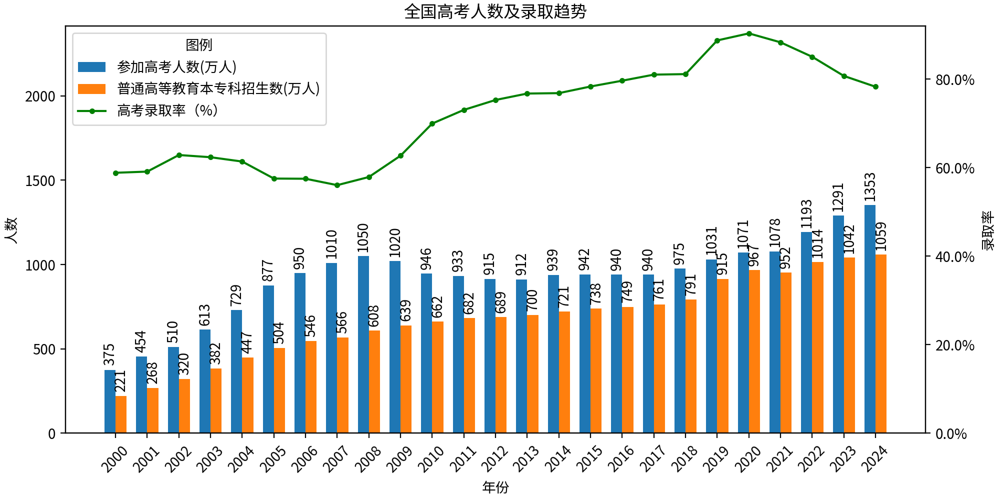

# 投资笔记 -2020 年

> **策略**：未来 2~4 年，当市场交易额下降至冰点（上海证券交易所成交额在 1000 亿以内），且稳定以后，开始分批建仓，静待未来的牛市到来。主要配置：沪深 300、标普 500、纳指 100。

叠加石油价格暴跌，沙特重新报复性增产，沙特这波操作估计也能来个 2~3 年，俄罗斯、伊朗、科威特他们才会真正妥协，未来 2~4 年日子都不会太好过。绝对不能过早抄底，做好跌 50%~80% 的准备。

受新型肺炎影响，全球股市恐慌性下跌。由于汽车、手机等行业严重依赖中国制造，等疫情结束，很多跨国公司会考虑此风险，预计未来许多跨国公司会重新布局全球产业链，不再把中国当做唯一的制造基地。其实这也不是突然的想法，随着中国的崛起，尽管产业链越来越完善，但生产成本也在增加，而且营商环境并没有同比例的提升，不可预测的风险仍在不断蓄积。等疫情结束，全球产业链的调整是不可避免的，中国必然要经历阵痛期。

中美贸易战仍在继续，中国与世界的贸易纠纷仍会继续。毕竟中国自 2001 年进入 WTO，也有将近 20 个年头了，这 20 年来，中国不断享受这 WTO 的红利，却丝毫不为其它国家做任何贡献，这种只索取不付出的情况，天下苦中国久已！按照 WTO 协定，中国早就该开放电线、媒体、银行、汽车等各个行业，但是中国就是耍无赖，拒不执行，或是延后执行，这必然引起其它国家的抵制。表面上看，不让外企进入，能够保护本国企业，但长远来看，这些受保护的企业反而越来越孱弱。

信息流通越来越难，获取国外的信息更难，非洲一个蝗灾，都被国内谣传的不成样子了。说到底，还是国内无法获取国外的一手信息，要是能够查阅国外的新闻网站，根本不用辟谣，稍微翻阅一下国外的权威媒体就知道了。哎，长此以往，从决策层到普通老百姓，越来越无知，越来越井底之蛙，与清朝末年的闭关锁国有啥区别。算了，不说了。

房地产高速增长期已过，未来即使增长也是缓慢增长，或是个别城市暴涨。经济增长寄托于刺激房地产的方法肯定失灵。过去 20 年，中国经济高速增长，但是与之匹配的政治、法制环境并未出现，未来必然进入软硬磨合期。考虑到 2020 年高考人数为 1071 万，近 7 年也是不断攀升，所以未来房市还是有十年的增长期。

自 2000 年以来高考人数、录取人数数据如下：

继续分析高考人数，还可以得出以下结论：

* 从 2000 年—2008 年，高考人数连续增长，2018 年到达巅峰后开始逐步回落，反映到楼市，从 2009~2016 年，楼市也是连续暴涨。
* 2008 年之后，高考人数开始回落，参加高考的人得好多年后才会开始购房，体现到楼市，2017 年之后，房价开始疲软。
* 未来如果高考人数下降或是维持不变，那么房市就不存在暴涨的基础，但只要高考人数不是暴跌，房市也不会大跌。政府只需稍微减少一部分土地出售，即可维持住房价。

美股一旦进入调整期，内忧外患下中国 A 股不可能进入牛市。

要想牛市，要么经济预期增长，要么有新的大饼，比如曾经的乐视、暴风，现如今国内大部分的互联网企业已在境外上市，爆发期已过，除非未来出现新的热点、新的风口。
