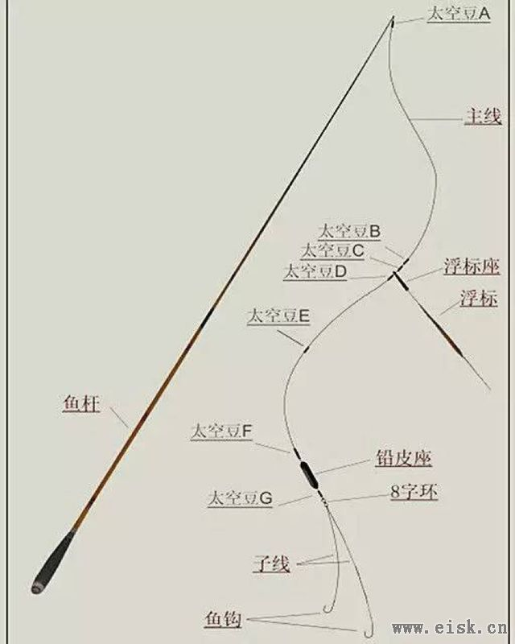
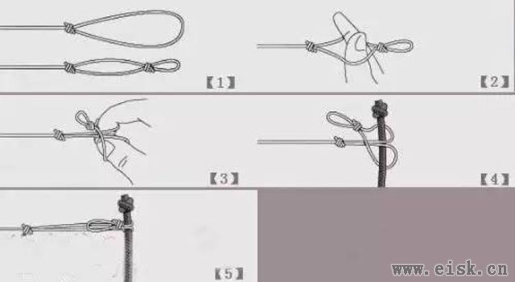

钓鱼

## 绑线

完整线组构成：

打结

1. 竿稍打 8 字结。
2. 主线末端打一个 Surgeon's Loop，然后最末端再打一个 8 字结（方便取下主线）。与竿稍一个马蹄结连接即可，然后锁紧太空豆。
3. 主线与八字环采用帕洛玛结。
4. 成品双钩子线一般末端会有一个八字结，用帕洛玛结与八字环连接。
5. 单钩的话很简单，打一个 Surgeon's Loop，马蹄扣与八字环连接。

## 子线长短

快鱼用短，慢鱼用长；小鱼用短，大鱼用长。钓顿用短，钓灵用长；饵轻用短，饵重用长。走水用短，静水用长。

15cm 以内为短，30cm 以内为长。

一般用 15cm~20cm 即可。
