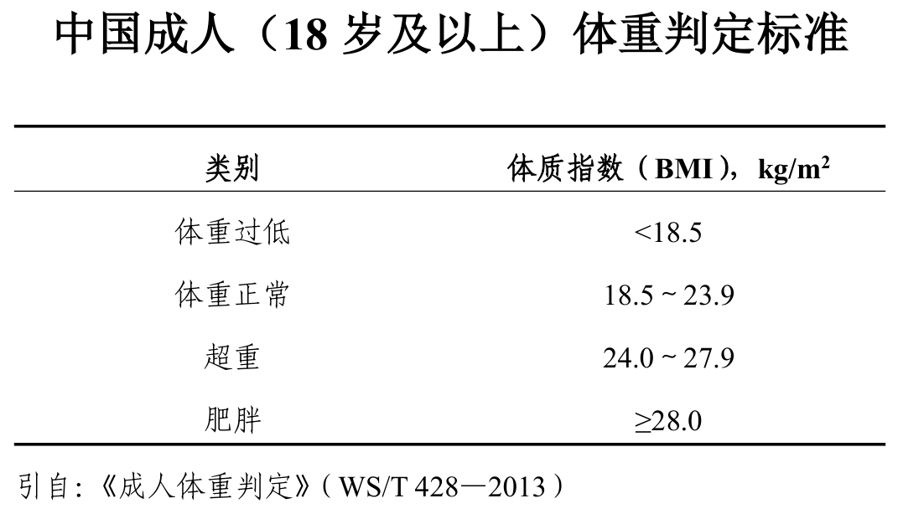

# 瘦身计划

参考国家卫生健康委办公厅印发的《体重管理指导原则（2024 年版）》，BMI≥24 即为超重。

$$BMI=\frac{75}{1.7^2}=\frac{75}{2.89}=25.95$$

2025 年 2 月体重：75kg。

目标：65kg。

俗话说管住自己的嘴，迈开自己的腿。减肥嘛，八分靠饮食，二分靠运动。坚持！加油！一定能胜利。

1. 严格控制饮食。早饭适量，午餐丰盛适量，晚餐简单。
2. 每天保持运动。每天保持 1 万步，1000 个跳绳。
