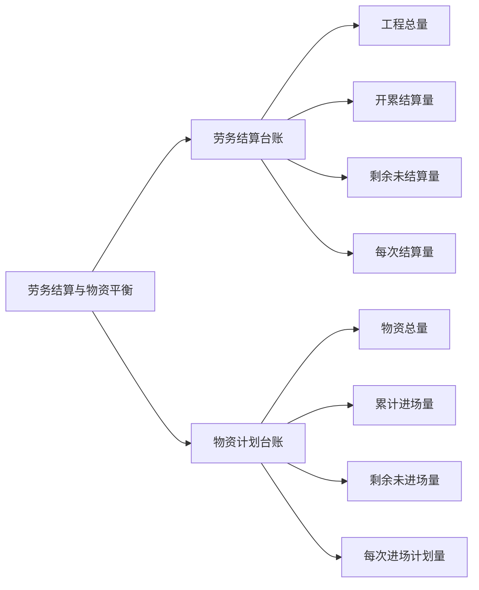

# Markdown 语法指南

## 基本语法

### 段落

Markdown 标准语法：这是内嵌 `python` 代码， **这是加粗字体**，*这是斜体*，这是链接：<https://docs.python.org>。

Markdown 常用扩展语法：~~这是删除线~~ ，==高亮显示==，^^下划线^^ ，下标：H~2~O，上标：x^2^+y^2^=z，内嵌公式：$\Gamma(z) = \int_0^\infty t^{z-1}e^{-t}dt\,.$

### 任务列表

- [x] Run ruff when the python file is saves
- [x] Use Import Optimizer

### 无序列表

- 一级无序列表
- 一级无序列表
  - 二级无序列表
  - 二级无序列表
    - 三级无序列表
    - 三级无序列表

### 有序列表

1. 一级有序列表

2. 一级有序列表

    1. 二级有序列表

    2. 二级有序列表

        1. 三级有序列表

        2. 三级有序列表

### 代码

```python
# python 语言
import os

def func(a, b):
    r = a + b
    return r

if __name__ == '__main__':
    func(1, 2)
# ---------------------
# -->  ==>  != >= <= ++
```

### 引用

>这是一个普通的引用
>
>这是一个普通的引用

### 表格

|  Method  | Description                          |
|:--------:|--------------------------------------|
|  `GET`   | :material-check:     Fetch resource  |
|  `PUT`   | :material-check-all: Update resource |
| `DELETE` | :material-close:     Delete resource |

### 思维导图



### 行内内嵌公式

内嵌公式：$\Gamma(z) = \int_0^\infty t^{z-1}e^{-t}dt\,.$

### 整行公式

$$
\operatorname{ker} f=\{g\in G:f(g)=e_{H}\}{\mbox{.}}
$$

## 扩展语法

下面是 Material for MkDocs 支持的一些扩展语法

### Admonitions

!!! note "这是一个 note 标记，支持 tittle 标题"
    支持的标记：note, abstract, info, tip, success, question, warning, failure, danger, bug, example, quote。

!!! info
    这是一个 info 标记

!!! warning
    这是一个 warning 标记

!!! danger
    这是一个 danger 标记

!!! example
    这是一个 example 标记

!!! quote
    这是一个 quote 标记
